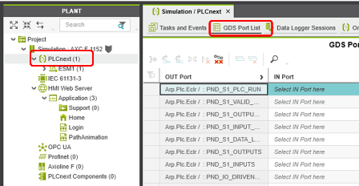

[Технологія PLCnext](README.md) > [Програмування контролерів PLCnext на мовах IEC 61131-3](programming.md) 

## Робота з даними

### Типи даних

У PLCnext Engineer чітко розрізняються коди, пов’язані з безпекою, і стандартні (не пов’язані з безпекою). Тому також розрізняють змінні, або, точніше, типи даних пов'язані з безпекою, і стандартні.

- Стандартні (не пов'язані з безпекою) типи даних, сумісні з IEC 61131-3. Це включає елементарні (elementary) та визначені користувачем типи даних (user-defined data types).
- Елементарні типи даних, пов'язані з безпекою.

Наприклад, неможливо підключити змінну зі стандартним типом даних до формального параметра, який очікує змінну, пов’язану з безпекою. У аркушах коду, пов’язаного з безпекою, пов’язані з безпекою та стандартні змінні можуть бути змішані та напряму пов’язані одна з одною. Це відповідає неявному перетворенню типу даних, яке вимагає дотримання деяких правил. Типи даних по'вязані з безпекою розглядаються в іншому розділі. 

На відміну від типів даних, означених користувачем, елементарні і стандартні типи даних не потрібно оголошувати, оскільки вони попередньо означені в системі, і тому одразу доступні в кожному POU.

Елементарні типи даних показані в таблиці:

| Тип даних            |                            | розмір в бітах | Діапазон                                                     | значення за замовченням   |
| -------------------- | -------------------------- | -------------- | ------------------------------------------------------------ | ------------------------- |
| BOOL                 | Boolean                    | 1              | `TRUE / FALSE`                                               | `FALSE`                   |
| SINT                 | Short integer              | 8              | `-128` до `127`                                              | `0`                       |
| INT                  | Integer                    | 16             | `-32,768` до  `32,767`                                       | `0`                       |
| DINT                 | Double integer             | 32             | `-2,147,483,648` до `2,147,483,647`                          | `0`                       |
| LINT                 | Long integer               | 64             | `-9,223,372,036,854,775,808` до  `9,223,372,036,854,775,807` | `0`                       |
| USINT                | Unsigned short integer     | 8              | `0` до `255`                                                 | `0`                       |
| UINT                 | Unsigned integer           | 16             | `0` до `65,535`                                              | `0`                       |
| UDINT                | Unsigned double integer    | 32             | `0` до `4,294,967,295`                                       | `0`                       |
| ULINT                | Unsigned long integer      | 64             | `0` to `18,446,744,073,709,551,615`                          | `0`                       |
| REAL                 | Real numbers               | 32             | `-3.402823466 E+38` (прибл. 7 цифр) до  `-1.175494351 E-38` (прибл. 7 цифр) 	<br />`+1.175494351 E-38` (прибл. 7 цифр) до  `+3.402823466 E+38` (прибл. 7 цифр) | `0.0`                     |
| LREAL                | Long real numbers          | 64             | `~ -1.798 E+308` (прибл. 15 цифр)  до `~ -2.225 E-308` (прибл. 15 цифр) і<br /> `~ +2.225 E-308` (прибл. 15 цифр)  до  `~ +1.798 E+308` (прибл. 15 цифр) | `0.0`                     |
| TIME                 | Duration                   | 32             | -`24d20h31m23s648ms` up до`24d20h31m23s647ms`                | `t#0s`                    |
| LTIME                | Long duration              | 64             | `- 106751d23h47m16s854ms775us808ns` до    `+106751d23h47m16s854ms775us807ns` | `LTIME#0ns`               |
| BYTE                 | Bit string of length 8     | 8              | `0`  до `255`  (`16#00...16#FF`)                             | `0`                       |
| WORD                 | Bit string of length 16    | 16             | `0`  to `65,535`  (`16#00...16#FFFF`)                        | `0`                       |
| DWORD                | Bit string of length 32    | 32             | `0` to `4,294,967,295`  (`16#00....16#FFFFFFFF`)             | `0`                       |
| LWORD                | Bit string of length 64    | 64             | `0` to `18,446,744,073,709,551,615`  (`16#00....16#FFFFFFFFFFFFFFFF`) | `0`                       |
| LDATE / LD           | Long date                  | 64             | min. : `1677-09 -22`<br />max. :  `2262-04-11`               | `LDATE#1970-01-01`        |
| LTIME_OF_DAY / LTOD  | Long time of day           | 64             | min. : `00:00:00.0`<br />max. : `23:59:59.999999999`<br />   | `LTOD#00:00:00`           |
| LDATE_AND_TIME / LDT | Long date with time of day | 64             | min. : `1677-09-21-00:12:43.145224192`<br />max. : `2262-04-11-23:47:16.854775807` | `LDT#1970-01-01-00:00:00` |

Текстові типи даних показані в таблиці:

| Byte                                                         | Description                                                  |
| ------------------------------------------------------------ | ------------------------------------------------------------ |
| **STRING data type**                                         |                                                              |
| 0...1                                                        | Capacity - Maximum number of characters that the string can hold (from 0 to UINT16.MAX). |
| 2...3                                                        | Length - Current number of characters in the string (from 0 to Capacity). |
| 4...84  (for an 80 characters string)<br />4...124  (for  a user-defined string of 120 characters) | String of ANSI characters followed by a trailing zero character. Each character is represented by one byte. |
| **WSTRING data type**                                        |                                                              |
| 0-1                                                          | Capacity - Maximum number of characters that the string can hold (from 0 to UINT16.MAX). |
| 2-3                                                          | Length - Current number of characters in the string (from 0 to Capacity). |
| 4...165 (for an 80 characters string)4...245 (for  a user-defined string of 120 characters) | String of UTF16 characters followed by a trailling zero character. Each character is represent |

Загальні типи даних (Generic data types) — це типи даних, які включають ієрархічні групи елементарних типів даних. Наприклад, `ANY_INT` включає елементарні типи даних `SINT`, `DINT`, `INT`, `LINT`, `USINT`, `UINT`, `UDINT` і `ULINT`. Якщо функція може бути пов'язана з `ANY_INT`, це означає, що змінні цих типів даних можна обробляти. Загальні типи даних організовані таким чином:


### Літерали IEC 61131-3

Якщо в коді повинні використовуватися постійні числові значення, рядки символів або значення даних часу, наприклад, для зв’язку їх із формальним параметром функції/функціонального блоку, замість констант можна використовувати літерали. Літерали — це безпосередньо введені "жорстко закодовані" постійні значення або рядки. Стандарт IEC 61131-3 означує літерали як "зовнішнє представлення даних". Літерали можна вводити безпосередньо в код. Декларацію вказувати не потрібно. Стандарт IEC 61131-3 описує різні літеральні типи відповідно до основних типів даних.

#### Числові літерати

| Тип                     | Приклади                                                     |
| ----------------------- | ------------------------------------------------------------ |
| Integer                 | `-12` `0` `123_456` `+986`   Для літералів SAFEINT завжди потрібно вводити тип даних (`SAFEINT#`). |
| Real                    | `-12.0` `0.0` `0.4560` `3.14159_26`                          |
| Real with exponent      | `-1.34E-12` `-1.34e-12` `1.0E+6`                             |
| Long Real               | `LREAL#-12.0` Observe the 2nd note below this table.         |
| Long Real with exponent | `LREAL#2.3E-89`Observe the 2nd note below this table.        |
| Base 2                  | `INT#2#1111_1111`                                            |
| Base 8                  | `INT#8#377`                                                  |
| Base 16                 | `INT#16#FF` `SINT#16#ff`                                     |
| Boolean FALSE and TRUE  | `FALSE`, `TRUE` <br />`SAFEFALSE`, `SAFETRUE`                |
| Boolean 0 and 1         | `0, 1`<br />Для літералів  `SAFEBOOL` має завжди  використовуватися `SAFEFALSE`, `SAFETRUE` |

Літерали INT можна використовувати без ключового слова. Приклад: для `INT#16#ff` можна використовувати `16#ff`. Літерали `BOOL/SAFEBOOL` також можна використовувати без ключового слова. Приклади: для `BOOL#FALSE` можна використовувати `FALSE`, а для `SAFEBOOL#FALSE` можна використовувати `SAFEFALSE`.

Якщо ви використовуєте PLCnext Engineer іншою мовою інтерфейсу користувача та/або з іншою системною мовою Windows, ніж англійська, ви все одно завжди в якості роздільника повинні водити крапку  (`.`) . Це стосується, наприклад, під час введення початкових значень у таблиці змінних або літералів `REAL/LREAL` у коді.

#### Літерали рядка символів

Літерали рядка символів містять однобайтові або двобайтові символи. Літерал однобайтового рядка символів — це послідовність із нуля або більше символів, укладених в одинарні лапки (`''`). Літерал двобайтового рядка символів — це послідовність із нуля або більше символів, укладених у подвійні лапки (`""`).

**Рядки однобайтових символів**

| Тип                    | Приклади           |
| ---------------------- | ------------------ |
| Порожній рядок         | `''`               |
| Рядок з одним пробілом | `' '`              |
| Не порожній рядок      | `'this is a text'` |

**Двобайтові рядки символів**

| Тип                    | Приклади           |
| ---------------------- | ------------------ |
| Порожній рядок         | `""`               |
| Рядок з одним пробілом | `" "`              |
| Не порожній рядок      | `"this is a text"` |

#### Ескейп-послідовності

PLCnext Engineer підтримує екранування символів у рядках. Екран-послідовності — це комбінація зворотної скісної риски (`\`), за якою йде спеціальний символ. Зворотний слеш використовується для екранування певних символів, наприклад табуляторів (`\t`) або нових рядків (`\n`) усередині текстового рядка. Символи керування використовуються як значення ініціалізації IEC або константи в таблицях коду.

Для забезпечення сумісності з іншими мовами програмування, що підтримуються технологією PLCnext Technology, екранування стилю IEC 61131-3 за допомогою символу `$` більше не підтримується. Старіші проекти, які використовують символ `$` для екранування, автоматично оновлюються. 

У наступній таблиці показано керуючі послідовності, які підтримуються в PLCnext Engineer.

| Ескейп-послідовність | Значить                                                      | Відобразить в онлайні                                        |
| -------------------- | ------------------------------------------------------------ | ------------------------------------------------------------ |
| `\\`                 | Вставити символ зворотної косої риски в рядок.               | `\`                                                          |
| `\n` або `\N`        | Вставити новий рядок у рядок.                                |  (Unicode U+21B5) HMI відобразить текст з кількома рядками |
| `\t` або `\T`        | Вставте табулятор у рядок.                                   |  (Unicode U+2192) HMI покаже символ `?` Розмір табуляції за замовченням можна налаштувати в діалоговому вікні `Extras > Options` в категорії `Online` |
| `\'`                 | Вставити символ одинарної лапки в рядок (застосовно лише для значень STRING). | `'`                                                          |
| `\"`                 | Вставити символ подвійних лапок у рядок (застосовно лише для значень WSTRING). | `"`                                                          |

В елементах керування force/overwite (аркуш онлайн-кода, вікно `FORCELIST` тощо) символи `<new line>` і `<tab>` у поточному онлайн-значенні відображаються як `\n` і `\t` (а не як `\N` і `\T`). Щоб використовувати ці символи для форсування/перезапису, ви можете ввести керуючі послідовності `\n`, `\N`, `\t` і `\T`.

#### Літерали дати та часу

Дані про тривалість можуть бути представлені в годинах, хвилинах, секундах, мілісекундах і в комбінації цих форматів.

| Тип          | Приклади                                                     |
| ------------ | ------------------------------------------------------------ |
| Short prefix | TIME data type: `T#14ms` `t#14ms` `t#12m18s3.5ms` `T#25h_15m` `t#25h_15m`   Коротке представлення префікса не допускається для літералів `SAFETIME`  <br />LTIME data type: `LT#14ms` `t#14ms` `t#12m18s3.5ms` `T#25h_15m` `t#25h_15m` |
| Long prefix  | TIME data type: `TIME#14 ms` `time#14ms` `TIME#25h_15m` `time#25h_15m`<br />SAFETIME data type: `SAFETIME#14 ms` `safetime#14ms` `SAFETIME#25h_15m` `safetime#25h_15m`<br />LTIME data type: `LTIME#14 ms` `time#14ms` `TIME#25h_15m` `time#25h_15m` |

#### Літерали дати та часу доби

| **Type**                   | **Examples**                                                 |
| -------------------------- | ------------------------------------------------------------ |
| Long date                  | `LDATE#1996-01-24` <br />`ldate#1996-01-24` <br />`LD#1996-01-24` <br />`ld#1996-01-24` |
| Long time of day           | `LTIME_OF_DAY#15:36:55.36` <br />`ltime_of_day#15:36:55.36` <br />`LTOD#15:36:55.36` <br />`ltod#15:36:55.36` |
| Long date with time of day | `LDATE_AND_TIME#1996-01-24-15:36:55.36`<br/>`ldate_and_time#1996-01-24-15:36:55.36`<br/>`LDT#1996-01-24-15:36:55.36`<br/>`ldt#1996-01-24-15:36:55.36` |

### Користувацькі типи даних 

IEC 61131-3 надає можливість декларувати власні, визначені користувачем типи даних на основі стандартизованих елементарних типів даних IEC 61131-3. Таким чином, прикладні програмісти можуть вказати власну «модель даних» з огляду на вимоги поточної програми. Ці означені користувачем типи даних також відомі як похідні типи даних або визначення типів.

Визначені користувачем типи даних (UDDT) оголошуються на аркуші типів даних за допомогою блоку декларацій `TYPE ... END_TYPE`. У одному аркуші даних може бути задекларовано кілька типів. 

PLCnext Engineer підтримує такі визначення типів:

- `Arrays` - типи даних масиву складаються з кількох елементів одного типу даних.
- `Structures` - структуровані типи даних включають кілька елементів одного або різних типів даних
- `Enumerations` - змінна може зберігати одне з кількох імен, указаних у визначенні типу
- `User-defined strings` - означені користувачем рядки складаються з певної кількості символів, указаних у визначенні типу.
- Комбіновані - Масиви, структури, перерахування та рядки можна комбінувати, утворюючи, наприклад, структуру з переліками або масиви структур

Використання та формат (пам’яті) типів даних, означені користувачем, залежать від типу контролера. Він має бути означений лише один раз на аркушах типів даних проекту. Однак у включених бібліотеках допускається ідентичне означення типу даних (те саме ім’я). Це означає, що, беручи до уваги бібліотеки, можливе кілька визначень одного типу даних.

Означені користувачем типи даних, наприклад  ARRAYs, STRUCTs і STRINGs, повинні бути оголошені в аркуші типів даних за допомогою текстового редактора. Керування аркушами типів даних здійснюється в категорії `Data Types` в області `COMPONENTS` праворуч. Тут ви додаєте аркуші нових типів даних, відкриваєте наявні аркуші для редагування або структуруєте категорію, вставляючи папки. Кожен блок оголошення типу даних починається ключовим словом `TYPE` і закінчується ключовим словом `END_TYPE`. Блок оголошення може містити одне або більше оголошень типу даних.


#### Масиви

Масиви оголошуються на аркуші типу даних за допомогою блоку оголошення TYPE...END_TYPE. Масив може бути багатовимірним. Типи даних масиву складаються з кількох елементів одного типу даних. До кожного елемента можна отримати доступ через його унікальний індекс елемента.

Довжину масиву (кількість елементів або значень, які може містити масив) можна визначити за допомогою літералів (фіксованих значень) або постійних змінних. Постійні змінні мають бути оголошені як VAR CONSTANT на аркуші типу даних за допомогою блоку оголошення VAR CONSTANT...END_VAR (див. приклад нижче).

Приклад 1. 1-вимірний масив з 10 цілих чисел, де довжина масиву, визначена за допомогою літералів матиме вигляд:


Якщо необхідно об'являти масив через константну змінну:


Створення змінної матиме вигляд:


Звернення до 1-го елементу масиву матиме вигляд:


Приклад 2. 2-вимірний масив. Об'явлення матиме вигляд як масив масивів


Звернення до елементу масиву:


Масиви, або, точніше, окремі елементи, що містяться в масиві, можна ініціалізувати наступним чином:


Для ініціалізації масивів з великою кількістю значень можна використовувати так звані *числа повторення*.
Приклад ініціалізації в аркуші типів даних:


Ця ініціалізація означає те саме, що:


У редакторі «[Налаштування початкового значення](file:///C:/Program Files/PHOENIX CONTACT/PLCnext Engineer 2022.3/en/Help/InitValueConfigurationEditor.htm)» ці числа повторення можна ввести як оператор ініціалізації для ініціалізації масивів .

#### Структури

Структуровані типи даних включають кілька елементів одного або різних типів даних. Таким чином, структури особливо підходять для відображення та обробки кількох різних властивостей об’єкта, наприклад, характеристик машини. У наступному прикладі тип структурованих даних "machine" складається з компонентів `x_pos`, `y_pos`, `depth` і `rpm`. Усі компоненти описують характеристики машини. Приклад опису типів даних показаний на рис.


Створення змінної матиме вигляд:


Приклад використання:


Структури, або, точніше, окремі елементи, що містяться в структурі, можна ініціалізувати наступним чином:


```pascal
TYPE
	machine1: STRUCT
		x_pos: INT := 10;
		y_pos: INT := -10;
		depth: INT := 25;
        rpm:   INT :=800;
        ready: BOOL:= FALSE;
        temper: REAL := 75.5;
	END_STRUCT
END_TYPE
```


#### Перелічення (Enumerations, enums)

Змінна визначеного користувачем типу даних `enum` може мати значення, вибране з попередньо визначеного списку. Інші значення змінних неможливі.

Приклад: перелічення `PossibleColors` включає значення Red, Green і Blue, кожне з яких є типом даних INteger, тобто Red = 0, Green = 1 і Blue = 2. У ST для змінної «Color», яка має тип даних enum, встановлено значення INT = 1, тобто зелений, якщо Start = TRUE. 

Означення типу:


Створення змінної типу:


Використання змінної:


Якщо два або більше перерахувань містять елемент з однаковою назвою, ім’я ENUM за бажанням може бути додано перед ім’ям елемента, а потім символ решетки. Приклад: два перерахування містять елемент Green.

```pascal
TYPE
   EnumColor : (Red := 0, Green := 10, Blue := 20) OF INT := Green;
   EnumBackgound : (Red := 255, Green := 128, Blue := 0) OF INT := Green;
END_TYPE
```

У коді оператор `eColor := EnumBackgound#Green;` є унікальним.

Перерахування можна ініціалізувати двома способами:

- Значення можна призначити кожному елементу, зазначеному в списках імен (Blue := 5 у прикладі нижче). Без ініціалізації цих елементів списку вони постійно нумеруються, починаючи з 0 для першого елемента.

- Один елемент списку можна попередньо вибрати або на аркуші типу даних, або в таблиці змінних, як показано в наступному прикладі (initial value = Green).

   Ви також можете використовувати редактор «Init Value Configuration» для визначення попередньо вибраного елемента переліку.


Змінна типу даних "PossibleColors" буде ініціалізована значенням Green (INT#1).

#### Strings

User-defined strings (STRINGs) are composed of a specified or a  variable number of characters. If a number is specified in brackets at  the string type definition, this is considered as fixed string length.  If no length is specified, the string can contain any number of  characters within the valid range.

Визначені користувачем рядки (STRING) складаються з певної або змінної кількості символів. Якщо число вказано в дужках у визначенні типу рядка, це вважається фіксованою довжиною рядка. Якщо довжина не вказана, рядок може містити будь-яку кількість символів у допустимому діапазоні від 1 до 32766.

Означення типу даних:


Означення змінної:


Приклад використання змінної:


Наступне стосується віддаленого доступу до змінних STRING, наприклад, з OPC UA, PLCnext Engineer HMI та онлайн-функцій PLCnext Engineer:

 **Обмеження віддаленого доступу**: доступ для читання та запису до змінних STRING поза програмою контролера обмежено 511 байтами. Причиною цього є обмеження у Remote Service Calls (RSC) IDataAccessService та ISubScriptionService. RSC — це служби для зв’язку між процесами та пристроями. Вони надають API для доступу до всіх основних компонентів мікропрограми PLCnext Technology.

Окрім визначених користувачем рядків, визначених у таблиці типу даних, стандарт IEC 61131-3 визначає рядки за замовчуванням. На відміну від рядків, визначених користувачем, STRING за замовчуванням можна безпосередньо оголошувати в таблицях змінних, вибравши тип STRING. Визначення типу даних не потрібне. Стандартний рядок має довжину 80 символів.

Початкове значення встановлюється для рядка в таблиці змінних шляхом введення рядка ініціалізації в стовпець «Ініціалізація» в одинарних лапках.


#### Комбінації типів даних, визначених користувачем

Визначені користувачем типи даних можуть бути комбінованими але не можуть бути вкладеними (тобто без рекурсивних викликів). Використовуйте редактор `Init Value Configuration` для ініціалізації структур і масивів.

Використання масиву структур, тобто структур, організованих як масиви, показано в наступному прикладі.


Тут відображається виробнича лінія (масив `line`) із 6 свердлильними верстатами (структура `machine`). За допомогою індексу масиву можна отримати доступ до кожної конкретної станції. За допомогою компонентів конструкції можна призначати різні значення для свердління.

У структурах можна використовувати масиви, перерахування та рядки, тобто один або кілька оголошених типів даних, визначених користувачем, містяться як компоненти в структурі. У наступному прикладі у структурі міститься масив (`seq`) , а також перелічення `material`, якому можна встановити одне зі значень `wood`, `aluminum` або `stone`.


Комбінації структур і масивів, а якщо бути точніше, їх окремі члени, також можна ініціалізувати за допомогою так званих *repetition numbers (чисел повторення)*.

**Приклад 1: Структура з масивом**

У наступному прикладі структура MyStruct містить серед інших елементів масив Integers.


У редакторі 'Init Value Configuration' оператор ініціалізації може мати такий вигляд:


**Приклад 2: Масив структур**

У наступному прикладі масив MyStruct оголошено на аркуші типів даних:


У редакторі Init Value Configuration рядок ініціалізації містить repetition numbers не лише для масиву в MyStruct, але й для масиву структури:


Пояснення оператора ініціалізації:

```pascal
[4((Field1 := 1, Field2 := TRUE, Field3 := [10(4)])),//4 elements are initialized
  2( ),                        //next 2 elements with default init value
  4((Field1 := 9, Field2 := TRUE, Field3 := [5(3), 5 (6)])) //last 4 elements are initialized
]
```

#### Порти UDDT

Порти можуть мати визначені користувачем типи даних, наприклад масиви або структури. Ви можете створити такий визначений користувачем порт так само, як і змінну типу даних, визначеного користувачем:

1. Введіть визначення типу в аркуш типу даних, використовуючи ключові слова оголошення `TYPE ... END_TYPE`.
2. Оголошуйте порт із визначеним користувачем типом даних: встановіть для параметра «Usage» значення «IN Port» або «OUT port», коли оголошуєте порт у програмному POU.

Тепер ви можете використовувати елементи, що містяться у визначених користувачем типах у програмному коді.

Також зовнішні (не IEC 61131-3) програми можуть містити порти складних типів даних.

У списку портів (вузла «PLCnext» або вузла екземпляра програми в PLANT) ви можете призначити окремих членів такого порту іншому порту. Коли відкривається інструмент вибору ролей для призначення, для вибору пропонуються відповідні члени порту.

**Example**

Порт OUT MyPortArray — це визначений користувачем тип даних ARRAY:
`MyArray : ARRAY[0..9] OF BOOL; `

Під час відкриття засобу вибору ролі для логічного порту в списку портів для вибору пропонуються окремі члени порту.


Перший біт масиву було відображено в логічний порт `IN`:


Після відключення члена порту він залишається непідключеним у списку портів. Потім його можна видалити за допомогою команди панелі інструментів `Delete  unconnected port member`

### Змінні

Відповідно до стандарту IEC 61131-3, логіка прикладної програми в PLCnext Engineer розробляється з використанням змінних замість безпосередньої адресації входів/виходів або використання прапорів. Кожна змінна та кожен екземпляр функціонального блоку, які використовуються в проекті, повинні бути оголошені.

Змінні оголошуються в:

- таблиці змінних (`variables`) POU (кожна POU надає власну таблицю змінних). Таблиця змінних містить оголошення всіх змінних і екземплярів функціональних блоків, які використовуються в конкретному POU.


- Список даних (`Data List`) вузла `IEC 61131-3` у `PLANT`. Список даних містить усі глобальні змінні ресурсу та системні змінні ресурсу (відповідно до стандарту IEC 61131-3). Оголошені тут змінні можна використовувати в усіх POU в рамках проекту, оголосивши там зовнішню (External)  змінну.
  Ті самі змінні також містяться в списку даних вузла контролера.


- Safety PLC, якщо він міститься у вашому проекті, надає власний список даних, який може містити змінні Safety PLC пов’язаних із безпекою (`safety-related`) та стандартних типів даних.

- Типи контролерів технології PLCnext на додаток до списку даних мають список портів GDS (`GDS Port  List`)  (у вузлі `PLCnext` у PLANT). Тут можна призначати один одному порти `IN` і `OUT` а  також порти, надані програмами, що не відповідають IEC 61131-3, які ви включили як бібліотеки.



Змінні можна оголошувати або під час вставки їх у код (через контекстне меню неоголошеної змінної), або перед їх використанням у коді, вручну ввівши оголошення в таблицю.

Щоб досягти чітко впорядкованої структури змінних у таблиці, можна використовувати означені користувачем групи. Групи не впливають на програмування, вони лише надають вам кращий огляд. Група `Default` створюється автоматично. Кожна група може містити будь-яку кількість оголошень. Клацніть лівою кнопкою миші піктограму зі стрілкою перед назвою групи, щоб переглянути/приховати елементи, які містяться в групі.

#### Області видимості змінних

Область видимості змінної означує, у якому або в яких POU вона дійсна, тобто де її можна використовувати. Можливі області дії: локальні та глобальні. Область кожної змінної означується місцем, де вона оголошена (таблиця локальних змінних або список даних вузла `IEC 61131-3`) і ключовим словом змінної, що використовується в декларації.

**Локальні змінні (local variables)** - це змінні, які можна використовувати лише в одному POU, включно з її методами, закодованими діями чи переходами. Локальні змінні мають бути оголошені в таблиці змінних, що стосується POU, де змінна буде використана. Можливі ключові слова оголошення змінних: 

- `Local` 
- `Input` 
- `Output` 
- `InOut`

PLCnext Engineer зберігає ці змінні в невідомих користувачеві області пам’яті контролера. Ці змінні можуть мати необов’язкове початкове значення.

**Ресурсно-глобальні змінні (Resource-global variables)** - це змінні, які можуть використовуватися в усіх POU, які виконуються стандартним контролером. Такі змінні мають бути оголошені у списку даних вузла `IEC 61131-3` у PLANT. Safety PLC має власні ресурсно-глобальні змінні, які можна використовувати в усіх пов’язаних із безпекою POU, що виконує Safety PLC. Ці змінні мають бути оголошені в списку даних вузла `Safety PLC` у PLANT.  

У списку даних контролера та ПЛК безпеки стовпець `Usage` для вибору ключового слова оголошення `Global` доступний лише для читання, оскільки він автоматично дійсний для всіх ресурсно-глобальних змінних. Ці ресурно-глобальні змінні можна призначити терміналу фізичного пристрою (I/Q). Після зіставлення глобальної змінної з елементом даних процесу значення, зчитане/записане в таку призначену глобальну змінну введення/виведення, фактично зчитується/записується на призначений фізичний термінал. Стандарт IEC 61131-3 називає ці змінні локалізованими змінними.

Щоб використовувати глобальну змінну в POU, її необхідно додатково оголосити з `Usage = External` у таблиці локальних змінних POU.

**Програмно-глобальні змінні (Program-global variables)**: змінна, яку можна використовувати в POU програми, де вона оголошена, і в усіх функціональних блоках POU, створених у цій програмі. У POU програми таку змінну оголошено за допомогою `Usage = Program`. Крім того, вона має бути оголошена як `Usage = External` у таблиці локальних змінних кожного екземпляра FB, де змінна буде використовуватися. Глобальні програмні змінні не підтримуються для POU, пов’язаних із безпекою.

#### Стандартні змінні та пов'язані з безпекою змінні

У PLCnext Engineer чітко розрізняються коди, пов’язані з безпекою, і стандартні (не пов’язані з безпекою). Тому також розрізняють змінні, а точніше, типи даних:

- Стандартні (Standard) не пов'язані з безпекою типи даних, які сумісні з IEC 61131-3, вони включають типи даних:
   - елементарні
   - означені користувачем
- Елементарні типи даних, пов'язані з безпекою.

У аркушах коду, пов’язаного з безпекою, пов’язані з безпекою та стандартні змінні можна змішувати та безпосередньо пов’язувати одні з одними. Це відповідає неявному перетворенню типу даних, яке вимагає дотримання деяких правил. Додатково про змінні безпеки читайте у відповідному розділі посбіника.

#### Змінні зворотного зв'язку

У функціональних блоках FBD/LD і програмних POU неявні зворотні зв’язки можна запрограмувати, з’єднавши вихід назад із входом (`feedback variable`). Змінна, яка вставляється в лінію з’єднання зворотного зв’язку, вважається змінною зворотного зв’язку. Вона забезпечує дві точки підключення (вхід/вихід).  У контекстному меню такої змінної стоїть опція `Toggle Feedback Variable`. Змінні зворотного зв'язку повинні бути з'єднані з обох сторін.

#### Системні змінні для цілей діагностики/моніторингу

Системні змінні надаються середовищем виконання. Вони дозволяють отримати доступ, наприклад, до стану системи, продуктивності процесора тощо. Системні змінні мають фіксовані адреси пам’яті та можуть використовуватися програмою контролера для отримання цієї інформації. Системні змінні автоматично оголошуються як глобальні змінні в списку даних контролера. Ім'я та властивості системної змінної означені за замовчуванням і не можуть бути змінені. Оскільки кожна системна змінна є глобальною змінною, в таблицю локальних змінних POU, де вона використовується необхідно вставити декларацію  `External`.


#### Порти для контролерів PLCnext Technology

Для контролерів покоління PLCnext Technology на додаток до глобальних ресурсних змінних або замість них можна використовувати вхідні та вихідні порти. Програми обмінюються даними за допомогою портів, тобто через порти можна зчитувати дані та записувати їх у програми. Через порти можливий зв’язок між IEC 61131-3-сумісними програмами так і з іншого типу, наприклад C++.

Для цього вхідні та вихідні порти можна призначити один одному за допомогою функції відображення ролей у списку портів GDS. Списки портів доступні на вузлі PLANT `PLCnext` і на вузлах екземплярів програми. Список портів містить порти, які мають відношення до відповідного вузла PLANT. Усі підключення до портів зберігаються в глобальному просторі даних контролера PLCnext Technology

### Оголошення змінних

Змінні та екземпляри FB можуть бути створені та оголошені наступним чином:

- У таблиці змінних POU. 
- Під час редагування аркуша коду POU через контекстне меню.

- У списку даних вузла `IEC 61131-3` у PLANT. 
- У списку даних вузла `Safety PLC`


#### Оголошення в таблицях локальних змінних

| Ключове слово         | Оголошення                                                   | Використовується в                                           |
| --------------------- | ------------------------------------------------------------ | ------------------------------------------------------------ |
| Local                 | Оголошення локальних змінних і екземплярів функціональних блоків. | Таблиця змінних, усі типи POU                                |
| Input                 | Оголошення змінних, які служать входами для функцій, функціональних блоків і методів. За допомогою змінної `Input` POU може отримати значення. У POU або методі вхідну змінну можна лише читати, але не записувати (можна довзолити запис в опціях опції компілятора). | Таблиця змінних функцій і POU функціональних блоків          |
| Output                | Оголошення змінних, які служать виходами функціональних блоків. За допомогою змінної `Output` POU можуть передавати значення іншим POU. У POU можна читати та записувати змінну  `Output`. | Таблиця змінних POU функціональних блоків                    |
| InOut                 | Оголошення змінних, які є як входами, так і виходами. Як правило, це робиться для складних типів даних, таких як рядки, масиви та структури. Адреса вхідної/вихідної змінної передається за посиланням. У POU змінну можна читати або записувати. | Таблиця змінних POU стандартного функціонального блоку. Змінні InOut не підтримуються для POU, пов’язаних із безпекою. |
| External              | Локальна декларація глобальної змінної в POU, де вона використовується (див. опис ключового слова `Global`). Значення `External` змінної доповнюється відповідним оголошенням `Global`. Це значення може бути змінено POU. | Таблиця змінних, усі типи POU                                |
| Instance              | Оголошення локальної змінної, яка буде використовуватися як змінна, пов’язана з екземпляром. Після вибору ключового слова `Instance` стає активним поле `I/Q` для вибору напрямку даних. | Таблиця змінних POU програм і функціональних блоків. Змінні, пов’язані з екземплярами, не підтримуються для POU, пов’язаних із безпекою. |
| Program               | Оголошення програмно-глобальної змінної. З цією метою змінна має бути оголошена у відповідному FB як змінна `External` (подібно до ресурсно-глобальної змінної). | Таблиця змінних POU програм і функціональних блоків. Змінні, пов’язані з екземплярами, не підтримуються для POU, пов’язаних із безпекою. |
| IN Port<br />OUT Port | Оголошення порту IN або OUT у POU програми під час роботи з контролером PLCnext Technology. За допомогою порту `IN` POU може отримати значення з порту `OUT` іншої програми. Через порт `OUT` програма може передавати значення на порт `IN` інших POU. |                                                              |

Під час оголошення змінних формальних параметрів для функції або POU функціонального блоку порядок оголошень у таблиці змінних визначає порядок появи Fu/FB у коді (у символі блоку або в ST список параметрів). Використовуючи піктограми «Перемістити вгору/вниз» на панелі інструментів таблиці змінних, ви можете змінити порядок формальних параметрів блоку в коді. 

#### Оголошення в Data Lists


| Ключове слово | Оголошення                                                   | Використовується в                     |
| ------------- | ------------------------------------------------------------ | -------------------------------------- |
| Global        | Оголошення глобальних змінних, які можна використовувати в усіх POU, які виконуються відповідним контролером (ресурсом). У PLCnext Engineer чітко розрізняються коди, пов’язані з безпекою, і стандартні (не пов’язані з безпекою). І стандартний контролер, і Safety PLC мають власний окремий список даних із `Global` деклараціями. Глобальну змінну контролера не можна використовувати в Safety PLC і навпаки. Для стандартного контролера глобальні змінні можна оголошувати як змінні, що зберігаються (за допомогою властивості `Retain`). Safety PLC не підтримує збереження змінних. Глобальні змінні оголошені як `Global` у списку даних вузла `IEC 61131-3`/`Safety PLC` є як змінні `External` в таблиці локальних змінних POU, де вони використовуються. | Список даних контролера та ПЛК безпеки |
| Instance      | Оголошення пов’язаної з екземпляром локальної змінної вводу/виводу. Такі оголошення вставляються автоматично для кожного екземпляра локальних змінних, які були оголошені за допомогою ключового слова `Instance` у сітці локальних змінних програми або FB POU. | Список даних контролера                |
| Program       | Оголошення пов’язаної з екземпляром глобальної програмної змінної вводу-виводу. Такі оголошення вставляються автоматично для кожного екземпляра глобальних програмних змінних, які були оголошені за допомогою ключового слова `Program` в сітці локальних змінних програми POU. | Список даних контролера                |

#### Variable/Port Properties 	


### Імпортування/експортування змінних із/до файлу `.csv`

Щоб експортувати оголошення змінних у файл `.csv`, натисніть кнопку  на панелі інструментів. Або виберіть `Export CSV...` у контекстному меню. Усі оголошення записуються у файл експорту незалежно від будь-якого вибору в сітці.

Якщо ви редагуєте експортований файл `csv` за допомогою зовнішнього інструменту, ви повинні переконатися, що використовуваний редактор не змінює розділювачі стовпців (крапки з комою) або кодування файлу. Наприклад, MS Excel може бути налаштовано на зміну файлів `csv`, що приведе до не можливосіт їх повторного імпортування.

Щоб імпортувати оголошення змінних з файлу `.csv`, натисніть кнопку  на панель інструментів. Або виберіть у контекстному меню `Import CSV...` У діалоговому вікні відкриття файлу виберіть файл `.csv`, який потрібно імпортувати, і натисніть `Open`.

Імпортуючи змінні, зверніть увагу на наступне:

- Існуючі змінні не перезаписуються та не змінюються. Натомість усі змінні, що містяться у файлі `csv`, імпортуються в сітку, навіть якщо вони вже існують. У результаті може існувати кілька ідентичних імен змінних, що спричиняє помилки. Якщо ви редагували існуючий набір змінних за допомогою зовнішнього інструменту, вам потрібно видалити їх із сітки перед початком імпорту.
— Нові змінні додаються в кінці групи, яка вказана на початку кожного рядка у файлі `csv`. (За потреби в кінці сітки додаються нові групи.)
- Для щойно доданих змінних для властивості `Access` встановлено значення `Private`. Ви можете редагувати цю властивість у сітці після імпорту.
- Змінні з недійсними властивостями, наприклад, недійсні типи даних імпортуються, але позначаються як помилкові в сітці (крім того, відповідний запис відображається в списку помилок). Те саме стосується декларацій із властивостями, які не можна поєднувати.
- Після імпорту змінних у сітку змінних POU, пов’язаного з безпекою, ви повинні переконатися, що імпорт виконано без будь-яких змін/пошкоджень даних. Це, зокрема, стосується змінних, пов’язаних із безпекою. Можна імпортувати стандартні типи даних у POU, пов’язане з безпекою, і навпаки.
  Майте на увазі, що пов’язані з безпекою типи даних у стандартному POU викликають помилку CIL Generator під час створення проекту.
- Змінні з недійсними назвами не імпортуються. Однак процес не переривається, і всі дійсні змінні імпортуються. Пробіли на початку назви змінної ігноруються.
- Процес імпорту реєструється в журналі проекту (вікно MESSAGES ).
