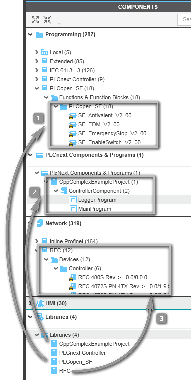
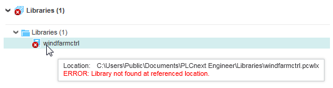

[Технологія PLCnext](README.md)

# Керування бібліотеками, імпортування/експортування  

## Добавлення існуючої бібліотеки

PLCnext Engineer підтримує такі типи бібліотек:

- Бібліотеки IEC 61131-3, що містять POU і типи даних. Ці бібліотеки IEC можуть бути означеними користувачем бібліотеками, які були випущені з іншого проекту PLCnext Engineer, або бібліотеками мікропрограм, наданими виробником пристрою (так звані системні бібліотеки). Бібліотека може містити POU, пов’язані з безпекою. Тип даних, означений користувачем, має бути визначений лише один раз на аркушах типів даних проекту. Однак у включених бібліотеках допускається ідентичне означення типу даних (те саме ім’я). Це означає, що, беручи до уваги бібліотеки, можливе кілька означень одного типу даних.

- Бібліотеки компонентів PLCnext Technology, тобто бібліотеки, що не відповідають IEC 61131-3. Такі бібліотеки можуть містити програми, які запрограмовані не мовами IEC 61131-3, а мовами високого рівня, такими як C++ або C#. Вони були створені за допомогою відповідного плагіна в сторонньому інструменті програмування (наприклад, `Eclipse`). Бібліотека компонентів технології PLCnext містить POU програм, які можна створити у вузлі дерева PLANT «PLCnext», відповідні метадані, а також порти введення та виведення програм. Після створення екземпляра програми її порти можна призначити у списку даних вузла «PLCnext».

- бібліотеки пристроїв
- бібліотеки символів HMI 
- бібліотеки Automation Module

Щоб додати бібліотеку до свого проекту, виконайте такі дії:

1. В області COMPONENTS клацніть правою кнопкою миші папку `Libraries` в категорії `Libraries` та виберіть

    - `Add User Library`, щоб включити бібліотеку, означену користувачем, яка була випущена з іншого проекту PLCnext Engineer,
    -  `Add Library`, щоб додати бібліотеку, надану виробником пристрою.

    Щоб додати бібліотеку, пов’язану з безпекою, ви повинні увійти в зону безпеки.

2. У діалоговому вікні, що з’явиться, знайдіть бібліотеку (файл `*.pcwlx`), яку потрібно додати до проекту, і натисніть `Open`.

При додаванні бібліотеки, пов'язаної з безпекою, компілятор перевіряє цілісність бібліотеки за допомогою її печатки. Бібліотека додається, лише якщо печатка правильна. Ця печатка (контрольна сума) була розрахована під час випуску пов’язаної з безпекою бібліотеки.

На рис. показано три приклади добавлення:

1) програмні елементи
2) компоненти
3) пристрої

Під час додавання бібліотек дотримуйтеся наступного:

- Бібліотеки потрібно додавати в рамках проекту, а не встановлення PLCnext Engineer.
- Файли бібліотеки мають розширення `*.pcwlx`.
- Після вставки в папці `Libraries` відображається назва доданої бібліотеки. Фактичний вміст автоматично сортується у відповідній категорії (POU, пристрої або символи HMI та зображення HMI). Дивіться приклади нижче.
- Спливаюча підказка на значку/назві бібліотеки в папці  `Libraries` показує розташування (повний шлях) і дату створення файлу бібліотеки.
- Якщо бібліотеку неможливо завантажити з будь-якої причини, у папці  `Libraries` та бібліотеці, на яку посилається, відображається накладений значок помилки, як показано в наступному прикладі. Навівши курсор миші на вузол бібліотеки, ви отримаєте додаткову інформацію.

- Якщо постачальник бібліотеки забороняє посилатися на неї, вузол бібліотеки буде створено, але бібліотека не буде завантажена. Піктограма помилки (див. вище) і відповідна підказка вказують на причину невдалого імпорту.
- Під час додавання бібліотеки, випущеної як бібліотека HMI, яка містить символ HMI, який уже існує в проекті, символ HMI у випущеній бібліотеці ігнорується. (Відповідне повідомлення відображається в списку помилок у вікні MESSAGES ).
- Під час додавання бібліотеки, випущеної як бібліотека, пов’язана з безпекою, яка містить завантажуваний код функції C, пов’язаної з безпекою, PLCnext Engineer перевіряє дійсність сертифіката підпису для бібліотеки, пов’язаної з безпекою. Якщо сертифікат недійсний, на бібліотеку не можна посилатися, і вона відхиляється. Сертифікат підпису для бібліотеки, пов’язаної з безпекою, походить від кореневого сертифіката або інших проміжних сертифікатів. Кореневий сертифікат і проміжні сертифікати повинні бути присутніми в PLCnext Engineer (додано до списку сертифікатів підпису коду в діалоговому вікні 'Options' в категорії 'Administration | Trust Stores'), щоб сертифікат підпису був надійним. Якщо відповідні сертифікати недоступні в PLCnext Engineer, додати бібліотеку до проекту неможливо.

## Випуск власної бібліотеки

Крім (системних) бібліотек, що поставляються з PLCnext Engineer за замовчуванням, ви можете випускати власні бібліотеки, що містять означені користувачем елементи та об’єкти. Такі бібліотеки можна поширювати та використовувати в інших проектах PLCnext Engineer. PLCnext Engineer підтримує змішані користувацькі бібліотеки, які можуть містити комбінацію коду IEC 61131-3 (місцевого стандарту та/або пов’язаного з безпекою POU), локальних пристроїв, локальних символів і зображень HMI та модулів автоматизації. Також можна випустити лише один тип елемента як бібліотеку, наприклад, лише код або лише пристрої. Вибір частин (елементів) проекту, які потрібно опублікувати, виконується клацанням піктограм категорій у діалоговому вікні `Release As Libraries` (див. покрокову процедуру нижче).

Наступні кроки можливі лише в режимі програмування. 

1) Відкрийте проект, частини якого ви хочете випустити як бібліотеку.

2) Виберіть `File > Release As Library...`.

3) У діалоговому вікні `Release As Library` виберіть частини проекту (елементи), які потрібно включити, натиснувши відповідні значки на панелі інструментів діалогового вікна. Після активації піктограми відповідні типи відображаються в полі нижче. Для деяких пунктів можливі додаткові параметри або налаштування.

| Значок категорії                              | Значення                                                     |
| --------------------------------------------- | ------------------------------------------------------------ |
|   | Програмування: означені користувачем стандартні POU і типи даних, що використовуються у вашому проекті. Якщо вибрати цю категорію, усі локальні POU будуть додані до випущеної бібліотеки. У поточній версії неможливо включити або виключити певні POU. |
|       | Пристрої, які ви імпортували в проект за допомогою файлів опису пристроїв (*`.GSDML)`. Ці пристрої доступні в папці `Local`  категорії `Network` (область COMPONENTS). Шаблони пристроїв із уже налаштованими пристроями (доступні в папці `Local > Device  Templates`  у `Network`  в області COMPONENTS). Ви можете включити або виключити певні пристрої з бібліотеки, активувавши або дезактивувавши прапорець `Selection` відповідного пристрою в дереві нижче. |
|    | Об’єкти HMI: означені користувачем символи HMI та зображення HMI, які ви створили та додали до свого проекту, доступні в папці `Local` категорії `HMI` (область COMPONENTS). Ви можете включати/виключати певні символи/зображення з бібліотеки, активуючи/дезактивуючи прапорець `Selection`  для відповідного елемента в дереві нижче. |
|        | Означені користувачем POU, пов’язані з безпекою. Якщо вибрати цю категорію, усі локальні POU, пов’язані з безпекою, будуть додані до випущеної бібліотеки. У поточній версії неможливо включити або виключити певні POU. |
|  | Модулі автоматизації, які ви створили та додали до свого проекту, доступні в папці `Local` на `Automation Modules` (область COMPONENTS ). Якщо модулі автоматизації містять POU користувача поточного проекту, ці POU залишаються видимими в дереві, навіть якщо ви скасуєте позначку  `Programming`. |

4) Введіть значущу назву бібліотеки. Якщо ви не введете/не виберете шлях до каталогу для нового файлу бібліотеки, введене ім’я бібліотеки автоматично доповнюється шляхом до каталогу бібліотеки за замовчуванням. (Цей шлях за замовчуванням можна змінити в розділі `Extras > Options`, діалогова область  `Tool | Directories`)

5) За бажанням можна означити номер версії та ввести опис.

6) Лише для коду IEC (`Programming`  та/або `Safety`, вибране на панелі інструментів): за бажанням ви можете додати файли довідки (`*.chm`), які надають довідкову інформацію щодо POU бібліотеки, які будуть випущені. Для цього доступна діалогова область  `Help  file(s)`. Крім того, ви можете додати файли опису мови, які містять текст підказки та назви папок, надані для POU бібліотеки.

7) Лише для коду IEC (`Programming`  та/або `Safety`, вибране на панелі інструментів): Щоб захистити свої ноу-хау під час розповсюдження POU у бібліотеках, ви можете означити видимість кожного визначеного користувачем POU та типу даних. З цією метою дерево діалогових списків містить розкривний список у стовпці  `Visible`. За замовчуванням для кожного стандартного POU/типу даних встановлено значення `Visible`. POU, пристрої, об’єкти HMI та модулі автоматизації, пов’язані з безпекою, завжди видимі.

8) Лише якщо на панелі інструментів вибрано `Safety` і проект містить пов’язані з безпекою функціональні блоки C POU із завантажуваним функціональним кодом C: у діалоговому вікні  `Private key file` відображається текстове поле `Release As Libraries`. Тут потрібно вибрати файл закритого ключа (файл `.pfx`), який стосується сертифіката підпису коду, указаного в довіреному сховищі PLCnext Engineer. 

9) Установіть можливість розповсюдження вашої бібліотеки, вибравши запис із розкривного списку `Redistribution`. Таким чином ви вказуєте, чи зможе користувач вашої бібліотеки випустити свій проект як бібліотеку, якщо ваша бібліотека включена до нього.

10) Якщо той самий проект уже було випущено як бібліотеку, прапорець `Create new library ID` буде активним. Якщо позначено, ідентифікатор бібліотеки буде замінено новим ідентифікатором. Під час повторного випуску бібліотеки завжди обчислюється новий підпис (контрольна сума) для нової версії бібліотеки, незалежно від налаштування прапорця.

11) Нарешті, збережіть поточні налаштування, щоб зберегти їх для майбутніх випусків, натиснувши кнопку `Save & Close`, або натисніть кнопку `Release`, щоб створити бібліотеку. Потім вибрані частини проекту експортуються у файл бібліотеки `*.pcwlx` у каталозі, зазначеному вище.

Для POU, пов’язаних із безпекою, обчислюється контрольна сума, яка використовується для запечатування файлу бібліотеки. При вставці бібліотеки в проект компілятор перевіряє цілісність бібліотеки за допомогою цієї печатки. Зберігайте джерела інженерного проекту для подальших змін.

Створивши випущені бібліотеки з елементів, визначених користувачем, ви можете додати їх до іншого проекту PLCnext Engineer і використовувати їхній вміст у проекті.

## Імпортування та експортування

PLCnext Engineer надає можливість імпортувати POU IEC 61131 і типи даних.  У вас є кілька можливостей для імпорту та експорту даних у існуючий або порожній проект PLCnext Engineer і з нього. Доступ до всіх операцій імпорту та експорту здійснюється через  меню `File > Import` / `File >  Export`. 

Меню `File > Import` містить такі команди для імпорту даних проекту:

- `Import From Another Project` / `Import From PLCopen XML` Імпортуйте POU (програми, функціональні блоки та функції), типи даних і символи HMI та сторінки з іншого проекту PLCnext Engineer або з XML-файлу, сумісного з PLCopen (схема версії 1.01 або новішої)

- `Import AutomationML APC` Імпортуйте файл мови розмітки автоматизації. AutomationML — це відкритий стандарт, який означує формат даних на основі XML для обміну мережними та інженерними даними з іншими інженерними системами (наприклад, інструментами ECAD).

- `Import GSDML file(s)` / `Import FDCML File(s)` Додайте пристрої до області COMPONENTS, імпортувавши файли опису пристрою GSDML або файли опису пристрою FDCML.

- `Import IODD File(s)` Додайте пристрої IO-Link до області COMPONENTS, імпортувавши файли опису пристроїв IO.

Меню `File > Export` містить такі команди для експорту даних проекту:

- `Export AutomationML APC` Експортуйте проект у файл Automation Markup Language.