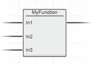

# POU

У даному розділі POU розглядаються без урахування використання в системах Safety.

POU (Program Organization Units) у проекті керуються в області COMPONENTS праворуч. У папці «Local» категорії «Programming» можна додавати, видаляти, перейменовувати та переміщувати POU, а також відкривати POU для редагування.

Відповідно до стандарту IEC 61131-3 доступні такі три типи POU:

- Функція (FU)
- Функціональний блок (FB)
- Програма (Program).

Означений користувачем POU має бути означено лише один раз у межах проекту. Однак тип POU з такою ж назвою дозволений у включених бібліотеках. Це означає, що з урахуванням бібліотек можливе кілька типів з однаковою назвою POU. Якщо POU з однаковою назвою означені в проекті та надані в бібліотеках, вони підлягають **ієрархії типів**. Завдяки включенню бібліотек створюються різні ієрархічні рівні, особливо якщо бібліотеки містять додаткові включені бібліотеки (вкладені посилання).

Кожен POU складається з частини декларації (таблиці змінних), що містить оголошення змінних, що використовуються в POU, і частини коду (один або **кілька** робочих аркушів коду), що містить інструкції для обробки.

Папка «Локальна» в категорії «Програмування» містить визначені користувачем програми та функції/функціональні блоки. Щоб упорядкувати визначені користувачем POU, ви можете додати щонайбільше 3 вкладені папки за допомогою контекстного меню. Цифра за назвою папки вказує на кількість POU, що міститься. POU можна просто переміщувати за допомогою перетягування між визначеними користувачем папками.

Порядок виконання аркушів коду в POU визначається їх розташуванням у групі редактора. Число лише для читання в квадратних дужках, призначене назві (заголовку) аркуша, вказує на порядок виконання аркуша відносно інших аркушів.

Щоб змінити порядок виконання робочих аркушів коду в POU, перетягніть потрібний робочий аркуш і опустіть його на робочий аркуш, перед яким він має бути виконаний (номер у квадратних дужках, що вказує на порядок виконання, адаптується автоматично).


EN/ENO дозволяє додаткове умовне виконання функцій і функціональних блоків відповідно до стандарту IEC 61131-3. EN — вхідний параметр дозволу, ENO — формальний параметр вихідного сигналу дозволу.

Під час оголошення змінних формальних параметрів для POU порядок оголошень у таблиці змінних визначає порядок появи Fu/FB у коді (у символі блоку або в ST список параметрів). Використовуючи піктограми «Move up/down» на панелі інструментів таблиці змінних, ви можете змінити порядок формальних параметрів блоку в коді. 

## Функція (Fu)

Функція — це POU з кількома вхідними параметрами та тільки з одним вихідним параметром (повернене значення). Виклик функції з однаковими значеннями завжди повертає той самий результат. Повернуті значення можуть мати простий тип даних. У межах функції можна викликати іншу функцію, але не функціональний блок чи програму. Рекурсивні виклики заборонені.

Для кожної функції необхідно встановити тип даних, що повертається. Це робиться за допомогою редактора «Signature» (див. рис. нижче).

Щоб додати функцію POU, клацніть правою кнопкою миші папку «COMPONENTS | Програмування > Локальне > Функції та функціональні блоки» (або будь-яку вкладену папку) і виберіть команду контекстного меню «Додати функцію».


**Доступ на запис** для введення формальних параметрів функцій можна дозволити, установивши опцію компілятора «Allow write on variables with usage input». Виберіть «Extras > Options» та відкрийте категорію «Compiler | IEC Compiler Settings» і встановіть відповідний прапорець.

**Примітка** Визначені користувачем POU, пов’язані з безпекою, не підтримуються. Можна використовувати лише пов’язані з безпекою функції з включених бібліотек.

У ST **виклик функції** в основному має такий синтаксис:

```
OutVariable := functionName(InVar1, InVar2);
```

Назви необхідних вхідних змінних зазначаються (у дужках) після імені функції. Повернене значення функції (результат) присвоюється вихідній змінній.

У FBD/LD назва функції вказується в символі функції.



Колір блоку та піктограма у верхньому лівому куті символу вказують на походження функції (створена локально, міститься в бібліотеці користувача або системній бібліотеці). 

У робочих аркушах коду, пов’язаних із безпекою, запрограмованих у SNOLD (мережевий план безпеки), бібліотечні функції відображаються жовтою піктограмою блоку:


## Функціональний блок (FB)

**Функціональний блок** — це POU з кількома параметрами введення/виведення та внутрішньою пам’яттю. Значення, яке повертає функціональний блок, залежить від значення його внутрішньої пам’яті. У функціональному блоці можна викликати інший функціональний блок або функції, але не програму. Рекурсивні виклики заборонені.

Щоб викликати функціональний блок в іншому функціональному блоці або програмі, екземпляр викликаного FB з унікальним іменем екземпляра має бути створений і оголошений у викликаючому POU. Оголошення екземпляра необхідно додати до таблиці змінних (безпосередньо або під час редагування коду). У таблиці змінних кожен екземпляр FB має власну декларацію, яка складається з унікального імені екземпляра FB, назви функціонального блоку та ключового слова оголошення («Usage») «Local».

**Об’єктно-орієнтовані функціональні блоки**: відповідно до IEC-61131-3, 3-е видання, підтримуються об’єктно-орієнтовані функціональні блоки. Додаючи метод до визначеного користувачем функціонального блоку, функціональний блок визначається як об’єктно-орієнтований функціональний блок. 

Ви можете створити FB користувача, пов’язані з безпекою, у категорії «Programming» області COMPONENTS для програми, пов’язаної з безпекою, якщо в проекті доступний Safety PLC.

Safety-related C Function Blocks (CFB) можуть бути створені для реалізації пов’язаних із безпекою (завантажуваних) функцій C. (У PLCnext Engineer функції C завжди представлені як CFB.) CFB не мають видимого аркуша коду. Натомість у них є редактор конфігурації, де ви повинні вказати функцію C, яку потрібно викликати, за її ідентифікатором, необхідний розмір стека тощо. Після створення та визначення CFB їх можна випустити як бібліотеку Safety IEC, яку потім можна включити в інші проекти. Додавання CFB до проекту як бібліотеки безпеки є обов’язковим. Неможливо створити CFB у проекті та створити їх безпосередньо в програмі безпеки або у FB.


У таблиці змінних POU, що викликає, має бути оголошено ім’я екземпляра. У наступному прикладі DrainCheck_1 — це ім’я екземпляра DrainCheck FB.


**Виклик функціонального блоку** в ST в основному має такий синтаксис:

```
instance(invar1:=1, invar2:=2, in_out_var:=MyVariable);    
a:= instance.outvar1;
```

Інший варіант:

```
instance(invar1 := 1, invar2:=2, outvar1 => a, in_out_var:=MyVariable);
```

У цьому прикладі FB з іменем екземпляра "instance" викликається з його вхідними параметрами "invar1" і "invar2" (кожному з присвоєним значенням). FB повертає результат у формі вихідної змінної 'outvar1'. У нашому прикладі виклику значення результату зберігається в змінній 'a'.

Формальний параметр 'in_out_var' читається та записується FB. У таблиці локальних змінних FB це оголошено з 'Usage = InOut'. Зауважте, що вхідний/вихідний формальний параметр не є «реальною змінною», а є посиланням на іншу змінну. Його можна порівняти з покажчиком, який вказує на адресу іншої змінної. Таким чином, у вхідних/вихідних параметрах дозволені лише змінні, але не константи чи літерали.

Текстова мова ST наразі не підтримується для FB, пов’язаних із безпекою. Замість цього використовуйте пов’язаний із безпекою графічний редактор SNOLD.

У FBD/LD/NOLD/SNOLD ім’я екземпляра функціонального блоку вказується над символом, а ім’я типу функціонального блоку – у символі блоку. Колір блоку та значок у верхньому лівому куті символу вказують на походження функціонального блоку (створений локально, міститься в бібліотеці користувача або системній бібліотеці).


У робочих аркушах коду, пов’язаних із безпекою, запрограмованих у SNOLD (мережевий план безпеки), екземпляри FB відображаються жовтою піктограмою блоку:


## Програма (Program)

Програма POU зазвичай містить логічну комбінацію викликів функцій/функціональних блоків. Програми мають внутрішню пам'ять. Програми не можна викликати з інших POU. Програма повинна бути створена в завданні (task), щоб її можна було виконати. Програми, які не створені в жодному завданні, не виконуються під час запуску програми контролера.

Програма виконується, лише якщо її екземпляр створено. Створення екземпляра програми, не пов’язаної з безпекою, має виконуватися шляхом призначення її завданням у редакторі «Tasks and Events». 

