[Розширені функції та функціональні блоки](../README.md)

# Функціональні блоки Ethernet

Функціональні блоки для зв’язку Ethernet використовуються для обміну даними між пристроями Ethernet за допомогою протоколів User Datagram Protocol (UDP), Transmission Control Protocol (TCP) і Transport Layer Security (TLS). Про протоколи TCP та UDP Ви можете почитати [в цій лекції](https://pupenasan.github.io/cmputernetwork/lec/7.html).

## TCP/TLS

TCP (Transmission Control Protocol) — це протокол, орієнтований на підключення, який дозволяє надсилати та/або отримувати потоки даних між двома кінцевими точками через мережеве з’єднання. Орієнтований на з’єднання означає, що перед обміном даними спочатку між комунікаційними партнерами має бути встановлено з’єднання. Під час обміну даними з'єднання залишається відкритим. Після завершення обміну даними з'єднання потрібно закрити. TCP включає перевірку помилок і гарантує повну доставку даних, включаючи порядок, у якому було надіслано пакети.

TLS (Transport Layer Security) — це криптографічний протокол, який забезпечує безпечний зв’язок між партнерами по зв’язку в мережі. Протокол TLS працює поверх протоколу TCP. 

Обидва протоколи реалізовані через наступні функціональні блоки, які детально описані за посиланням: 

| Функція                           | Короткий опис                                                |
| --------------------------------- | ------------------------------------------------------------ |
| [TLS_SOCKET_2](TLS_SOCKET_2.md)   | Відкриває та закриває сокет TCP або TLS та ініціалізує зв’язок |
| [TLS_SEND_2](TLS_SEND_2.md)       | Відправляє дані через TCP/TLS                                |
| [TLS_RECEIVE_2](TLS_RECEIVE_2.md) | Отримує дані з TCP/TLS                                       |

### Короткий опис блоків

Функціональний блок `TLS_SOCKET_2` поєднує обробку TCP і TLS. Його вхідний параметр `START_TLS` вказує чи ініціалізувати та використовувати протокол TLS поверх TCP чи використовується чистий TCP. Функціональний блок може працювати як в режимі клієнта так і сервера. Як сервер він може спілкуватися з кількома клієнтами TCP/TLS. 

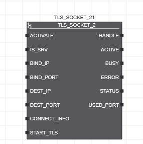

На виході `HANDLE`  формуються  ідентифікатори сокетів (дескриптори), створені `TLS_SOCKET_2`, які в подальшому використовуються функціональними блоками `TLS_SEND_2` і `TLS_RECEIVE_2`. По передньому фронту на вході `ACTIVATE` система починає відкривати сокет TCP/TLS. Після відкриття сокета та успішного встановлення з’єднання вихід `ACTIVE` встановлюється в `TRUE`. Лише коли `ACTIVE = TRUE`, дескриптор сокета, наданий на виході `HANDLE`, можна використовувати для наступних викликів функціональних блоків `TLS_SEND_2/TLS_RECEIVE_2`. По здньому фронту сигналу входу `ACTIVATE` система закриває сокет. Сокет залишається відкритим, поки вхід `ACTIVATE=TRUE`.  

Вихід `BUSY` встановлюється в `TRUE` тоді, коли вхід `ACTIVATE` має значення `TRUE`, а сокет все ще не відкритий. Якщо вхід `ACTIVATE` перемикається в `FALSE`, сокет закривається, а вихід `ACTIVE` встановлено в `FALSE` . Якщо з'єднання втрачено, функціональний блок намагається відновити з'єднання, поки `ACTIVATE = TRUE`.

Вхід `START_TLS` означує, чи функціональні блоки `TLS_SEND_2/TLS_RECEIVE_2` надсилають і отримують дані через чисте з’єднання TCP чи через з’єднання TLS.  Вхідні дані `SEND_SECURE/RECEIVE_SECURE` функціональних блоків мають відповідати значенню `START_TLS`. Коли з’єднання встановлено з переднім фронтом на `START_TLS` ініціалізується протокол TLS, тобто існуюче з’єднання TCP оновлюється до з’єднання TLS. Поки `START_TLS = TRUE`, дані надсилаються й отримуються через захищене з’єднання TLS. Для ініціалізації протоколу TLS використовуються дані, застосовані на вході `CONNECT_INFO` при активації функціонального блоку. Попередньо означена структура на вході `CONNECT_INFO` містить, серед іншого, сертифікати клієнта та сервера, що містяться в довіреному сховищі та сховищі ідентифікаційних даних пристроїв, які використовуються для автентифікації. 

Якщо `IS_SRV` = `TRUE`, функціональний блок створює прослуховуючий (серверний) сокет. Сокет може бути прив’язаний до вказаного локального адаптера Ethernet (вхід `BIND_IP`) і порту (вхід `BIND_PORT`) і очікує на вхідні запити від віддалених клієнтів. За потреби кількість прийнятих клієнтів можна обмежити, вказавши входи `DEST_IP/DEST_PORT`. Якщо `IS_SRV = FALSE`, створюється клієнтський сокет. У випадку клієнтського сокета входи `DEST_IP/DEST_PORT` використовуються для вказівки IP-адреси та IP-порту сервера для зв’язку.

Деталі описані в розділі [TLS_SOCKET_2](TLS_SOCKET_2.md).

Функціональний блок `TLS_SEND_2` використовується для надсилання даних через TCP або TLS через відкритий сокет функціональним блоком `TLS_SOCKET_2`.

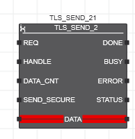

Після відкриття сокета та встановлення з’єднання функціональний блок надсилає дані комунікаційному партнеру через TCP або TLS. Тип підключення залежить від значення входу `START_TLS` функціонального блоку `TLS_SOCKET_2`: при `START_TLS = FALSE` - чисте з’єднання TCP, при `START_TLS = TRUE` - TLS.

Кожна операція передачі ініціюється переднім фронтом на вході запиту `REQ`. Під час цього циклу функціональний блок копіює дані для надсилання (застосовуються до вхідних даних `DATA`) у внутрішній буфер. Поки дані надсилаються з внутрішнього буфера вихід `BUSY` встановлено в `TRUE`. 

Якщо з’єднання розірвано та партнера по зв’язку неможливо досягти, вихід `ERROR` встановлюється на `TRUE` протягом одного циклу. Відповідний код помилки надається на виході `STATUS` протягом цього циклу.

Після успішного надсилання даних `DONE = TRUE` на один цикл.

Деталі описані в розділі [TLS_SEND_2](TLS_SEND_2.md)

Функціональний блок `TLS_RECEIVE_2` використовується для отримання даних через TCP або TLS відкритого за допомогою функціонального блоку `TLS_SOCKET_2` .

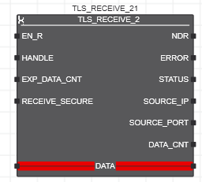

Після відкриття сокета та встановлення з’єднання функціональний блок отримує дані від партнера по зв’язку через чисте з’єднання TCP або захищене з’єднання TLS. Тип підключення залежить від значення входу `START_TLS` функціонального блоку `TLS_SOCKET_2`. 

Якщо вхід `EN_R` має значення `TRUE`, функціональний блок очікує дані на вході. Якщо дані були успішно отримані, вихід `NDR` встановлюється в `TRUE` для кожного циклу, у якому вказаний обсяг даних було скопійовано до буфера `DATA`. Якщо нових даних не отримано, `NDR` має значення `FALSE`.

Пристрій, з якого надходять дані, вказується на виходах `SOURCE_IP` (IP-адреса пристрою-відправника) і `SOURCE_PORT` (номер порту пристрою-відправника).

Вхід `EXP_DATA_CNT` вказує на кількість байтів даних, які очікується отримати. Якщо значення більше за 0, лише зазначена кількість байтів копіюється до змінної, підключеної до буфера `DATA`. Якщо значення дорівнює 0, усі дані, отримані після останнього виклику, копіюються до змінної, пов’язаної з буфером  `DATA` (кількість скопійованих байтів обмежена розміром підключеної змінної). Вихід `DATA_CNT` відповідно вказує на кількість отриманих байт (на один цикл). Ви можете використовувати функцію `SIZEOF`, щоб визначити розмір змінної (кількість байтів, зарезервованих для змінної в пам’яті контролера).

Деталі описані в розділі [TLS_RECEIVE_2](TLS_RECEIVE_2.md)

### Приклад створення простого TCP-клієнта

У даному прикладі в якості сервера використовується програма, написана Node-RED. У якості альтернативи можна також використати безкоштовну утиліту [Packet Sender](https://packetsender.com/) (або аналогічну), яка не потребує програмування. Зауважте, що для Packet Sender треба ставити опцію  `Persisten Connection` інакше з'єднання буде розриватися після отримання даних. 

Приклад можна використовувати для тестування на емуляторі ПЛК, при цьому треба вказати реальний IP комп'ютера де буде запущений Node-RED (або Packet Sender), навіть якщо це буде той самий ПК, де виконується емулятор ПЛК. 

У прикладі програма в PLCnext пересилає дані зі структурної змінної типу `TOSEND` на Node-RED і отримує у відповідь значення змінної типу `TORCV`. Типи мать бути створені в проекті PLCnext та описані нижче.   

```pascal
TYPE
    TOSEND : STRUCT
        int1 : INT;
        real1: REAL:=0.0;
    END_STRUCT
    TORCV : STRUCT
        int1 : INT;
        int2 : INT;
        real1: REAL:=0.0;
        real2: REAL:=0.0;        
    END_STRUCT    
END_TYPE
```

Сервер в Node-RED реалізований через два вузли:

- `tcp in`, який прослуховує порт 5556 та сприймає усі вхідні дані як потік байт (Buffer), 
- та `tcp out`, який відповідає клієнту.  

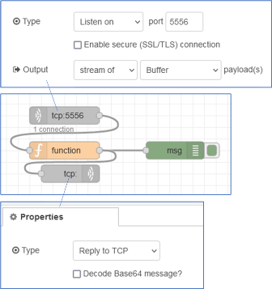

Між  `tcp in` та  `tcp out` є функція, яка обробляє вхідні дані та за певною логікою формує на основі них вихідні значення. Нижче наведений код з коментарами:

```js
let bufferIn = Buffer.from (msg.payload);//зробити буфер з вхідних даних 
let bufferOut = Buffer.alloc(12,0x00);//виділити пам'ять на 12 байт 
//потік байт - в структуру 
msg.PLC_SEND = {
    int1 : bufferIn.readInt16LE(0),//0,1 байт як int 
    real1 : bufferIn.readFloatLE(4)};//4,5,6,7 байт як REAL 
//вихідна структура
msg.PLC_RCV = {
    int1 : msg.PLC_SEND.int1,
    int2 : msg.PLC_SEND.int1 + 10,
    real1 : msg.PLC_SEND.real1,
    real2 : msg.PLC_SEND.real1 + 10.0
}
//структуру - в потік байт
bufferOut.writeInt16LE(msg.PLC_RCV.int1, 0);
bufferOut.writeInt16LE(msg.PLC_RCV.int2, 2);
bufferOut.writeFloatLE(msg.PLC_RCV.real1, 4);
bufferOut.writeFloatLE(msg.PLC_RCV.real2, 8);
msg.payload = bufferOut;//на вихід потік байт
return msg;
```

Зауважте, що змінні в структурах PLCnext вирівнюються, тому вхідне повідомлення містить 2-й та 3-й байти порожні. Після реалізації програми на виході вузла `msg` буде повідомлення схоже на наведеному на рисунку нижче. 

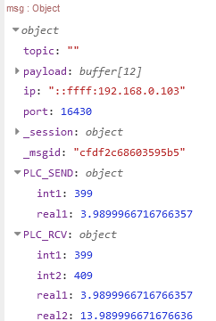

У PLCnext основна частина програми клієнта матиме вигляд: 

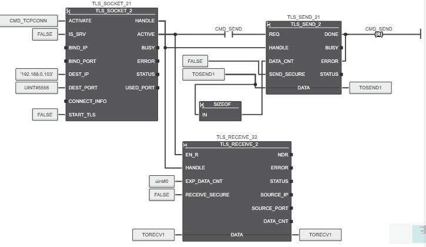

З'єднання ініціюється переднім фронтом `CMD_TCPCONN`. При цьому для `BIND` не вказується порт та IP, що передбачає використання усіх можливих інтерфейсів ПЛК та вільного з пулу клієнтського TCP-порта. TLS в цьому прикладі не задіюється, тому і `CONNECT_INFO` не потрібен. Коли `ACTVE=TRUE` передача даних ініціюється переднім фронтом `CMD_SEND`. Для вказівки кількості даних при передачі використовується функція `SIZEOF`.  Отримання даних очікується також при `ACTVE=TRUE`. При цьому довжина не вказується (`EXP_DATA_CNT = 0`), тому дані будуть повністю записані у виділену змінну `TORECV1`. 

Змінна `TOSEND1` має тип `TOSEND`, а  `TORECV1` - `TORECV`. Ці змінні змінюються через кожні 2 секунди і тоді ж встановлюється `CMD_SEND`, тоді як після передачі `CMD_SEND` скидається (див рис. вище вихід `DONE`). Фрагмент програми зміни змінних та  `CMD_SEND`:

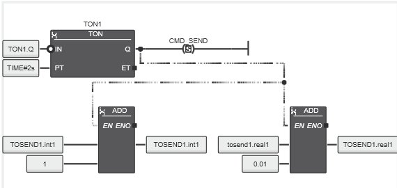 

Ініціювання підключення та перепідключення  реалізується за наступною логікою.

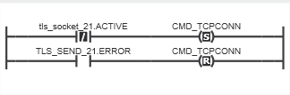

Слід зауважити що наведена вище програма є досить спрощеною. В реальних умовах можливо знадобиться детальніше аналізувати помилки та отримані результати з блоків.

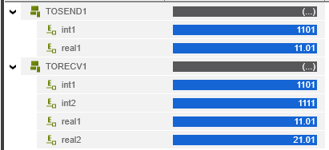

## UDP

UDP (User Datagram Protocol) — це мережевий протокол без підключення, який обмінюється так званими дейтаграмами між пристроями Ethernet, що підтримують UDP, без підтвердження. Без з’єднання означає, що немає необхідності спочатку встановлювати з’єднання перед надсиланням або отриманням дейтаграм. Відправник, наприклад, просто надсилає дейтаграму і не перевіряє, чи її отримав одержувач. Дейтаграма UDP складається з заголовка UDP, за яким слідують дані. Адресна інформація, тобто інформація про відправника та одержувача дейтаграми, міститься в заголовку UDP. Для зв’язку через UDP доступні такі функціональні блоки:

| Функція                           | Короткий опис                                           |
| --------------------------------- | ------------------------------------------------------- |
| [UDP_SOCKET_2](UDP_SOCKET_2.md)   | реалізація UDP-сокету з підтримкою ширкомовної передачі |
| [UDP_SEND_2](UDP_SEND_2.md)       | відправка по UDP                                        |
| [UDP_RECEIVE_2](UDP_RECEIVE_2.md) | отримання по UDP                                        |

UDP-сокет представлено вихідним параметром `HANDLE`. Цей дескриптор має бути направлено до функціональних блоків `UDP_SEND_2` і `UDP_RECEIVE_2`, яким потрібен дескриптор сокета для обміну даними з партнером по зв’язку. 

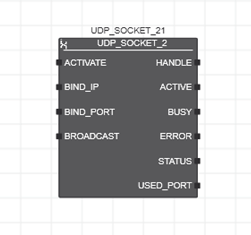

З наростаючим фронтом на вході `ACTIVATE` система починає відкривати сокет. Після відкриття сокета та успішного встановлення з’єднання вихід `ACTIVE` встановлюється в `TRUE`. Лише коли стане `ACTIVE = TRUE`, дескриптор сокета, наданий на виході `HANDLE`, можна використовувати для наступних викликів функціональних блоків `UDP_SEND_2/UDP_RECEIVE_2`. Сокет залишається відкритим до тих пір, поки вхід `ACTIVATE` має значення `TRUE`. Вихід `BUSY` встановлюється в `TRUE` у тому випадку, коли `ACTIVATE` має значення `TRUE`, а сокет все ще не відкритий. Як тільки сокет відкривається, `BUSY` встановлюється на `FALSE` і залишається `FALSE`, поки `ACTIVE = TRUE`.

IP-адресу та порт Ethernet-адаптера, який буде використовуватися для обміну даними, можна вказати за допомогою входів `BIND_IP` і `BIND_PORT`. Вхід `BROADCAST` керує тим, чи адресовано одного конкретного партнера зв’язку (`FALSE`) чи в широкомованому режимі (якщо застосовано `TRUE`). Якщо вхід `ACTIVATE` перемикається на `FALSE`, сокет закритий, а вихід `ACTIVE` встановлено на `FALSE`.

Функціональні блоки для зв’язку UDP обробляються асинхронно. Це означає, що функціональні блоки видають команди та чекають їх обробки. У разі гарячого чи холодного старту або скидання контролера мікропрограма закриває всі сокети, які були відкриті за допомогою відповідного екземпляра екземпляра `UDP_SOCKET_2`.

Функціональний блок  `UDP_SEND_2`  використовується для надсилання дейтаграми UDP. Перш ніж надсилати дані, UDP-сокет потрібно відкрити за допомогою функціонального блоку `UDP_SOCKET_2`.

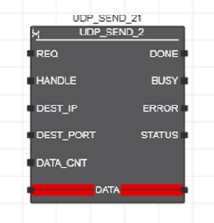

Кожна операція передачі ініціюється наростаючим фронтом на вході запиту `REQ`. Під час цього циклу функціональний блок копіює дані для надсилання (застосовуються до вхідних даних `DATA`) у внутрішній буфер. Вихід `BUSY` встановлено на `TRUE`, поки дані надсилаються з внутрішнього буфера. Якщо `BUSY = TRUE`, вхід `REQ` ігнорується. Передача нових даних, які доступні на вході `DATA` під час поточного циклу передачі, може бути ініційована лише за допомогою наростаючого фронту на вході `REQ`, якщо для виходу `BUSY` встановлено значення `FALSE`.

Якщо під час виконання функціонального блоку виникає помилка, вихід `ERROR` встановлюється в`TRUE` протягом одного циклу. Відповідний код помилки надається на виході `STATUS` протягом цього циклу.

Пристрій, на який мають бути надіслані дані, вказується за допомогою параметра `DEST_IP` (IP-адреса пристрою-одержувача) і параметра `DEST_PORT` (номер порту пристрою-одержувача).

Якщо відповідний сокет було створено з параметром `BROADCAST = TRUE` у функціональному блоці `UDP_SOCKET_2`, дані можна надсилати як широкомовну розсилку. Для цього `DEST_IP` має бути встановлено на широкомовну адресу `255.255.255.255`.

На рисунку ничже показаний приклад передачі активного реального часу ПЛК кожну секунду. Приклад можна протестувати на емуляторі ПЛК з використанням тестової програми [Packet Sender](https://packetsender.com/) (або аналогічної).

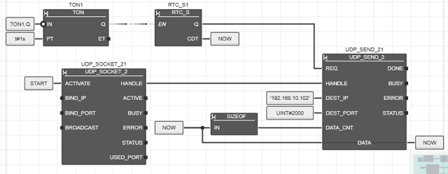