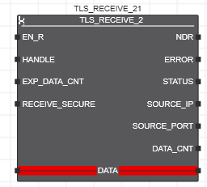

[Розширені функції та функціональні блоки](../README.md) -> [Ethernet](README.md)

# TLS_RECEIVE_2

Функціональний блок `TLS_RECEIVE_2` поєднує обробку TCP і TLS в одному FB. Крім того, він підтримує сервер TCP/TLS, який може спілкуватися з кількома клієнтами TCP/TLS. FB `TLS_RECEIVE_2` потрібно використовувати з FB `TLS_SEND_2` на основі сокета, створеного за допомогою FB `TLS_SOCKET_2`.

## Опис роботи

Функціональний блок використовується для отримання даних через TCP або TLS від TCP/TLS-сумісного пристрою Ethernet. Це робиться за допомогою TCP/TLS сокета. Перед отриманням даних сокет спочатку потрібно відкрити за допомогою функціонального блоку `TLS_SOCKET_2` .

Після відкриття сокета та встановлення з’єднання функціональний блок отримує дані від партнера по зв’язку через чисте з’єднання TCP або захищене з’єднання TLS. Тип підключення залежить від значення входу `START_TLS` функціонального блоку `TLS_SOCKET_2`:

- Якщо `START_TLS = FALSE`, функціональний блок використовує для отримання даних чисте з’єднання TCP.
- Якщо `START_TLS = TRUE`, функціональний блок отримує дані через захищене з’єднання TLS.

Функціональний блок забезпечує перевірку безпеки для визначення того, чи програма IEC очікує, що дані будуть отримані через з’єднання TCP чи через з’єднання TLS. Перевірка безпеки виконується шляхом порівняння значень входу `RECEIVE_SECURE` функціонального блоку та входу `START_TLS` FB `TLS_SOCKET_2`. Якщо виявлено невідповідність вхідних значень, наприклад, `RECEIVE_SECURE = TRUE` (програма IEC вимагає безпечного прийому даних) і `START_TLS = FALSE` (протокол TLS ще не ініціалізовано), вихід `ERROR` встановлюється на `TRUE`, а код помилки `16#C150` вказується на виході `STATUS`.

Якщо вхід `EN_R` (`EN_R` - ENable_Receive) має значення `TRUE`, функціональний блок отримує дані. Якщо дані були успішно отримані, вихід `NDR` (`NDR` = New Data Received) встановлюється в `TRUE` для кожного циклу, у якому вказаний обсяг даних було скопійовано до буфера `DATA`. Якщо `EN_R` все ще встановлено на `TRUE` і нові дані отримані в наступному циклі, `NDR` залишається `TRUE`, а нові дані копіюються до змінної, пов’язаної з параметром `DATA`. Якщо нових даних не отримано, `NDR` має значення `FALSE`.

Пристрій, з якого надходять дані, вказується на виходах `SOURCE_IP` (IP-адреса пристрою-відправника) і `SOURCE_PORT` (номер порту пристрою-відправника).

Сокет, відкритий функціональним блоком `TLS_SOCKET_2`, можна використовувати лише для наступних викликів функціонального блоку `TLS_RECEIVE_2`, якщо вихід `ACTIVE` функціонального блоку `TLS_SOCKET_2` має значення `TRUE`. Виклик функціонального блоку `TLS_RECEIVE_2`, коли `ACTIVE = FALSE`, викликає помилку у функціональному блоці `TLS_RECEIVE_2` (видається `ERROR = TRUE` і код `STATUS code =0xC210`).

Для контролерів із вбудованим брандмауером переконайтеся, що брандмауер не блокує порти, залучені до зв’язку. В іншому випадку з’єднання не вдасться встановити.

## Входи

| Назва          | Тип   | Призначення                                                  |
| -------------- | ----- | ------------------------------------------------------------ |
| EN_R           | BOOL  | При передньому фронті на вході `EN_R` (`EN_R = ENable_Receive`) починається прийом даних. Поки `EN_R = TRUE`, отримання даних можливе. |
| HANDLE         | DWORD | Дескриптор сокета, який було відкрито за допомогою функціонального блоку `TLS_SOCKET_2` (див. також примітки вище). Параметр оцінюється лише в циклі, у якому параметр `EN_R` перемикається на `TRUE`. |
| EXP_DATA_CNT   | UDINT | Кількість байтів даних, які потрібно отримати (`EXP_DATA_CNT` = EXPected DATA CouNT). Кількість байтів менше або дорівнює кількості байтів, наданих змінною, підключеною до буфера ` DATA`. Застосовується наступне: - Якщо значення більше за 0, лише зазначена кількість байтів копіюється до змінної, підключеної до буфера `DATA`. - Якщо вказана кількість байтів менша за отриману, ці байти додаються до вже отриманих байтів у змінній, підключеній до буфера `DATA`. Вихід `DATA_CNT` відповідно збільшується. Якщо отримано байти `EXP_DATA_CNT`, для вихідного звіту `NDR` встановлюється значення `TRUE`. В іншому випадку необхідні подальші виклики цього екземпляра для отримання всіх очікуваних даних. - Якщо отримано більше ніж указану кількість байтів, лише `EXP_DATA_CNT` байтів копіюються до змінної, підключеної до буфера `DATA`. Вихід `DATA_CNT` відповідно збільшується, а `NDR` встановлюється на `TRUE`. Байти, що залишилися (отримані, але ще не скопійовані), можуть бути прочитані наступними викликами екземпляра. - Якщо значення дорівнює 0, усі дані, отримані після останнього виклику, копіюються до змінної, пов’язаної з буфер  `DATA` (кількість скопійованих байтів обмежена розміром підключеної змінної). Вихід `DATA_CNT` відповідно збільшується. Якщо один або більше байтів отримано (`DATA_CNT>0`), вихідний NDR встановлюється на `TRUE`. Параметр оцінюється лише в циклі, у якому параметр `EN_R` перемикається на `TRUE`. Ви можете використовувати функцію `SIZEOF`, щоб визначити розмір змінної (кількість байтів, зарезервованих для змінної в пам’яті контролера). |
| RECEIVE_SECURE | BOOL  | Означує, чи програма IEC очікує, що дані будуть отримані через з’єднання TCP чи через з’єднання TLS.  `TRUE`: програма очікує отримання даних через з’єднання TLS. ` FALSE`: програма очікує отримання даних через TCP-з’єднання Вхідне значення порівнюється зі значенням `START_TLS` введення FB `TLS_SOCKET_2`. Якщо виявлено невідповідність вхідних значень, наприклад, `RECEIVE_SECURE = TRUE` (програма IEC вимагає безпечного прийому даних) і `START_TLS = FALSE` (протокол TLS ще не ініціалізовано), вихід `ERROR` встановлюється на `TRUE`, а код помилки  на виході `STATUS` вказується `16#C150`.  |

## Входи/виходи

| Назва | Тип  | Призначення                                                  |
| ----- | ---- | ------------------------------------------------------------ |
| DATA  | ANY  | Буфер даних, який містить отримані дані. Дані передаються у вигляді потоку байтів. Перетворення Little-/Big-Endian не відбувається. Якщо типом даних підключеної змінної є `STRUCT` (або `ARRAY OF STRUCT`), змінна в пам’яті контролера може містити байти заповнення, які слід враховувати у вхідному потоці даних. |

## Виходи

| Назва       | Тип    | Призначення                                                  |
| ----------- | ------ | ------------------------------------------------------------ |
| NDR         | BOOL   | `NDR` (Отримано нові дані) встановлюється на `TRUE` протягом одного циклу після успішного отримання даних. Ви можете лише оцінити успішність передачі протягом циклу, якщо `NDR = TRUE`. Якщо `NDR` має значення `TRUE`, наступний виклик (якщо було отримано кілька байтів) перезапише `DATA` (`NDR` може знову мати значення `TRUE`). Якщо `NDR` має значення `FALSE`, наступний виклик (якщо було отримано кілька байтів) додасть отримані байти до `DATA`. `DATA_CNT` буде відповідно збільшено. Якщо очікувану кількість байтів досягнуто, `NDR` матиме значення `TRUE` |
| ERROR       | BOOL   | Якщо виникає помилка, вихід `ERROR` встановлюється на `TRUE`. Відповідний код помилки вказується на виході `STATUS`.  |
| STATUS      | WORD   | Надає код помилки у разі помилки (`ERROR = TRUE`) або поточний стан функціонального блоку (`ERROR = FALSE`). Коди помилок починаються з `16#Cxxx`, а коди стану - з `16#8xxx`. |
| SOURCE_IP   | STRING | IP-адреса пристрою, з якого були отримані дані. У разі помилки зберігається остання дійсна IP-адреса. Рядок містить адресу IPv4, яка складається з чотирьох чисел (від `0` до `255`), розділених крапкою. |
| SOURCE_PORT | UINT   | Номер порту пристрою, з якого були отримані дані. У разі помилки зберігається останній дійсний номер порту. |
| DATA_CNT    | UDINT  | Кількість успішно отриманих байтів. Кількість байтів менше або дорівнює кількості байтів, наданих змінною, підключеною до буфера `DATA`. Параметр має бути оцінений у циклі, у якому `NDR = TRUE`.  Ви можете використовувати функцію `SIZEOF`, щоб визначити розмір змінної (кількість байтів, зарезервованих для змінної в пам’яті контролера). |