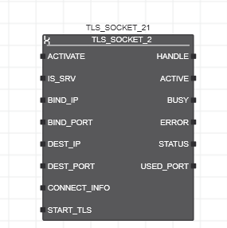

[Розширені функції та функціональні блоки](../README.md) -> [Ethernet](README.md)

# TLS_SOCKET_2

Функціональний блок `TLS_SOCKET_2` поєднує обробку TCP і TLS в одному FB, тобто його вхідні параметри вказують, чи ініціалізується та використовується поверх TCP протокол TLS. Крім того, він підтримує сервер TCP/TLS, який може спілкуватися з кількома клієнтами TCP/TLS. Ідентифікатори сокетів, створені за допомогою FB `TLS_SOCKET_2` використовуються з функціональними блоками `TLS_SEND_2` і `TLS_RECEIVE_2`

## Опис роботи

Функціональний блок відкриває та закриває сокет TCP/TLS. (Протокол TLS працює поверх TCP). Цей сокет можна використовувати як для стандартного TCP-зв’язку, так і для безпечного IP-зв’язку між сервером і клієнтом через Transport Layer Security (TLS).

Сокет TCP/TLS представлено вихідним параметром `HANDLE`. Цей дескриптор сокета має бути передано функціональним блокам `TLS_SEND_2` і `TLS_RECEIVE_2`, які потребують дескриптора сокета для (безпечного) обміну даними з партнером по зв’язку.

Під час впровадження сервера TCP/TLS, який може спілкуватися з кількома клієнтами TCP/TLS, для кожного клієнта, до якого потрібно підключитися, потрібно створити один екземпляр `TLS_SOCKET_2` (з `IS_SRV = TRUE`). У цьому сценарії клієнти підключаються до відповідного екземпляра/`HANDLE TLS_SOCKET_2`, як зазначено в `DEST_IP/DEST_PORT`.

По передньому фронту на вході `ACTIVATE` система починає відкривати сокет TCP/TLS. Після відкриття сокета та успішного встановлення з’єднання вихід `ACTIVE` встановлюється в `TRUE`. Лише коли `ACTIVE = TRUE`, дескриптор сокета, наданий на виході `HANDLE`, можна використовувати для наступних викликів функціональних блоків `TLS_SEND_2/TLS_RECEIVE_2`.

По здньому фронту на вхід `ACTIVATE` система закриває сокет. З’єднання завершується у формі тристороннього рукостискання, тобто між клієнтом і сервером обмінюються трьома телеграмами. Під час процесу завершення новий передній фронт призводить до помилки функціонального блоку.

Якщо `ACTIVE = FALSE`, виклик функціональних блоків `TLS_SEND_2/TLS_RECEIVE_2` за допомогою дескриптора сокета викликає помилку у функціональних блоках. Сокет залишається відкритим, поки вхід `ACTIVATE=TRUE`. Вихід `BUSY` встановлено в `TRUE`, тоді коли вхід `ACTIVATE` має значення `TRUE`, а сокет все ще не відкритий. Якщо вхід `ACTIVATE` перемикається в `FALSE`, сокет закривається, а вихід `ACTIVE` встановлено в `FALSE` (див. також примітки нижче). Якщо з'єднання втрачено, функціональний блок намагається відновити з'єднання, поки `ACTIVATE = TRUE`.

Функціональні блоки для зв'язку TCP/TLS обробляються асинхронно. Це означає, що функціональні блоки видають команди та чекають їх обробки.

Кількість сокетів, які наразі відкриті, відображаються в системній змінній `TLS_ACTIVE_SOCKETS` (міститься у списку даних вузла контролера та вузла «IEC 61131-3» у PLANT).

У разі гарячого старту або холодного старту або скидання контролера, мікропрограма закриває всі сокети, які були відкриті за допомогою відповідного екземпляра `TLS_SOCKET_2`.

Для контролерів із вбудованим брандмауером переконайтеся, що брандмауер не блокує порти, залучені до зв’язку. В іншому випадку з’єднання не вдасться встановити.

**TLS поверх TCP**

Вхід `START_TLS` означує, чи функціональні блоки `TLS_SEND_2/TLS_RECEIVE_2` надсилають і отримують дані через чисте з’єднання TCP чи через з’єднання TLS. У типовому випадку використання FB `TLS_SOCKET_2` коли вхід `ACTIVATE` стає `TRUE` вхід `START_TLS` також `TRUE` . У рідкісних ситуаціях, як для SMTP, вхід `START_TLS` отримує передній фронт, тоді як `ACTIVATE` має значення `TRUE`. Якщо після встановлення з’єднання `START_TLS = FALSE`, функціональні блоки `TLS_SEND_2/TLS_RECEIVE_2` використовують з’єднання TCP для надсилання та отримання даних.

Вхідні дані `SEND_SECURE/RECEIVE_SECURE` функціональних блоків мають відповідати значенню `START_TLS`. Коли з’єднання встановлено з переднім фронтом на `START_TLS` ініціалізується протокол TLS, тобто існуюче з’єднання TCP оновлюється до з’єднання TLS. Поки `START_TLS = TRUE`, дані надсилаються й отримуються через захищене з’єднання TLS.

Для ініціалізації протоколу TLS використовуються дані, застосовані на вході `CONNECT_INFO` при активації функціонального блоку. Попередньо означена структура на вході `CONNECT_INFO` містить, серед іншого, сертифікати клієнта та сервера, що містяться в довіреному сховищі та сховищі ідентифікаційних даних пристроїв, які використовуються для автентифікації (див. нижче опис значень `CONNECT_INFO` та способів керування та зв’язування сертифікатів у веб-керування (WBM) контролера).

**Функціональність як кілєнта або сервера**

Вхід `IS_SRV` означує, чи функціональний блок реалізує функціональність сервера чи клієнта.

Якщо `IS_SRV` = `TRUE`, функціональний блок створює прослуховуючий (серверний) сокет. Сокет може бути прив’язаний до вказаного локального адаптера Ethernet (вхід `BIND_IP`) і порту (вхід `BIND_PORT`) і очікує на вхідні запити від віддалених клієнтів. За потреби кількість прийнятих клієнтів можна обмежити, вказавши входи `DEST_IP/DEST_PORT`. З відкритим (серверним) сокетом можливі лише з’єднання `1:1`, тобто прослуховуючий сокет може приймати лише одне вхідне з’єднання TLS. Під час реалізації сервера TCP/TLS, який може спілкуватися з кількома клієнтами TCP/TLS, один виділений екземпляр `TLS_SOCKET_2` має використовуватися для кожного очікуваного клієнта.

Якщо `IS_SRV = FALSE`, створюється клієнтський сокет. У випадку клієнтського сокета входи `DEST_IP/DEST_PORT` використовуються для вказівки IP-адреси та IP-порту сервера для зв’язку.

## Входи

| Назва        | Тип         | Призначення                                                  |
| ------------ | ----------- | ------------------------------------------------------------ |
| ACTIVATE     | BOOL        | Функціональний блок починає відкривати сокет TCP/TLS, коли на вході виявляється передній фронт. Сокет залишається відкритим, поки вхід `ACTIVATE` приходить значення `TRUE`. Задній фронт викликає закриття сокету. Якщо партнер по спілкуванню закриває з’єднання, коли на вхід `ACTIVATE` залишається `TRUE`, тоді FB спробує встановити нове з’єднання. Оскільки закриття сокета займає деякий час (тристороннє рукостискання між клієнтом і сервером), наступний передінй фронт слід застосувати до `ACTIVATE` тільки після того, як виходи `ACTIVE` і `BUSY` обидва `FALSE`. Інакше, якщо зроблено запит на нове з’єднання, коли завершення попереднього сокета ще не завершено, виникає помилка та на виході `STATUS` відображається  код помилки `16# C205` . |
| IS_SRV       | BOOL        | Вказує, чи функціональний блок реалізує функціональні можливості сервера чи клієнта:  `TRUE`: функціональний блок створює прослуховуючий (серверний) сокет. Під час реалізації сервера TCP/TLS, який може спілкуватися з кількома клієнтами TCP/TLS , `S_SRV` має бути встановлено на `TRUE` для кожного екземпляра `TLS_SOCKET_2`, пов’язаного з цим сервером.  `FALSE`: функціональний блок створює клієнтський сокет. |
| BIND_IP      | STRING      | Якщо `IS_SRV = TRUE`: цей параметр означує IP-адресу контролера, на якому сервер прослуховує вхідні з’єднання. Клієнти, які хочуть підключитися до цього сервера, повинні вказати ту саму IP-адресу як свій `DEST_IP`. Якщо цей рядок порожній (= початкове значення параметра) або містить значення `0.0.0.0`, сервер прослуховує кожен адаптер Ethernet контролера.  Якщо `IS_SRV = FALSE`: у цьому випадку параметр необов’язковий. Якщо вказано, він означує, який адаптер Ethernet контролера використовується для встановлення зв’язку. В іншому випадку (якщо порожній або містить значення `0.0.0.0`), контролер вибирає відповідний адаптер Ethernet за допомогою параметра `DEST_IP`. Функціональний блок оцінює цей параметр лише в циклі задачі, в якому виявлено наростаючий фронт на `ACTIVATE` . |
| BIND_PORT    | UINT        | Означує номер локального порту, до якого прив’язаний створений сокет (необхідно для налаштування серверів TCP/TLS). Вибраний номер порту використовується сервером TCP/TLS для вхідних даних. Клієнти, які хочуть підключитися до цього сервера, повинні вказати той самий номер порту, що й `DEST_PORT`. Якщо значення дорівнює `0` (= початкове значення параметра), стек призначає тимчасовий порт.Функціональний блок оцінює цей параметр лише в циклі задачі, у якій виявлено наростаючий фронт на вході `ACTIVATE`. |
| DEST_IP      | STRING      | Залежно від того, чи функціональний блок реалізує функції сервера чи клієнта (встановлюється за допомогою вхідних даних `IS_SRV`), вхідні дані мають таке значення:  Якщо `IS_SRV = TRUE` (FB створює сокет для прослуховування), лише запити від клієнта з цією IP-адресою приймаються. Якщо рядок порожній (= початкове значення параметра), приймається будь-яка IP-адреса клієнта. Під час налаштування сервера TCP/TLS, який може спілкуватися з кількома клієнтами TCP/TLS, потрібен один екземпляр `TLS_SOCKET_2` для кожного підключеного клієнта. У цьому випадку `DEST_IP` конкретного екземпляра FB адресує одного конкретного клієнта. Вихідний параметр `SOURCE_IP` FB `TLS_RECEIVE_2` надає IP-адресу його партнера по зв’язку.  Якщо `IS_SRV = FALSE` (FB створює клієнтський сокет), параметр містить IP-адресу сервера-партнера для зв’язку. Функціональний блок оцінює цей параметр лише в циклі задачі, у якому виявлено передній фронт на вході `ACTIVATE` |
| DEST_PORT    | UINT        | Залежно від того, чи функціональний блок реалізує функції сервера чи клієнта (встановлюється за допомогою вхідних даних `IS_SRV`), вхідні дані мають таке значення: З `IS_SRV = TRUE` (FB створює сокет прослуховування), лише запити від клієнта з цим TCP-портом приймаються. Якщо значення дорівнює 0 (= початкове значення параметра), приймається будь-який TCP-порт клієнта. Вихідний параметр `SOURCE_PORT` FB `TLS_RECEIVE_2` надає номер порту свого партнера по зв’язку. З `IS_SRV = FALSE` (FB створює клієнтський сокет), параметр містить TCP-порт сервера-партнера для зв’язку. Функціональний блок оцінює цей параметр лише в циклі задачі, у якому виявлено передній фронт на вході `ACTIVATE`. |
| CONNECT_INFO | ConnectInfo | Атрибути, які використовуються для ініціалізації протоколу TLS поверх TCP. Значення застосовуються в циклі з перднім фронтом на вході `ACTIVATE`. Застосовані значення використовуються, щойно вхід `START_TLS` стане `TRUE`. Опис структури наведений нижче. |
| START_TLS    | BOOL        | Означує, чи зв’язок здійснюється через TCP чи TLS. Після успішного встановлення з’єднання застосовується таке:  Якщо `START_TLS = FALSE`, функціональні блоки `TLS_SEND_2/TLS_RECEIVE_2` використовують чисте з’єднання TCP для надсилання та отримання даних.  Якщо `START_TLS = TRUE`, протокол TLS ініціалізується, а наявне з’єднання TCP оновлюється до з’єднання TLS. Дані надсилаються та отримуються через захищене з’єднання TLS. Для ініціалізації протоколу TLS використовуються дані, застосовані на вході `CONNECT_INFO` під час активації функціонального блоку (див. вище). Скидання `START_TLS` на `FALSE` під час відкритого сокету TLS викликає помилку ( Вихід `ERROR` встановлено на `TRUE`) із кодом помилки `16#C151`, указаним у виході `STATUS`. Значення `START_TLS` порівнюється зі значенням входів `SEND_SECURE/RECEIVE_SECURE` функціональних блоків `TLS_SEND_2/TLS_RECEIVE_2`. Якщо виявлено невідповідність вхідних значень, наприклад, `SEND_SECURE = TRUE` (застосунок IEC вимагає безпечної передачі даних) і `START_TLS = FALSE` (протокол TLS ще не ініціалізовано), функціональні блоки `TLS_SEND_2/TLS_RECEIVE_2` повідомляють про помилку (вихід `ERROR = TRUE` з кодом помилки `16#C150`, указаним у вихідному сигналі `STATUS`). Функціональний блок не підтримує деактивацію протоколу TLS і повторну активацію протоколу TCP шляхом скидання `START_TLS` на `FALSE`. |

### Тип ConnectInfo 

| Назва             | Тип    | Призначення                                                  |
| ----------------- | ------ | ------------------------------------------------------------ |
| TrustStoreName    | STRING | Назва `Trust Store` (сховища довіри). `Trust Store` використовується для перевірки віддаленого сертифіката під час обміну даними через SSL. Використовуючи інформацію в довіреному сховищі, сервер може перевіряти автентичність підключених клієнтів, перевіряючи автентичність наданих ними сертифікатів. Довіреними сховищами та сертифікатами, що в ньому містяться, можна керувати за допомогою веб-інтерфейсу керування (WBM) контролеру. Це дозволяє обмінюватися сертифікатами навіть під час роботи без необхідності змінювати прикладну програму. Опис того, як керувати та зв’язувати сертифікати `IdentityStores` і `TrustStores` у WBM контролера описано нижче. `Trust Store` — це спеціальна постійна область пам’яті (ідентифікована назвою сховища довіри), яка містить критерії для перевірки сертифікатів, за допомогою яких партнери по зв’язку автентифікують себе. Іншими словами: вміст `Trust Store` дозволяє перевірити автентичність сертифіката, наданого потенційним партнером по спілкуванню. |
| IdentityStoreName | STRING | Назва `Identity Store` (сховища ідентифікаційних даних). `Identity Store` містить сертифікати сервера разом із закритим ключем. Сертифікати використовуються для автентифікації між сервером і його клієнтами під час спілкування через SSL. Значення необхідно вказати під час використання як TLS-сервера. Ім’я сховища ідентифікаційних даних є обов’язковою інформацією для серверів під час встановлення безпечного з’єднання. Сховищами ідентифікаційних даних, а також сертифікатами та парами ключів, що містяться, можна керувати через веб-інтерфейс керування (WBM) контролера. Це дозволяє обмінюватися сертифікатами навіть під час роботи без необхідності змінювати прикладну програму. Опис того, як керувати та зв’язувати сертифікати `IdentityStores` і `TrustStores` у WBM контролера навдено нижче. Сховище ідентифікаційних даних — це спеціальна постійна область пам’яті (позначена назвою `Identity Store`), яка містить (частково суворо конфіденційні) дані, які пристрій може використовувати для автентифікації для партнерів по спілкуванню. Ці дані містять асиметричну пару ключів (що складається з відкритого та закритого ключів). Пара ключів супроводжується відповідним сертифікатом відкритого ключа (відповідно до стандарту X.509) і додатково сертифікатами видавця до `Trusted Anchor`. Для автентифікації пристрій використовує свою асиметричну пару ключів. Комунікаційний партнер або вважає відкритий ключ надійним, оскільки він знає його ідентичність, або пристрій додатково передає свій сертифікат (який вказує на його ідентичність), і комунікаційний партнер також перевіряє цей сертифікат. У ієрархічній структурі сертифікації пристрій також надсилає сертифікати емітента, що зберігаються в його сховищі ідентифікаційних даних, щоб надати комунікаційному партнеру можливість перевірити весь шлях сертифікації. |
| CipherList        | STRING | Список шифрів, які будуть використовуватися для встановлення захищеного з’єднання TLS. Починаючи з мікропрограми контролера версії 2019.6, функціональний блок використовує список шифрів за замовчуванням, реалізований у бібліотеці openSSL, якщо список шифрів не вказано. Для старіших версій мікропрограми вам потрібно вказати (непорожній) список шифрів, інакше під час виконання FB не встановлюється з’єднання TLS. Шифр — це криптографічний алгоритм, який використовується для шифрування та дешифрування інформації. Шифри об'єднані в набори шифрів. Набір шифрів означує, який алгоритм слід використовувати для встановлення безпечного з’єднання. Протокол TLS підтримує різноманітні набори шифрів, які використовуються для автентифікації сервера та клієнта один з одним. Під час безпечного з’єднання TLS клієнт і сервер домовляються про те, який набір шифрів використовувати на основі доступних шифрів клієнта та сервера. для обміну даними. |
| HostName          | STRING | Ім’я віддаленої станції, яке порівнюється з віддаленим сертифікатом. Ім’я хосту використовується для клієнтів і є необов’язковим. Це підвищує безпеку при перевірці автентичності |

## Виходи

| Назва     | Тип   | Призначення                                                  |
| --------- | ----- | ------------------------------------------------------------ |
| HANDLE    | DWORD | Створений дескриптор сокета TCP/TLS. Дескриптор сокета потрібен для наступних викликів функціональних блоків `TLS_RECEIVE_2` і `TLS_SEND_2`, щоб надсилати або отримувати дані, наприклад, на або з сервера TLS. Дескриптор сокета можна використовувати лише для наступних викликів `TLS_SEND_2/TLS_RECEIVE_2` якщо `ACTIVE = TRUE`. Виклик функціональних блоків `TLS_*`, коли `ACTIVE = FALSE`, викликає помилку у функціональних блоках (див. опис функціональних блоків `TLS_*` для згенерованого коду `STATUS`). |
| ACTIVE    | BOOL  | Вказує, чи відкритий сокет.  `TRUE`: підключення успішно встановлено, сокет відкритий. Поки `ACTIVE = TRUE`, `HANDLE` сокета можна використовувати для викликів функціональних блоків `TLS_SEND_2/TLS_RECEIVE_2` для операцій надсилання/отримання.  `FALSE`: сокет закрито. Якщо `ACTIVE = FALSE`, виклик функціональних блоків `TLS_SEND_2/TLS_RECEIVE_2` за допомогою сокета `HANDLE` викликає помилку у функціональних блоках. |
| BUSY      | BOOL  | Встановлює значення `TRUE`, якщо вхід `ACTIVATE` має значення `TRUE`, але сокет ще не відкритий. Як тільки сокет відкривається, `BUSY` встановлюється на `FALSE` і залишається `FALSE`, поки `ACTIVE = TRUE`. Коли `ACTIVATE` стає `FALSE` (спадаючий фронт), вихід `BUSY` встановлюється на `TRUE`, доки триває процес завершення. . |
| ERROR     | BOOL  | Якщо виникає помилка, вихід `ERROR` встановлюється на `TRUE`. Відповідний код помилки можна прочитати на виході `STATUS`, якщо `ERROR = TRUE`. |
| STATUS    | WORD  | Надає код помилки у разі помилки (якщо `ERROR = TRUE`) або поточний стан функціонального блоку (якщо `ERROR = FALSE`). Коди помилок починаються з `16#Cxxx`, а коди стану — з `16#8xxx`. |
| USED_PORT | UINT  | Вказує порт, який використовується для створення сокета (автоматично призначений або номер порту, указаний у вхідних даних `BIND_PORT`). Вихід можна використовувати для діагностичних цілей, якщо це необхідно. |

## Керування сертифікатами TrustStores і IdentityStores і їх зв’язування

Керування сертифікатами `IdentityStores` і `TrustStores` для безпечного зв’язку контролера здійснюється в Web-браузері WBM контролера. На сторінці `Certificate Authentication` в області  `Security` ви можете створити різні `TrustStore` та `IdentityStores` і додати сертифікати.

Щоб забезпечити безпечний зв’язок TLS між сервером і клієнтом за допомогою функціонального блоку `TLS_SOCKET_2`, `TrustStore` та `IdentityStore`, створені на сторінці «Автентифікація сертифіката», мають бути призначені елементам `TrustStoreName` та `IdentityStoreName` структури `CONNECT_INFO` (див. вище).

Щоб створити `TrustStore` та `IdentityStore` у WBM контролера та додати сертифікат до `TrustStore` та `IdentityStore`, виконайте такі дії:

**Додайте TrustStore і відповідний сертифікат**:

1) У WBM контролера відкрийте сторінку `Certificate Authentication` в області `Security`.

2) На вкладці  `Trust Stores`  натисніть кнопку  `+` у кінці таблиці `Trust Store`. У діалоговому вікні, що відкриється, введіть ім’я в поле введення `Name` (наприклад, `ServerTrustStore`), а потім натисніть кнопку `Add` . Введене тут ім’я `TrustStore` (у нашому прикладі `ServerTrustStore`) має бути призначено елементу `TrustStoreName` структури `CONNECT_INFO`.

3) Натисніть кнопку `+` під таблицею `Certificates`  доданого `TrustStore`. Відкриється діалогове вікно `Add Certificate`. У діалоговому вікні `Add Certificate` виберіть параметри, як показано на рисунку нижче, а потім натисніть кнопку `Browse`. У файловому провіднику, що відкриється, виберіть сертифікат (у форматі `.pem`) і натисніть `Add`.

**Додайте  IdentityStore і відповідний сертифікат**:

1. У WBM контролера відкрийте сторінку  `Certificate Authentication`  в області `Security`.

2) На вкладці `Identity Stores` натисніть кнопку `+` у кінці таблиці `Identity Store`. У діалоговому вікні, що відкриється, введіть ім’я в поле `Name` (наприклад, `Client`), а потім натисніть кнопку `Add`. Введене тут ім’я `IdentityStore` (у нашому прикладі `Client`) має бути призначено елементу `IdentityStoreName` структури `CONNECT_INFO`.

3) Натисніть кнопку `+` під таблицею `Certificates` доданого `IdentityStore`. Відкриється діалогове вікно `Add Identity Store`. У діалоговому вікні `Add Identity Store` виберіть параметри, як показано на рисунку нижче, а потім натисніть кнопку  `Browse` . У файловому провіднику, що відкриється, виберіть пару ключів (у форматі `.pem`) і натисніть `Add`.

4) На останньому кроці необхідно додати сертифікат клієнта. Для цього натисніть кнопку  праворуч від `Certificate` у таблиці `Identity Store` . Відкриється діалогове вікно `Set Key Certificate`. У діалоговому вікні `Set Key Certificate` встановіть параметри, як показано на попередньому кроці, виберіть пару ключів і натисніть `Add`.

