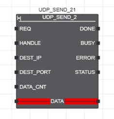

# UDP_SEND_2

Функціональний блок `UDP_SEND_2` є новою реалізацією FB `UDP_SEND`, яка в цьому розділі довідки називається «старішою реалізацією». Різниця між новою та старішою реалізацією полягає в тому, що `UDP_SEND_2` підтримує широкомовлення, якщо сокет було створено відповідним чином за допомогою`UDP_SOCKET_2` FB. FB `UDP_SEND_2` можна використовувати лише з дескрипторами сокетів, створеними FB `UDP_SOCKET_2`.

## Опис роботи

Функціональний блок використовується для надсилання дейтаграми UDP (Universal Datagram Protocol) на пристрій Ethernet із підтримкою UDP через IP-сокет. Перш ніж надсилати дані, IP-сокет потрібно відкрити за допомогою функціонального блоку `UDP_SOCKET_2`.

Кожна операція передачі ініціюється наростаючим фронтом на вході запиту `REQ`. Під час цього циклу функціональний блок копіює дані для надсилання (застосовуються до вхідних даних `DATA`) у внутрішній буфер. Вихід `BUSY` встановлено на `TRUE`, поки дані надсилаються з внутрішнього буфера. Якщо `BUSY = TRUE`, вхід `REQ` ігнорується. Передача нових даних, які доступні на вході `DATA` під час поточного циклу передачі, може бути ініційована лише за допомогою наростаючого фронту на вході `REQ`, якщо для виходу `BUSY` встановлено значення `FALSE`.

Якщо під час виконання функціонального блоку виникає помилка, вихід `ERROR` встановлюється в`TRUE` протягом одного циклу. Відповідний код помилки надається на виході `STATUS` протягом цього циклу.

Пристрій, на який мають бути надіслані дані, вказується за допомогою параметра `DEST_IP` (IP-адреса пристрою-одержувача) і параметра `DEST_PORT` (номер порту пристрою-одержувача).

Якщо відповідний сокет було створено з параметром `BROADCAST = TRUE` у функціональному блоці `UDP_SOCKET_2`, дані можна надсилати як широкомовну розсилку. Для цього `DEST_IP` має бути встановлено на широкомовну адресу `255.255.255.255`.

IP-сокет, відкритий функціональним блоком `UDP_SOCKET_2`, можна використовувати лише для наступних викликів функціонального блоку `UDP_SEND_2`, доки вихід `ACTIVE` функціонального блоку `UDP_SOCKET_2` має значення `TRUE`. Виклик функціонального блоку `UDP_SEND_2`, коли `ACTIVE = FALSE`, викликає помилку у функціональному блоці `UDP_SEND_2` (видається `ERROR = TRUE` і код `STATUS = 0xC210`).

Для контролерів із вбудованим брандмауером переконайтеся, що брандмауер не блокує порти, залучені до зв’язку. В іншому випадку з’єднання не вдасться встановити.

Усі використані IP-адреси – це адреси IPv4, які складаються з чотирьох чисел (від 0 до 255), розділених крапкою. 

## Входи

| Назва     | Тип    | Призначення                                                  |
| --------- | ------ | ------------------------------------------------------------ |
| REQ       | BOOL   | Наростаючий фронт на вході запиту `REQ` ініціює передачу даних, застосованих до входу `DATA`. Введення ігнорується, доки надсилаються дані (`BUSY = TRUE`). Усі інші вхідні параметри оцінюються з наростаючим фронтом на вході `REQ` у випадку, якщо `BUSY = FALSE`. |
| HANDLE    | DWORD  | Дескриптор сокета, який було відкрито за допомогою функціонального блоку `UDP_SOCKET_2`. Параметр оцінюється лише в тому циклі, в якому параметр `REQ` змінює значення `TRUE`. Не використовуйте дескриптор, створений за допомогою екземпляра старішої реалізації функціонального блоку `UDP_SOCKET` з функціональним блоком `UDP_SEND_2`. Використовуйте дескриптори лише в межах одного «покоління FB». |
| DEST_IP   | STRING | IP-адреса (адреса IPv4) пристрою, на який мають надсилатися дані, що зберігаються в буфері `DATA`. Параметр оцінюється лише в тому циклі, в якому параметр `REQ` змінює значення `TRUE`. Якщо відповідний сокет було створено з налаштуванням `BROADCAST = TRUE` у функціональному блоці `UDP_SOCKET_2`, дані можна надсилати як широкомовну розсилку. Для цього `DEST_IP` має бути встановлено на широкомовну адресу `255.255.255.255`. |
| DEST_PORT | UINT   | Номер порту пристрою, на який мають надсилатися дані, що зберігаються в буфері `DATA`. Параметр оцінюється лише в тому циклі, в якому параметр `REQ` змінює значення `TRUE`. |
| DATA_CNT  | UDINT  | Кількість байтів, які потрібно надіслати з буфера `DATA` (`DATA_CNT = DATA_CouNT`). Максимальна кількість байтів для надсилання обмежена максимальним значенням `2147483647` байт. Це обмеження має лише теоретичний характер, на практиці максимальний розмір для пов’язаної змінної буде обмежуючим фактором. Параметр оцінюється лише в тому циклі, в якому параметр `REQ` змінює значення `TRUE`. Якщо `DATA_CNT = UDINT#16#FFFFFFFF`, надсилається повний розмір змінної, пов’язаної з `DATA`. **Порада.** Ви можете використовувати функцію `SIZEOF`, щоб визначити розмір змінної байтів, зарезервованих для змінної в пам'яті контролера). |

## INOUT

| Назва | Тип  | Призначення                                                  |
| ----- | ---- | ------------------------------------------------------------ |
| DATA  | ANY  | Буфер даних, який містить дані для надсилання на пристрій, означений параметрами `DEST_IP` і `DEST_PORT`. Дані передаються у вигляді потоку байтів. Перетворення `Little-/Big-Endian` не існує. Якщо типом даних підключеної змінної є `STRUCT` (або `ARRAY OF STRUCT`), потік байтів може містити байти заповнення. |

## Виходи

| Назва  | Тип  | Призначення                                                  |
| ------ | ---- | ------------------------------------------------------------ |
| DONE   | BOOL | Після успішного надсилання даних установлюється значення `TRUE`. Вихід встановлюється лише на один цикл. |
| BUSY   | BOOL | Встановлюється значення в `TRUE`, коли система намагається надіслати дані. Поки для цього параметра встановлено значення `TRUE`, вхід `REQ` ігнорується. |
| ERROR  | BOOL | Якщо виникає помилка, вихід `ERROR` встановлюється на `TRUE`. Відповідний код помилки можна прочитати на виході `STATUS`, якщо `ERROR = TRUE`. У разі виявлення помилки вихід встановлюється на `TRUE` лише на один цикл. Код помилки має бути прочитаний на виході `STATUS` протягом цього циклу. |
| STATUS | WORD | Надає код помилки у разі помилки (`ERROR = TRUE`) або поточний стан функціонального блоку (`ERROR = FALSE`). Коди помилок починаються з `16#Cxxx`, а коди стану — з `16#8xxx`. |

## Приклад

