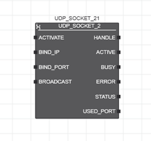

# UDP_SOCKET_2

Функціональний блок `UDP_SOCKET_2` є новою реалізацією FB `UDP_SOCKET` що підтримує широкомовлення. Дескриптори (handles) сокетів, створені за допомогою FB `UDP_SOCKET_2`, можна використовувати лише з функціональними блоками `UDP_SEND_2` і `UDP_RECEIVE_2`. 

## Опис роботи

IP-сокет представлено вихідним параметром `HANDLE`. Цей дескриптор має бути направлено до функціональних блоків `UDP_SEND_2` і `UDP_RECEIVE_2`, яким потрібен дескриптор сокета для обміну даними з партнером по зв’язку. 

З наростаючим фронтом на вході `ACTIVATE` система починає відкривати сокет. Після відкриття сокета та успішного встановлення з’єднання вихід `ACTIVE` встановлюється в `TRUE`. Лише коли стане `ACTIVE = TRUE`, дескриптор сокета, наданий на виході `HANDLE`, можна використовувати для наступних викликів функціональних блоків `UDP_SEND_2/UDP_RECEIVE_2`. Якщо `ACTIVE = FALSE`, виклик функціональних блоків `UDP_SEND_2/UDP_RECEIVE_2` за допомогою дескриптора сокета викликає помилку. Сокет залишається відкритим до тих пір, поки вхід `ACTIVATE` має значення `TRUE`. Вихід `BUSY` встановлюється в `TRUE` у тому випадку, коли `ACTIVATE` має значення `TRUE`, а сокет все ще не відкритий. Як тільки сокет відкривається, `BUSY` встановлюється на `FALSE` і залишається `FALSE`, поки `ACTIVE = TRUE`.

IP-адресу та порт Ethernet-адаптера, який буде використовуватися для обміну даними, можна вказати за допомогою входів `BIND_IP` і `BIND_PORT`. Вхід `BROADCAST` керує тим, чи адресовано одного конкретного партнера зв’язку (`FALSE`) чи в широкомованому режимі (якщо застосовано `TRUE`). Якщо вхід `ACTIVATE` перемикається на `FALSE`, сокет закритий, а вихід `ACTIVE` встановлено на `FALSE`.

Функціональні блоки для зв’язку UDP обробляються асинхронно. Це означає, що функціональні блоки видають команди та чекають їх обробки. У разі гарячого чи холодного старту або скидання контролера мікропрограма закриває всі сокети, які були відкриті за допомогою відповідного екземпляра екземпляра `UDP_SOCKET_2`.

Для контролерів із вбудованим брандмауером переконайтеся, що брандмауер не блокує порти, залучені до зв’язку. В іншому випадку з’єднання не вдасться встановити.

Усі використані IP-адреси – це адреси `IPv4`, які складаються з чотирьох чисел (від 0 до 255), розділених крапкою.

Кількість IP-сокетів, які наразі відкриті, вказується системною змінною `IP_ACTIVE_SOCKETS` (міститься у списку даних вузла контролера та вузла `IEC 61131-3` у `PLANT`).

## Входи

| Назва     | Тип    | Призначення                                                  |
| --------- | ------ | ------------------------------------------------------------ |
| ACTIVATE  | BOOL   | Функціональний блок починає відкривати сокет, коли на вході виявляється передній фронт. Задній фронт викликає закриття сокету. Сокет залишається відкритим, поки вхід `ACTIVATE` має значення `TRUE`. |
| BIND_IP   | STRING | Означує локальну IP-адресу (адресу IPv4) адаптера Ethernet, до якого прив’язаний створений сокет. Вибраний адаптер Ethernet використовується для обміну даними між мережевими пристроями (корисно, наприклад, з серверами UDP для контролерів, які використовують кілька адаптерів Ethernet). Разом із номером порту, прив’язаним до створеного сокета (вхід `BIND_PORT`), IP-адреса ідентифікує адаптер Ethernet.  Якщо рядок порожній або містить значення `0.0.0.0.`, вибирається підхожий адаптер Ethernet. Функціональний блок перевіряє значення цього параметру лише в циклі задачі, в якому виявлено наростаючий фронт на вході `ACTIVATE`. |
| BIND_PORT | UINT   | Означує номер локального порту, пов’язаний з IP-адресою вибраного адаптера Ethernet (вхід `BIND_IP`), до якого прив’язаний створений сокет. Вибраний номер порту використовується сокетом UDP для вхідних даних. Якщо значення дорівнює `0` (= початкове значення параметра), стек призначає тимчасовий порт. Функціональний блок перевіряє значення цього параметру лише в циклі задачі, в якому виявлено наростаючий фронт на вході `ACTIVATE`. |
| BROADCAST | BOOL   | Якщо `BROADCAST = TRUE`, створений сокет може надсилати дейтаграми UDP на широкомовну адресу `255.255.255.255`. Переконайтеся, що для шлюзу в конфігурації IP встановлено дійсне значення, відмінне від `0.0.0.0` (адреса `0.0.0.0` розглядається як відсутній шлюз). Необов’язково, щоб мережа містила пристрій із налаштованою адресою шлюзу. Якщо не вказано дійсну адресу шлюзу, широкомовлення не надсилається, а під час виклику `FB UDP_SEND_2` видається помилка `0xC212`. Функціональний блок перевіряє значення цього параметру лише в циклі задачі, в якому виявлено наростаючий фронт на вході `ACTIVATE`. |

## Виходи

| Назва     | Тип   | Призначення                                                  |
| --------- | ----- | ------------------------------------------------------------ |
| HANDLE    | DWORD | Створений дескриптор IP-сокета. Дескриптор сокета потрібний для наступних викликів функціональних блоків `UDP_RECEIVE_2` і `UDP_SEND_2`, щоб надсилати або отримувати дані, наприклад, до або з сервера UDP. Не використовуйте дескриптор, створений за допомогою екземпляра старішої реалізації функціонального блоку `UDP_SOCKET` з новими функціональними блоками `UDP_SEND_2/UDP_RECEIVE_2` і навпаки. Використовуйте дескриптори лише в межах одного «покоління FB». Дескриптор сокета можна використовувати лише для наступних викликів функціональних блоків `UDP_SEND_2/UDP_RECEIVE_2` тільки у випадку коли`ACTIVE = TRUE`. Виклик функціональних блоків `UDP_*`, коли `ACTIVE = FALSE`, викликає помилку у функціональних блоках |
| ACTIVE    | BOOL  | Якщо `TRUE` - підключення успішно встановлено, сокет відкритий. Поки `ACTIVE = TRUE`,  для викликів функціональних блоків `UDP_SEND_2/UDP_RECEIVE_2` для операцій надсилання/отримання дескриптор сокета можна використовувати. Якщо `FALSE` - сокет закрито. Якщо `ACTIVE = FALSE`, виклик функціональних блоків `UDP_SEND_2/UDP_RECEIVE_2` за допомогою дескриптора сокета викликає у функціональних блоках помилку. |
| BUSY      | BOOL  | Встановлює значення `TRUE`, якщо вхід `ACTIVE` має значення `TRUE`, а сокет все ще не відкритий. Коли сокет відкривається, `BUSY` встановлюється в `FALSE` і залишається `FALSE`, поки `ACTIVE = TRUE`. |
| ERROR     | BOOL  | Якщо виникає помилка, вихід `ERROR` встановлюється в `TRUE`. Відповідний код помилки можна прочитати на виході `STATUS`, якщо `ERROR = TRUE`. |
| STATUS    | WORD  | Надає код помилки у разі помилки (`ERROR = TRUE`) або поточний стан функціонального блоку (`ERROR = FALSE`). Коди помилок починаються з `16#Cxxx`, а коди стану — з `16#8xxx`. |
| USED_PORT | UINT  | Вказує порт, який використовується для створення сокета (автоматично призначений або номер порту, указаний у параметрі `BIND_PORT`). Вихід можна використовувати для діагностичних цілей, якщо це необхідно. |

