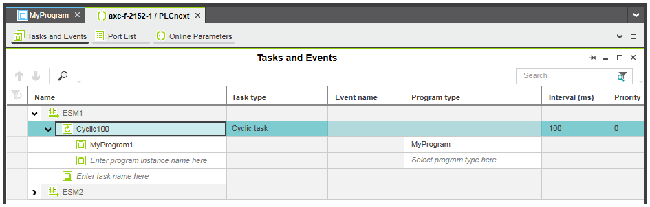
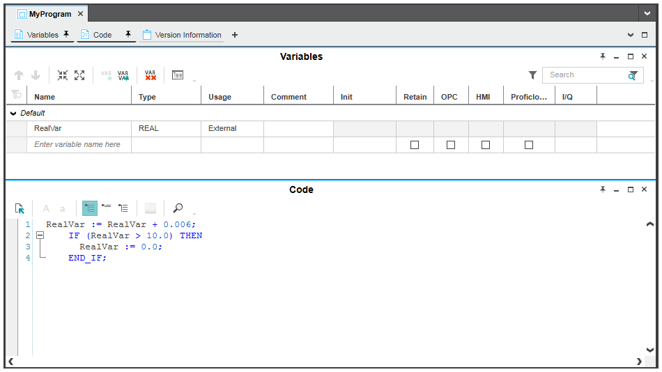

# HMI швидкий старт

У цьому короткому посібнику ви дізнаєтеся, як створити програму HMI, написати проект, включаючи програму HMI, для контролера та візуалізувати/записати змінну, яку ви створили в PLCnext Engineer за допомогою стандартного веб-браузера.

У цьому посібнику ви створите 2 сторінки HMI. На першій сторінці (стартовій сторінці) ви вставите кнопку, яка використовується для переходу до другої сторінки HMI під час її натискання. На другій сторінці  вставите стрілочний прилад, який візуалізує значення глобальної змінної IEC 61131-3 `RealVar` а також кнопку  `Reset`, яка скидає значення `RealVar` до `0`.

## Крок 0: Створіть проект

1) Створіть проект з назвою `QuickstartHMI` для реального ПЛК або імітатора

2) Створіть нову або перейменуйте існуючу POU в `MyProgram1` в межах задачі `Cyclic100`, яка виконується циклічно з інтервалом 100 мс.



У POU `MyProgram1` створіть код на мові ST, що містить приклад коду та таблицю змінних із оголошенням змінної `RealVar`.

```pascal
RealVar := RealVar + 0.006;   
IF (RealVar > 10.0) THEN    
	RealVar := 0.0;   
END_IF;
```



## Крок 1: Призначте глобальні змінні IEC 61131-3 тегам HMI

Змінна, яку потрібно візуалізувати, повинна бути назначена тегу HMI. Пізніше тег HMI буде пов’язано з динамікою траєкторії стрілки стрілочного приладу та дією `Write value` кнопки `Reset`.

1) У PLANT для двічі клацніть вузол контролера.

2) В області редакторів відкрийте редактор `Data List`.

3) У таблиці `Data List` клацніть правою кнопкою миші комірку `HMI tag` змінної `RealVar` і виберіть `Add HMI Tag`  у контекстному меню. Ім’я створеного тегу HMI `RealVar` походить від назви змінної.


## Крок 2: Додайте сторінки HMI до свого проекту

Для цього швидкого старту нам потрібні 2 сторінки HMI. Ми назвемо сторінки `Home` і `PathAnimation`.

1) Щоб додати порожню сторінку HMI до поточного проекту, клацніть у PLANT правою кнопкою миші вузол `Application` що знаходиться під вузлом `HMI Webserver` і виберіть `Add HMI Page` у контекстному меню.

2) Перейменуйте сторінку на `Home`, вибравши вузол, натиснувши `<F2>` (або `Rename`) і ввівши назву.

3) Повторіть ці дії для другої сторінки HMI `PathAnimation`.

4) Щоб призначити сторінку HMI `Home` як стартову сторінку (стартова сторінка буде завантажена першою під час запуску візуалізації), клацніть правою кнопкою миші на ній і виберіть `Set HMI Page as Startup` у контекстному меню.


## Крок 3: Розмістіть на сторінках HMI об’єкти

Тепер ви можете вставляти графічні об’єкти на сторінки HMI. Використовуються такі об'єкти:

- кнопку `Button` з назвою `Path Animation`, яка завантажуватиме другу сторінку HMI після натискання.
- бібліотечний символ `Radial Gauge`, який відображає поточне значення змінної `RealVar`, яку потрібно візуалізувати.
- кнопку `Button` з назвою `Reset`, яка записуватиме значення `0` у змінну `RealVar`.

### Кнопка переходу на другу сторінку

1) Двічі клацніть сторінку `Home` під `HMI Webserver > Application` у PLANT, щоб відкрити цю сторінку в області редакторів.

2) В області COMPONENTS (права бічна панель) у категорії `HMI` відкрийте групу `Objects` і виберіть об’єкт `Button` і перемістіть його за допомогою миші на сторінку та опустіть його в потрібне місце. Або виберіть об’єкт у групі `Objects`, перемістіть курсор на сторінку HMI і клацніть лівою кнопкою миші на сторінці.

4) У вікні властивостей (розташоване праворуч на сторінці HMI) вставленого об’єкту `Button` для властивості `Text`  введіть текст `Path  Animation` . Або двічі клацніть кнопку, введіть мітку та клацніть будь-де на сторінці HMI.

5) Змініть розмір кнопки, щоб відповідати тексту, перетягнувши маркер об’єкта.


### Символ `Radial Gauge` для візуалізації глобальної змінної

PLCnext Engineer постачається з низкою включених бібліотечних символів. За допомогою цих включених символів ви можете створювати свої сторінки HMI та контролювати/візуалізувати свої процеси прямо з коробки. Ці символи можна знайти в області COMPONENTS `HMI > Default > Symbols`.

1) Двічі клацніть сторінку `PathAnimation` під `HMI Webserver >  Application` у PLANT, щоб відкрити дану сторінку в області редакторів.

2) В області COMPONENTS категорії `HMI` відкрийте `Default > Symbols` і виберіть символ `Radial Gauge` і перетягніть символ за допомогою миші на сторінку та опустіть його в потрібне місце.


Тепер ми маємо пов’язати шкалу вимірювання з тегом HMI `RealVar`, щоб відобразити поточне значення змінної `RealVar`, яку ми хочемо візуалізувати. 

5) Виберіть вкладку `Parameters` у вікні властивостей символу.  У полі списку `Source Value` виберіть запис `HMI Webserver` у дереві ліворуч, а потім тег HMI `RealVar` праворуч, клацнувши його та натиснувши будь-де за межами поля списку або натиснувши `<Enter>`.


### Кнопка запису глобальної змінної

1) На сторінці `PathAnimation` вставте об’єкт `Button`, так само, як описано вище.

2) Для кнопки введіть мітку `Reset` та клацніть будь-де на сторінці HMI


## Крок 4: Додайте динаміку

Тепер ми додамо таку динаміку до властивостей об’єктів:

- Динаміка `Action on Click` з дією `Load page` призначається кнопці `Path Animation`. Після натискання кнопка завантажить сторінку `PathAnimation`.
- Динаміка `Action on Click` з дією `Write value`, призначеною кнопці `Reset`. Натискання кнопки призведе до скидання змінної `RealVar` до `0`.

### Динаміка завантаження стоірнки

1) Відкрийте сторінку  `Home` в області редакторів і виберіть кнопку на сторінці.

2) Виберіть вкладку `Dynamics` у вікні властивостей.

3) Клацніть лівою кнопкою миші кнопку `New Dynamic` у верхній частині вкладки та виберіть `Action > Action on Click`.

4) У розкривному списку `Action` виберіть пункт `Load page`. Додайте властивість `Page`. Клацніть лівою кнопкою миші праворуч від параметра `Page` та виберіть сторінку `PathAnimation` зі спадного списку.


### Динаміка скидання змінної

1) На сторінці `PathAnimation` виберіть кнопку `Reset`.

2) Виберіть вкладку `Dynamics` у вікні властивостей.

3) Клацніть лівою кнопкою миші кнопку `New dynamic` у верхній частині вкладки та виберіть `Action > Action on Click`.

4) У розкривному списку `Action` виберіть запис `Write value`.

5) Виберіть тег HMI `RealVar` як змінну призначення та введіть значення `0` для параметра `Source constant`.


## Крок 5: Запишіть образ проекту в контролер

На додаток до логіки програми та всіх відповідних даних конфігурації/параметризації проекту, створений образ проекту міститиме дані програми HMI.

1) Збережіть проект.
2) Відкрийте редактор `Cockpit` вузла контролера та виберіть `TCP/IP` зі спадного списку у верхньому лівому куті для реального ПЛК або `Simulation` для підсистеми емуляції.


2) У PLANT клацніть правою кнопкою миші вузол контролера та виберіть `Write and  Start Project` у контекстному меню або натисніть `<F5>` на клавіатурі, щоб створити образ проекту, записати його в контролер і почати виконання. Або натисніть кнопку  на панелі інструментів `Cockpit`.

## Крок 6. Вимкніть застосування прав доступу

За замовчуванням безпека для HMI увімкнена, тобто всі сторінки та об’єкти HMI недоступні для користувачів під час запуску програми HMI на контролері. Щоб вимкнути безпеку для HMI, параметр `Enforcement  of user levels`, доступний в редакторі `HMI Webserver > Settings`  потрібно змінити з `PLCnext user management` на `None`.

1) Перейдіть в режим `Debug Off`
2) Двічі клацніть вузол `HMI Webserver` в PLANT.

2) В області редакторів відкрийте редактор налаштувань.

3) У розділі `Security` змініть `Enforcement of user levels` на `None`.


4) Збережіть проект.
5) У PLANT клацніть правою кнопкою миші вузол контролера та виберіть `Write and  Start Project` у контекстному меню або натисніть `<F5>` на клавіатурі, щоб створити образ проекту, записати його в контролер і почати виконання. Або натисніть кнопку  на панелі інструментів `Cockpit`.

## Крок 7: Запустіть програму HMI

1) Якщо редактор `Cockpit` ще не відкрито в областях редакторів, двічі клацніть вузол контролера в PLANT і відкрийте редактор.

2) Натисніть кнопку  (`Launches default browser...`) на панелі інструментів `Cockpit`.

3) Враховуючи роботу з самопідписаним сертифікатом з'явиться сторінка попередження, треба погодитися на ризик і продвожити (`Додактово -> Погодитися на ризик і продовжити`). 

4) Веб-браузер за замовчуванням, налаштований для вашого комп’ютера, завантажує програму HMI і починає відображати сторінку HMI, указану як початкову сторінку (у нашому прикладі відображається `Path Animation`).

5) Натисніть кнопки `Path Animation` для відкриття сторінки, на якій показано стрілочний прилад. Значення змінної там буде збільшуватися. Натискання на RESET скидує значення в `0`