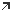
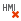

[HMI застосунок](README.md)

# HMI теги

Теги HMI (HMI tags) використовуються для анімації графічних об’єктів на сторінках HMI та керування програмою автоматизації через HMI. Загалом, тег HMI можна розглядати як внутрішню змінну HMI. Через тег HMI програма HMI отримує доступ для читання або до запису змінних. Додавши динаміку до властивості об’єкта HMI і зв’язавши цю динаміку з тегом HMI, значення змінної можна візуалізувати/записати через HMI.

PLCnext Engineer підтримує використання двох різних типів тегів HMI:

- Теги HMI, створені зі змінних контролера - видимі для кожної станції HMI (клієнт HMI). Якщо змінна контролера змінюється, ця зміна впливає на змінну всіх клієнтів HMI, тобто кожен клієнт, який використовує цю змінну, має однакове значення для цієї змінної.
- Локальні теги HMI - видимі лише для однієї станції HMI (клієнт HMI), тобто тег пов’язаний із певним клієнтом. Якщо локальний тег HMI змінюється, зміна впливає лише на тег конкретного клієнта, тобто кожен клієнт, який використовує цей тег, може мати різне значення для цього тегу.

## HMI теги створені зі змінної контролера

Теги HMI, створені зі змінних контролера, видимі для кожної станції HMI (клієнт HMI). Якщо змінна контролера змінюється, ця зміна впливає на змінну всіх клієнтів HMI, тобто кожен клієнт, який використовує цю змінну, має однакове значення для цієї змінної.

Теги HMI для змінних контролера можна створити:

- Призначення тегу HMI глобальній змінній IEC 61131-3.
- Для контролерів PLCnext Technology: встановлення прапорця HMI у таблиці властивостей змінних для локальних змінних у функціональному блоці та програмних POU. Якщо встановити прапорець, усі екземпляри POU надають локальну змінну як тег HMI, який потім можна використовувати в програмі HMI.

Усі теги HMI, створені для глобальних змінних IEC 61131-3, перераховані в списку даних Data List вузла  `HMI Webserver`  у PLANT. Список даних автоматично синхронізується під час створення тегу HMI для глобальної змінної IEC у будь-якому іншому  `Data List`.

Створення тегу HMI для глобальної змінної IEC можливо:

- у списку даних вузла `HMI Webserver`.
- у списку даних вузла `IEC 61131-3` і вузла `Safety PLC`, а також у будь-якому іншому списку даних, пов’язаному з пристроєм.
- при додаванні динаміки до властивості об’єкта HMI 
- шляхом імпорту елементів даних із файлу `.csv` (значення, розділені комами) до списку даних.

Теги HMI можна створювати для обох типів декларацій: глобальних і пов’язаних із екземплярами змінних вводу/виводу. У списку даних Safety PLC теги HMI можна створювати лише для змінних обміну, тобто для призначення між стандартною змінною Safety PLC і глобальною змінною стандартного PLC.

Наприклад додавання в списку даних вузла `IEC 61131-3`:

Елементи даних процесу та теги HMI не можуть бути призначені системним змінним за винятком контролерів зі спеціальними функціями, такими як швидкі лічильники або швидкі введення.

#### How to add/remove an HMI tag in the 'HMI Webserver' Data List

1. In the Data List, select a line above which the new HMI tag is to be inserted and click the  button on the toolbar. Alternatively, go to the end of the table,  left-click into the empty 'Enter ... here' input field and enter the  name of the new HMI tag.
2. If desired, edit the default HMI tag name by clicking into the table cell and entering the desired name. The 'Function' field can be used to enter a descriptive text for the HMI tag.
3. To declare the HMI tag as read-only, activate the 'Read Only'  checkbox. A read-only HMI tag may only be read  and not written in the  HMI page.
4. To assign a controller variable and process data item to the HMI  tag, click into the respective cell of the  'Variable (PLC)' or 'Process data item' column and use the Role Picker to select the desired  variable and process data item. (The Role Picker only provides data  items for selection which are allowed to be assigned to the HMI tag.)

#### How  to add/remove an HMI tag for a global variable in the Data List of the  'IEC 61131-3' node, 'Safety PLC' node, or controller node

1. To add an HMI tag and assign it to a global variable ('Global'  declaration) or an instance-related I/O variable ('Instance' or  'Program' declaration) at the same time, select the corresponding  variable in the respective 'Data List' and click the 'Add a new HMI Tag' button on the 'Data List' toolbar. Alternatively, select 'Add HMI Tag'  from the variable's context menu. The command is only available for  variables which have no HMI tag assigned. 

**Note**  Currently, no direct assignments to HMI tags are possible in the  Safety PLC Data List. However, HMI tags can be created for exchange  variables (Safety PLC standard variable assigned to a controller  variable).

The name of the new HMI tag is derived from the variable name and can be modified (see step 2).

2) If desired, edit the default HMI tag name by clicking into the table cell and entering the desired name. The 'Function' field can be used to enter a descriptive text for the HMI tag.

3) To declare the HMI tag as read-only, activate the 'Read Only'  checkbox. A read-only HMI tag may only be read  and not written in the  HMI page.

**Note**   All modifications on the HMI configuration are immediately applied  to all other locations where the corresponding HMI tag is listed.

**Further Info**  HMI tags can also be assigned to global IEC variables ('Global'  declaration) or instance-related I/O variables ('Instance' or 'Program'  declaration) in the HMI editor. For detailed information, refer to the  topic "HMI Application"  .

To remove an HMI tag from a global IEC variable, right-click the variable  and select 'Remove HMI Tag'. Alternatively, select the variable and  click the 'Delete HMI Tag' button on the 'Data List' toolbar.   **Note**  When you remove an HMI tag in the 'Data List' table from a variable  and the variable is connected to a dynamic property of an HMI object, a  corresponding error message is reported in the message window.  Double-clicking the message opens the HMI page with the respective HMI  object in the editors area. To remove the error, either delete the  linkage between variable and dynamic property or assign another variable to the property. 

#### How to import data items from a .csv file

1. In the respective Data List, click the  button on the toolbar. Alternatively, select 'Import CSV...' from the context menu.

2. In the file open dialog, select the .csv file you want to import and click 'Open'. The progress of the import is displayed in the MESSAGES  window. 

   The log entries provide, amongst other, information on the number of imported process data items, variables, HMI tags etc.

   Observe the following when importing data items:

   - Only variables (standard and safety-related  variables) and HMI tags are imported. Process data items assigned to  variables are not imported.

   - The data items are imported into the pool of  data items (contains the data items of all Data Lists). This means data  items which do not belong to the active Data List are also imported and  added to the respective Data List.

     Example: if the .csv file contains  safety-related variables and you perform the import in the Data List of  the 'IEC 61131-3' node (contains only variables of the standard  controller), the safety-related variables are imported into the Data  List of the Safety PLC node.

   - Exisiting data items are not overwritten or  modified. Only those data items are imported which are not yet contained in the Data List.

   -  Data items with invalid properties, for  example, invalid data types are imported but marked as errors in the  Data List (a corresponding entry is also shown in the MESSAGES window).

   - Data items with invalid variable names are not imported and  the process is aborted.

Via the  button or the 'Export CSV...' context menu item you can export the Data List contents to a .csv file.

## Локальні теги HMI

Локальні теги HMI видимі лише для одного клієнта (станції), тобто тег пов’язаний з конкретним клієнтом. Якщо локальний тег HMI змінюється, зміна впливає лише на тег конкретного клієнта, тобто кожен клієнт, який використовує цей тег, може мати різне значення для цього тегу.

PLCnext Engineer дозволяє створювати наступні типи локальних тегів HMI:

- Локальний тег застосунку (Application local tag): тег, який є специфічним для одного клієнта (станції), але використовується для всіх сторінок HMI у вашому проекті. Це означає, що локальний тег застосунку видимий лише для одного клієнта, але його можуть використовувати та бачити всі сторінки HMI у проекті. Теги застосунку ініціалізуються під час завантаження проекту (застосунку). Теги створюються за допомогою редактора `Tags`, доступного для вузла `Application` (підвузол `HMI Webserver`) у PLANT.

Щоразу, коли ви створюєте новий проект і створюєте екземпляр контролера, до редактора `Tags` для вузла `Application` додаються наступні попередньо означені теги, які доступні лише для читання (тобто їх не можна редагувати, видаляти, перетягувати тощо), за винятком того, що ви можете ввести коментар. Якщо потрібно, ви можете скопіювати попередньо означений тег і створити новий тег, означений користувачем.

| Попередньо означений тег | Data type      | Опис                                                         |
| ------------------------ | -------------- | ------------------------------------------------------------ |
| ClientNow                | LDATE_AND_TIME | Показує місцевий час клієнта.                                |
| StationID                | STRING         | Показує ідентифікатор станції клієнта.                       |
| ProjectName              | STRING         | Показує назву проекту, що містить дані HMI, які виконуються на клієнті. |
| ActivePage               | STRING         | Показує назву поточної активної сторінки. Тег оновлюється під час кожного завантаження сторінки з назвою поточної сторінки. |
| LanguageCode             | STRING         | Означує код мови поточної активної мови (наприклад, en, de, it тощо) застосунку HMI. Записуючи тег LanguageCode, клієнт HMI може перемикати мову HMI під час виконання застсунку. Передумови для перемикання мови: Мова за замовчуванням і відповідна альтернативна мова (мови) вибрані в діалоговому вікні `Options` (`Extras  > Options > International > Default Language Settings`) Переклади текстів HMI надаються в редакторі `Resources` вузла `Application` PLANT або в редакторі `Resources` групи редакторів текстового списку. |

- Локальний тег сторінки: тег, який є специфічним для сторінки HMI, де він означений. Локальний тег сторінки може використовуватися та переглядатися лише сторінкою HMI, яка містить оголошення тегу. Усі інші сторінки HMI у проекті не бачать тегу. Локальні теги сторінки ініціалізуються, коли завантажується відповідна сторінка. Теги створюються за допомогою редактора `Tags`, доступного для вузла сторінки HMI в PLANT.

  

Локальні теги застосунку та локальні теги сторінки можна вибирати в динаміці, прив’язувати до параметрів екземпляра символу та використовувати у виразах.

### Редактор тегів

The 'Tags' editor available for the 'Application' node (located under the 'HMI Webserver' node in the PLANT) and HMI page nodes is used to  create and modify the application local and page local tags. With the  editor you can:

Редактор `Tags`, доступний для вузла `Application` (розташованого під вузлом `HMI Webserver` у PLANT) і вузлів сторінки HMI, використовується для створення та зміни локальних тегів застосунку та локальної сторінки. За допомогою редактора ви можете:

- створювати та видаляти теги
- редагувати властивості тегів
- сортувати таблиці тегів, переміщати теги в таблиці, фльтрувати відображення тегів

#### Create and delete tags

To create a new tag, either  the tag name into the 'Enter tag name...' cell and press <Enter> or click the   button on the toolbar.

To delete a tag, select the variable and press <Del>.

#### Edit the tag properties

| Property | Description                                                  |
| -------- | ------------------------------------------------------------ |
| Type     | Data type of the tag. The data type determines what kind of value the tag can have. Left-clicking into the cell shows the selectable data types. |
| Init     | Initial value of the tag.                                    |
| Comment  | User-defined comment.                                        |

**Note**   A red outline indicates when you have entered/selected an invalid value within a cell.

#### Sort the tags table

You can sort the table alphabetically in ascending, descending or  unsorted order where each column can be used as sort criterion. To sort  the table by the column data, left-click on the column title field (an  arrow up/down icon above the column name shows the sort order). To  toggle through the sort order, click the column title field again.

#### Move tags up/down

Move one or several tags up/down using the Move Up / Move Down arrow keys on the toolbar.

#### Filter the tags table

The  table can be filtered with  predefined filters or by text:

- Filtering with predefined filters. The  predefined filters are shown by left-clicking the filter icon at the top right above the table.  In the appearing selection list,  activate/deactivate the desired filter. The settings are directly  applied when activating/deactivating a checkbox. The activated filter is indicated by the framed filter icon.

  

  To deactivate the filter, click the filter icon again and deactivate the checked filter options.

- Filtering by text

  The table allows a search  for specific elements. The search operates on all visible texts in the  table. Enter the search text into the 'Search' input field at the top  right above the table. The search is directly applied to the table when  entering the text. All strings that match the entered text are  highlighted.

  

  To deactivate the search, i.e., to delete the search string entered, click the delete icon   on the right of the 'Search' input field.

An active filter is indicated by the   icon in the first column.

### Приклад використання

**Завдання**: наступний варіант використання пояснює концепцію локальних тегів HMI. У прикладі програми ми створили прапорець видимості, який пов’язано з локальним тегом сторінки `ShowButtons` (див. рис.1). Прапорець використовується, щоб показати або приховати панель кнопок (що складається з двох кнопок) на основі вибору прапорця. Панелі кнопок (групі з двох кнопок) призначено динаміку видимості. Динаміка пов’язана з локальним тегом сторінки «ShowButtons» (див. рис.2).

**Результат**: Панель кнопок зникає лише на клієнті (станції) користувача після зняття прапорця. На всіх інших станціях, які були підключені під час зняття прапорця, панель кнопок залишається видимою.

Рисунок 1: локальний тег сторінки `ShowButtons`, призначений для прапорця. Якщо позначено, прапорець має значення `True`.

Рисунок 2: панель кнопок із призначеною динамікою видимості, пов’язаною з тегом `ShowButtons`. Панель кнопок прихована, якщо тег `ShowButton`» має значення `False` (прапорець знятий).
