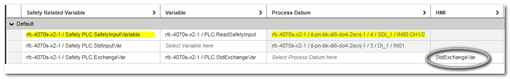
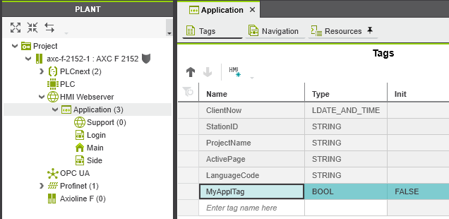
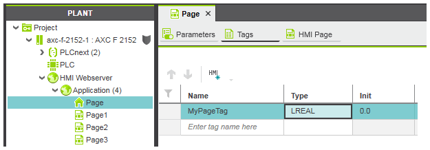
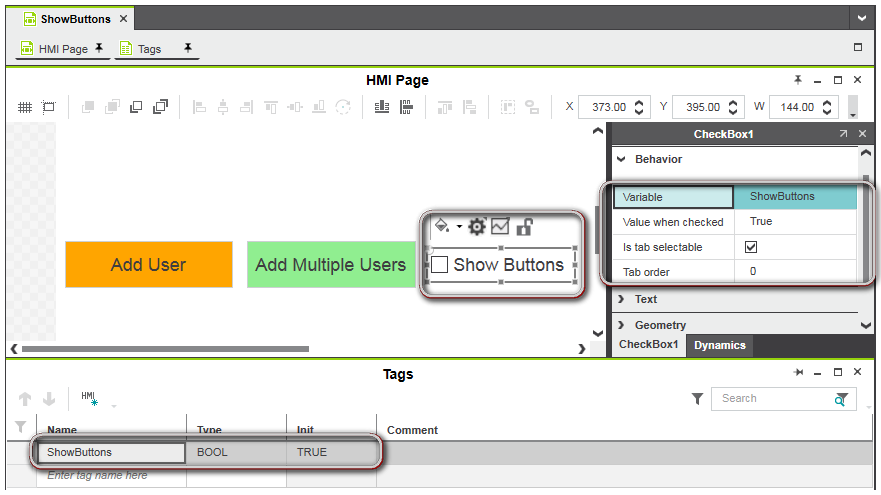
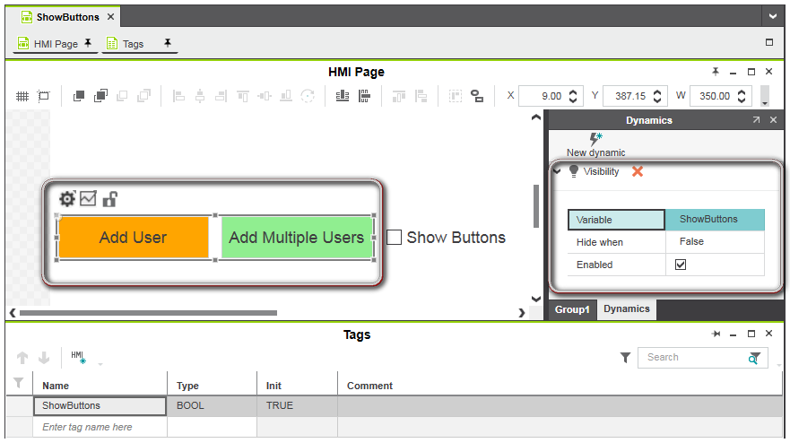

[HMI застосунок](README.md)

# HMI теги

Теги HMI (HMI tags) використовуються для анімації графічних об’єктів на сторінках HMI та керування програмою автоматизації через HMI. Загалом, тег HMI можна розглядати як внутрішню змінну HMI. Через тег HMI програма HMI отримує доступ для читання або до запису змінних. Додавши динаміку до властивості об’єкта HMI і зв’язавши цю динаміку з тегом HMI, значення змінної можна візуалізувати/записати через HMI.

PLCnext Engineer підтримує використання двох різних типів тегів HMI:

- Теги HMI, створені зі змінних контролера - видимі для кожної станції HMI (клієнт HMI). Якщо змінна контролера змінюється, ця зміна впливає на змінну всіх клієнтів HMI, тобто кожен клієнт, який використовує цю змінну, має однакове значення для цієї змінної.
- Локальні теги HMI - видимі лише для однієї станції HMI (клієнт HMI), тобто тег пов’язаний із певним клієнтом. Якщо локальний тег HMI змінюється, зміна впливає лише на тег конкретного клієнта, тобто кожен клієнт, який використовує цей тег, може мати різне значення для цього тегу.

## HMI теги створені зі змінної контролера

Теги HMI, створені зі змінних контролера, видимі для кожної станції HMI (клієнт HMI). Якщо змінна контролера змінюється, ця зміна впливає на змінну всіх клієнтів HMI, тобто кожен клієнт, який використовує цю змінну, має однакове значення для цієї змінної.

Теги HMI для змінних контролера можна створити:

- Призначення тегу HMI глобальній змінній IEC 61131-3.
- Для контролерів PLCnext Technology: встановлення прапорця HMI у таблиці властивостей змінних для локальних змінних у функціональному блоці та програмних POU. Якщо встановити прапорець, усі екземпляри POU надають локальну змінну як тег HMI, який потім можна використовувати в програмі HMI.

Усі теги HMI, створені для глобальних змінних IEC 61131-3, перераховані в списку даних Data List вузла  `HMI Webserver`  у PLANT. Список даних автоматично синхронізується під час створення тегу HMI для глобальної змінної IEC у будь-якому іншому  `Data List`.

Створення тегу HMI для глобальної змінної IEC можливо:

- у списку даних вузла `HMI Webserver`.
- у списку даних вузла `IEC 61131-3` і вузла `Safety PLC`, а також у будь-якому іншому списку даних, пов’язаному з пристроєм.
- при додаванні динаміки до властивості об’єкта HMI 
- шляхом імпорту елементів даних із файлу `.csv` (значення, розділені комами) до списку даних.

Теги HMI можна створювати для обох типів декларацій: глобальних і пов’язаних із екземплярами змінних вводу/виводу. У списку даних Safety PLC теги HMI можна створювати лише для змінних обміну, тобто для призначення між стандартною змінною Safety PLC і глобальною змінною стандартного PLC.

Наприклад додавання в списку даних вузла `IEC 61131-3`:

Елементи даних процесу та теги HMI не можуть бути призначені системним змінним за винятком контролерів зі спеціальними функціями, такими як швидкі лічильники або швидкі введення.

## Локальні теги HMI

Локальні теги HMI видимі лише для одного клієнта (станції), тобто тег пов’язаний з конкретним клієнтом. Якщо локальний тег HMI змінюється, зміна впливає лише на тег конкретного клієнта, тобто кожен клієнт, який використовує цей тег, може мати різне значення для цього тегу.

PLCnext Engineer дозволяє створювати наступні типи локальних тегів HMI:

- Локальний тег застосунку (Application local tag): тег, який є специфічним для одного клієнта (станції), але використовується для всіх сторінок HMI у вашому проекті. Це означає, що локальний тег застосунку видимий лише для одного клієнта, але його можуть використовувати та бачити всі сторінки HMI у проекті. Теги застосунку ініціалізуються під час завантаження проекту (застосунку). Теги створюються за допомогою редактора `Tags`, доступного для вузла `Application` (підвузол `HMI Webserver`) у PLANT.

Щоразу, коли ви створюєте новий проект і створюєте екземпляр контролера, до редактора `Tags` для вузла `Application` додаються наступні попередньо означені теги, які доступні лише для читання (тобто їх не можна редагувати, видаляти, перетягувати тощо), за винятком того, що ви можете ввести коментар. Якщо потрібно, ви можете скопіювати попередньо означений тег і створити новий тег, означений користувачем.

| Попередньо означений тег | Data type      | Опис                                                         |
| ------------------------ | -------------- | ------------------------------------------------------------ |
| ClientNow                | LDATE_AND_TIME | Показує місцевий час клієнта.                                |
| StationID                | STRING         | Показує ідентифікатор станції клієнта.                       |
| ProjectName              | STRING         | Показує назву проекту, що містить дані HMI, які виконуються на клієнті. |
| ActivePage               | STRING         | Показує назву поточної активної сторінки. Тег оновлюється під час кожного завантаження сторінки з назвою поточної сторінки. |
| LanguageCode             | STRING         | Означує код мови поточної активної мови (наприклад, en, de, it тощо) застосунку HMI. Записуючи тег LanguageCode, клієнт HMI може перемикати мову HMI під час виконання застсунку. Передумови для перемикання мови: Мова за замовчуванням і відповідна альтернативна мова (мови) вибрані в діалоговому вікні `Options` (`Extras  > Options > International > Default Language Settings`) Переклади текстів HMI надаються в редакторі `Resources` вузла `Application` PLANT або в редакторі `Resources` групи редакторів текстового списку. |

- Локальний тег сторінки: тег, який є специфічним для сторінки HMI, де він означений. Локальний тег сторінки може використовуватися та переглядатися лише сторінкою HMI, яка містить оголошення тегу. Усі інші сторінки HMI у проекті не бачать тегу. Локальні теги сторінки ініціалізуються, коли завантажується відповідна сторінка. Теги створюються за допомогою редактора `Tags`, доступного для вузла сторінки HMI в PLANT.

  

Локальні теги застосунку та локальні теги сторінки можна вибирати в динаміці, прив’язувати до параметрів екземпляра символу та використовувати у виразах.

### Редактор тегів

The 'Tags' editor available for the 'Application' node (located under the 'HMI Webserver' node in the PLANT) and HMI page nodes is used to  create and modify the application local and page local tags. With the  editor you can:

Редактор `Tags`, доступний для вузла `Application` (розташованого під вузлом `HMI Webserver` у PLANT) і вузлів сторінки HMI, використовується для створення та зміни локальних тегів застосунку та локальної сторінки. За допомогою редактора ви можете:

- створювати та видаляти теги
- редагувати властивості тегів
- сортувати таблиці тегів, переміщати теги в таблиці, фльтрувати відображення тегів

### Приклад використання

**Завдання**: наступний варіант використання пояснює концепцію локальних тегів HMI. У прикладі програми ми створили прапорець видимості, який пов’язано з локальним тегом сторінки `ShowButtons` (див. рис.1). Прапорець використовується, щоб показати або приховати панель кнопок (що складається з двох кнопок) на основі вибору прапорця. Панелі кнопок (групі з двох кнопок) призначено динаміку видимості. Динаміка пов’язана з локальним тегом сторінки «ShowButtons» (див. рис.2).

**Результат**: Панель кнопок зникає лише на клієнті (станції) користувача після зняття прапорця. На всіх інших станціях, які були підключені під час зняття прапорця, панель кнопок залишається видимою.

Рисунок 1: локальний тег сторінки `ShowButtons`, призначений для прапорця. Якщо позначено, прапорець має значення `True`.

Рисунок 2: панель кнопок із призначеною динамікою видимості, пов’язаною з тегом `ShowButtons`. Панель кнопок прихована, якщо тег `ShowButton`» має значення `False` (прапорець знятий).
