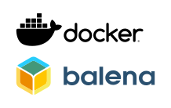

# Запуск програм із контейнерів OCI 

https://www.plcnext.help/te/Service_Components/Using_OCI_containers.htm

Пристрої PLCnext Control готові до запуску програм із [контейнерів OCI (Open Container Initiative)](https://www.opencontainers.org/).



Протягом багатьох років використання OCI-сумісних контейнерів (таких як docker®, **moby** або balena) зробило революцію в ІТ-ландшафті. Вони дозволяють набагато швидше та простіше повторно використовувати існуючі або спеціальні служби. Тепер PLCnext Technology поєднує ці можливості: надійність системи керування з можливостями сучасного розповсюдження програмного забезпечення. Це означає, що створювати, розгортати та запускати програми PLCnext Technology ще простіше. Створюйте власні мікросервіси або використовуйте існуючі контейнери!

Ми працюємо над додатковими функціями та інтеграцією в цьому відношенні, надаючи деякі наступні випуски мікропрограм.

Для початку тут ви можете знайти довідку та вказівки щодо впровадження контейнерів OCI у PLCnext Technology.

## Встановлення та налаштування контейнерів

У наступних розділах наведено вступ і перші кроки з Balena-Engine, орієнтованою на IoT контейнерну технологію Docker на елементі керування PLCnext. Для отримання додаткової інформації про Balena-Engine відвідайте [веб-сайт](https://www.balena.io/engine/) і [проект GitHub](https://github.com/balena-os/balena-engine).

Для інсталяції потрібно бути користувачем root, перейти туди можна: 

```bash
su
```

Щоб встановити пароль для root

```bash
sudo passwd root
```

Для встановлення Balena-Engine:

```bash
# Download the Project
git clone https://github.com/PLCnext/Docker_GettingStarted.git

# Execute Setup.sh in archive
cd Docker_GettingStarted
chmod +x setup.sh
./setup.sh
```

Усі OCI-сумісні образи можна використовувати в поєднанні з balena, особливо образи докерів, див.: https://hub.docker.com/

Для завантаження образу на контролер

`Pull` loads an image from a repository and stores it locally. if no complete domain is given, the images on https://hub.docker.com/ are searched automatically.

`Pull` завантажує образ зі сховища та зберігає його локально. Якщо не вказано повний домен, пошук образу на https://hub.docker.com/ здійснюється автоматично.

```bash
root@axcf2152:~# balena-engine pull armhf/debian
```

`Start` створює контейнер із образу, доступного на локальному комп'ютері

```bash
root@axcf2152:~# balena-engine start armhf/debian
```

Команда `run` поєднує в собі `pull` і `start`

```bash
root@axcf2152:~# balena-engine run armhf/debian
```

Команда `-it` (інтерактивна з `tty`) створює новий процес у контейнері. Також необхідно вказати точку входу. У прикладі `/bin/bash`

```bash
root@axcf2152:~# balena-engine run -it debian /bin/bash
# Result: If a container is successfully started
root@9bc6dd4527e0:/#
```

Перевірте доступ до Інтернету в контейнері докерів

```bash
root@9bc6dd4527e0:/# ping 8.8.8.8
# Result:
PING 8.8.8.8 (8.8.8.8) 56(84) bytes of data.
64 bytes from 8.8.8.8: icmp_seq=1 ttl=55 time=14.6 ms
```

Під час закриття та перезапуску контейнерів дані часу виконання (дані, які не є частиною образу) втрачаються. Якщо ці дані потрібно зберігати, вони повинні зберігатися постійно. 

```bash
root@9bc6dd4527e0:/# exit
# Result:
root@axcf2152:~#
```

Монтування головних томів у контейнер і тестування. Хостовий том — це один із способів збереження даних із контейнера.

```bash
# Create a project folder on the host e.g. /opt/plcnext/test and mount it in the container as /home/test/
root@axcf2152:~# mkdir /opt/plcnext/test
root@axcf2152:~# balena-engine run -it -v /opt/plcnext/test:/home/test/ debian bash
```

Замість томів хосту ви можете використовувати томи-контейнери на своєму хості. Існують також інші методи постійного зберігання даних із контейнерів, для яких надаються різні драйвери. Окрім томів і папок, часто використовується центральне мережеве сховище, наприклад NFS.

```bash
# For use a container volume you need a name instead of directory. Example:
balena-engine run -it -v test:/home/test/ debian bash
# will be create a volume.

# The volumes can be viewed by:
root@axcf2152:~# balena-engine volume ls

# The content of the volume can be inspected via ls on the host system
root@axcf2152:~# ls /media/rfs/rw/var/lib/balena/volumes/test/_data
```

Ви можете побачити приклад виведення на консолі.

```bash
root@axcf2152:~# balena-engine ps -a
Result:
CONTAINER ID        IMAGE                 COMMAND                  CREATED             STATUS                       PORTS                                            NAMES
4401cdaf0fee        armhf/debian          "bash"                   7 minutes ago       Exited (130) 8 seconds ago                                                    cranky_mayer
df194ad3f89d        debian                "bash"                   22 minutes ago      Exited (0) 21 minutes ago                                                     agitated_austin
092fe03508aa        nginx                 "nginx -g 'daemon of…"   33 minutes ago      Exited (0) 31 minutes ago                                                     magical_antonelli
0dd0b4d84759        registry:2            "/entrypoint.sh /etc…"   About an hour ago   Up About an hour             5000/tcp, 0.0.0.0:5000->5000/tcp                 registry_name
2c71de9f0555        portainer/portainer   "/portainer"             About an hour ago   Up About an hour             0.0.0.0:18000->8000/tcp, 0.0.0.0:19000->9000/tcp frosty_mclean
```

Ви можете побачити приклад виведення на консолі.

```bash
root@axcf2152:~# balena-engine rm 44 (a part of ID-Number: 4401cdaf0fee)
root@axcf2152:~# balena-engine ps -a
Result:
CONTAINER ID        IMAGE                 COMMAND                  CREATED             STATUS                       PORTS                                            NAMES
df194ad3f89d        debian                "bash"                   22 minutes ago      Exited (0) 21 minutes ago                                                     agitated_austin
092fe03508aa        nginx                 "nginx -g 'daemon of…"   33 minutes ago      Exited (0) 31 minutes ago                                                     magical_antonelli
0dd0b4d84759        registry:2            "/entrypoint.sh /etc…"   About an hour ago   Up About an hour             5000/tcp, 0.0.0.0:5000->5000/tcp                 registry_name
2c71de9f0555        portainer/portainer   "/portainer"             About an hour ago   Up About an hour             0.0.0.0:18000->8000/tcp, 0.0.0.0:19000->9000/tcp frosty_mclean
```

## Приклад встановлення контейнеру Node-RED

Це перекладена стаття [Джерело](https://www.plcnext-community.net/makersblog/node-red-and-getting-started-with-docker/)

Контейнер Docker можна використовувати для запуску сервера node-RED на пристрої PLCnext. Хоча інший метод, описаний [тут](https://www.plcnext-community.net/en/makersblog-off/298-automation-maker-002-node-red.html), є трохи швидшим. Використання контейнерів OCI має деякі переваги. Наприклад, при багаторазовому використанні тих самих пакетів для програми може бути корисним створити стандартний образ і просто завантажити його з Docker hub. Docker також можна використовувати для запуску та зупинки сервера node-red, коли ми цього забажаємо.

Цей блог пояснить саме це. Спочатку я проведу вас через процес встановлення Docker, і ми перевіримо встановлення. Ми створимо користувацькі образи з пакетами на наш смак, попередньо встановленими з Dockerfile, і створимо контейнер із нашого щойно створеного образу. Нарешті ми переконаємося, що наш контейнер запускатиметься під час завантаження контролера та надсилатиме наш образ на Dockerhub.

### Установка рушія Balena

Я трохи збрехав, коли сказав, що контейнери Docker можна використовувати для запуску середовища виконання node-RED на пристрої PLCnext. Як ви побачите, ми використовуємо двигун Balena як двигун для запуску контейнерів, точніше ми будемо використовувати контейнери OCI (Open Container Initiative). Боротьба через номенклатуру привела б нас далеко до створення блогу Makersblog, але в розділі для подальшого читання в кінці цього блогу я додав кілька посилань для тих, хто зацікавлений.

Процедура інсталяції досить проста, і її можна знайти [тут](https://github.com/PLCnext/Docker_GettingStarted/tree/master/getting-started) для повного ознайомлення, але з міркувань практичності команди також наведено в наступному розділ. 

Переконайтеся, що ви ввійшли як користувач root, щоб створити новий пароль root, введіть наступну команду в оболонку та введіть пароль адміністратора, а потім двічі новий пароль root.

```bash
sudo passwd root
```

Увійдіть як користувач root, ввівши `su`, а потім ваш щойно створений пароль.

Клонуйте репозиторій git і перейдіть до нової папки

```bash
git clone https://github.com/PLCnext/Docker_GettingStarted.git
cd Docker_GettingStarted
```

Зробіть сценарій налаштування виконуваним і виконайте цей сценарій.

```perl
chmod +x setup.sh
./setup.sh
```

### Отримання доступу до Інтернету з ваших контейнерів 

Іноді під час встановлення таблиці nft налаштовуються неправильно. На щастя, це легко виправити.
Повний довідковий посібник можна знайти тут, але короткий опис прогресу наведено нижче.

У вашому типі оболонки

```
ifconfig
```

З’явиться конфігурація ваших мережевих інтерфейсів. Один із них на ім'я Balena, зверніть увагу на адресу Інтернету цього інтерфейсу.

Це має бути приблизно так: `172.17.0.1`.

Введіть наступну команду в оболонку та порівняйте адресу Інтернету, отриману на попередньому кроці, з другим рядком сценарію.

Дві адреси мають бути однаковими, якщо так, ви можете переходити до наступного розділу.
Якщо ні, переведіть наступну команду у вашу оболонку та змініть адресу у другому рядку, щоб вона відповідала адресі, отриманій ifconfig.

```bash
nano /etc/nftables/balena.nft
```

Зупиніть і запустіть `balena-engine-daemon`, щоб перезавантажити таблиці nft.

```bash
/etc/init.d/balena stop
/etc/init.d/balena start
```

### Мій перший контейнер

Щоб завантажити свій перший контейнер, скористайтеся наступною командою, позначки будуть пояснені пізніше, не хвилюйтесь про них зараз. Тепер ми завантажимо контейнер Node-RED без пакетів custom. Якщо вам не потрібні пакети custom, ви можете зупинитися тут і перейти до порту 1880 контролера.

```bash
balena-engine run -d -p 1880:1880 --name nodered --restart always nodered/node-red
```

### Docker Hub

Образ `arm32v7/debian`, використаний у попередньому розділі, було завантажено з Docker Hub.
Docker Hub — це, по суті, місце, де збираються образи контейнерів, звідки їх можна легко завантажити.

Я можу порекомендувати організацію `arm32v7`, ця організація створює образи, сумісні з архітектурою AXC F 2152.

Організація node-red створила образи, сумісні з AXC F 2152, ми використаємо ці образи в наступному розділі, але спочатку я хочу зазначити, що якщо ви будете часто використовувати контейнери, вам слід створити обліковий запис на Docker Hub і використовувати його сховища. Створивши безкоштовний обліковий запис, ви отримаєте майже необмежену кількість публічних сховищ і одне приватне сховище. Деякий час я опирався використанню Docker Hub, але це коштувало мені багато часу.

В останньому розділі цього блогу я трохи згладжу криву навчання використанню Docker Hub, показавши, як увійти, повторно позначити образи та надіслати образ в Docker Hub.

### Dockerfile

Докер-файл у певному сенсі є рецептом для образу докера. У цьому блозі ми використаємо Dockerfile, щоб створити власний образ node-red із встановленими пакетами, які нам потрібні.

Перший рядок Dockerfile майже завжди є командою `FROM`. За допомогою цієї команди ми визначаємо базове зображення, з якого буде створено наше власне зображення.

Після оператора FROM ми починаємо будувати наш образ. Є багато можливих команд, які можна використовувати у файлі Docker, але тут ми будемо використовувати лише RUN.

Довідкове посилання на Dockerfile наведено в розділі додаткових матеріалів.

The RUN statement will execute the command that follows inside the container that we are building.
So to install a new package, for example the SNMP package we state: RUN `npm install node-red-node-snmp`

After the theory, let’s build a Dockerfile. Hopefully, you’re still  in a SSH session (make sure you’re back on the AXC F 2152 and not in the debian contain from two sections ago!).
You can create the  Dockerfile with nano and copy pasting the contents into the new file.  save (ctrl + s) and exit (ctrl + x).nano Dockerfile

```bash
FROM nodered/node-red:latest-minimal`
`RUN npm install node-red-node-snmp
```

Now it’s time to build our new image!

```bash
balena-engine build . --tag myimage
```

When you recieved the message that the images was tagged succesfully, you’ve build your first image!
To see the image you just build use the command: balena-engine images

### Running our new image

Finaly, we are ready to run our image and create a container from it!
Cast the following command in the shell to run the container interactively.
Interactively means that we can see in the terminal what’s going on inside the container.
The opposite is detached, marked with the flag -d

```bash
balena-engine run -it -p 1880:1880 --name nodered myimage
```

To exit the container and keep it running use ctrl + p ctrl +q
When you browse to the IP-address of the controller followed by port 1880  the node red environment shows and we see snmp package installed!

### Starting the image on boot and a primer on docker run flags

It is unpractical to boot the container manually every time the AXC F 2152 gets restared. Luckely we can tell Docker to start it for us, and  it is easy to!
Just use command listed below. This is also the time  to get a better understanding of the docker flags used. For starters, a  flag is something we give after the command and starts with either – or  –.
Until now we’ve seen only -it, to run a container interactively and -d to run a container detached (in the background).

The flag -p maps the port of the container to the port of the host. First  the the portnumber of the host is stated then the portnumber of the  container.
We can give the container a name with the –name flag. This name will be shown when u use balena-engine ps, to list all active  containers or balena-engine ps -a to list all containers.
When no –name flag is used the balena-daemon will assign a random name to the container.

And last but not least, a restart policy can be assigned to a container with the –restart flag.
The possible settings can be found in the reference link listed in the further readings.
For now –restart always will do the trick! Our command will be: 

```bash
balena-engine run -it -p 1880:1880 --name nodered --restart always myimage
```

### Pushing to Docker hub

When you wan’t to use your image on different controllers. It’s an good idea to upload your image to Docker Hub.
On the premise that you already have an account and created a docker  repository we’ll continue. First we’ll need to login to our account.  This can be done by typing balena-engine login followed by your username and password. Now it is possible to download images from private  repositories and to push your image to Docker hub.

To push your  image to Docker hub it is important to get the name right. When I’ve  made a repository myrep and my user account is myaccount the name of the image should be myaccount/myrep.
When you did not name it like that  when building the image, you have to re-tag the image by using  balena-engine tag oldimagetag newimagetag. In our case this would be:

```bash
balena-engine tag myimage myaccount/myrep  
```

When nothing more is defined it well get the label latest. It is  possible to at a lable adding a : and a label name. For example:

```bash
balena-engine tag myimage myaccount/myrep:alabel 
```

The only thing left is pushing our image to Docker hub with the command:

```perl
balena-engine push myaccount/myrep
```


- Прочитайте [запис у блозі Makers](https://www.plcnext-community.net/makersblog/how-to-turn-an-axc-f-2152-into-an-aws-greengrass-device/), який демонструє як за допомогою контейнера OCI можна легко перетворити PLCnext Control на пристрій [AWS IoT Greengrass](https://docs.aws.amazon.com/greengrass/latest/developerguide/what-is-gg.html).

Обговоріть із нашими спеціалістами на [форумі спільноти PLCnext](https://www.plcnext-community.net/forum/#/categories/container-plcnext-docker-moby-balena) і відфільтруйте вміст, щоб показати лише контейнер категорія (список на правій панелі).