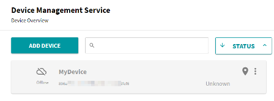
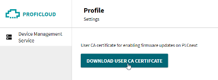

[Сервісні компоненти](..\README.md)

# Proficloud V3 Device Management Service

## Про Proficloud V3

Proficloud V3 — це середовище хмарних обчислень Phoenix Contact, доступне за адресою [www.proficloud**.io**](https://proficloud.io). Уже кілька років Phoenix Contact розміщує відому службу Proficloud на [www.proficloud**.net**](https://www.proficloud.net), надаючи послуги даних часових рядів (TSD) і підтримку онлайн-інсталяції на контролери з PLCnext Store. Новий Proficloud V3 побудований як абсолютно нове середовище на основі нових архітектур і технологій, деякий час обидві версії існуватимуть разом. Усі функції відомого Proficloud залишаться доступними, і на даний момент користувачі можуть використовувати одночасно на контролері підключення до обидвох середоивщ Proficloud .

Proficloud V3 пропонує простий спосіб керування та обслуговування віддалених пристроїв PLCnext, наприклад, таких як контролери на вітрових електростанціях. Окрім PLCnext до Proficloud є можливість підключати деякі інші пристрої Phoenix Contact, а також будь-яких організацій через відкритий API, є готова бібліотека для Node-RED. 

Основні функції Proficloud :

- відображення для підключених пристроїв:
  - статичної інформації та геолокації 
  - стану справності: повідомлення, попередження, помилки
  - журнали повідомлень 

- Перевірка наявності оновлень прошивки та їх оновлення на підключених пристроях через хмару
- Використання даних часових рядів (TSD) 

У майбутньому будуть доступні додаткові сервіси.

У даному посібнику розглядаються наступні питання:

- реєстрування на платформі
- підключення PLCnext до Proficloud
- використання сервісів адміністрування пристроїв на Proficloud - Device Management Service
  - добавлення, редагування, видалення пристроїв
  - підключення PLCnext до Proficloud V3
  - підключення Node-RED до Proficloud V3
- використання сервісів керування пристроями
- використання сервісів часових рядів 

## Реєстрування користувача в Proficloud

Для реєстрування в Proficloud потрібна лише поштова скринька, наразі деякі сервіси безкоштовні в певному обсязі: 

1. Відкрийте [www.proficloud.io](https://proficloud.io) у браузері та зареєструйтеся як користувач
2. Підтвердіть обліковий запис користувача, відповівши на повідомлення електронної пошти, надіслане на адресу, указану разом з обліковим записом       

## Device Management Service 

Device Management Service - це сервіс для адміністрування та керування пристроями. За допомогою нього можна:

- додавати нові пристрої до Proficloud, які планується підключати
- для кожного пристрою вказувати статичну інформацію (ідентифікація, серійний номер, тощо) та дані геолокації
- переглядати використовувані Proficloud сервіси для пристрою та переходити на сторінку їх використання, зокрема на TSD - перегляд записаних даних у вигляді трендів та Dashboard
- переглядати стан пристроїв щодо підключення та помилок: кольором та текстом
- переглянути актуальність мікропрограми у віддаленому ПЛК 
- віддалено прошити ПЛК новою мікропрограмою, скинути до попередньої версії при помилковому відновленні 

- переглядати журнал повідомлень та помилок для пристроїв


У цій темі показано як додавати, редагувати або видаляти свої пристрої PLCnext та NodeRED в Proficloud V3 Device Management Service. У наступній розглядаються можливості використання сервісів керування пристроями. 

### Загальні принципи додавання пристроїв 

Добавлення пристроїв відбувається через одноіменну панель. 

1) Увійдіть у свій обліковий запис користувача на [www.proficloud.io](https://proficloud.io)

2) Натисніть `Device Management Service` на панелі ліворуч, щоб відкрити сторінку `Device Overview`.

3) Натисніть `ADD DEVICE` на сторінці `Device Overview` 

​          

З’явиться діалогове вікно `New Device`.


4) Введіть **UUID** вашого пристрою PLCnext (надрукований на його корпусі) і **name**, щоб ідентифікувати цей запис в `Device Overview`. Якщо пристрій не підтримує сервіс Proficloud, і UUID в нього немає - можна виставити відповідну опцію (Virtual Device), деталі див. в Додавання віртуальних пристроїв через Nde-RED нижче. 

5) За бажанням введіть **comment**, **address**, де розташований пристрій, і корисний **tag** для розрізнення великої кількості пристроїв, підключених до одного облікового запису

6) Завершіть, натиснувши кнопку `ADD DEVICE TO PROFICLOUD`

7) Пристрій з'являється в Device Overview
             

8) Якщо ваш пристрій під’єднано до Інтернету, через кілька секунд повідомлення про статус має стати `Online`. Тепер цей пристрій готовий до використання з Proficloud V3.

9) Повторіть процедуру для інших пристроїв.

Підказка. Зі збільшенням списку пристроїв ви можете змінити порядок пристроїв у меню STATUS:


### Редагування або видалення пристроїв з Proficloud

Щоб відредагувати або видалити інформацію про пристрій, створену під час процесу реєстрації, натисніть значок із трьома крапками праворуч на картці пристрою та виберіть відповідний пункт меню:


 

Діалогове вікно `Edit Device` має приблизно ту саму форму, що й діалогове вікно `New Device`, тому ви можете додати необов’язкову інформацію пізніше:


Діалогове вікно `Delete Device` містить підказки щодо того, що станеться, якщо видалити пристрій. Уважно прочитавши, натисніть кнопку підтвердження або скасування:


### Підключення PLCnext до Proficloud

У цій темі ви прочитаєте, як підготувати свій PLCnext Control до роботи з Proficloud V3. Якщо Ваш пристрій не підтримує Proficloud його можна добавити через API або використовуючи готові вузли Node-RED (читай  нижче) 

#### Отримання сетифікату користувача Proficloud V3

Сертифікат користувача потрібний, лише якщо ви хочете на своїх пристроях PLCnext оновлювати мікропрограму (прошивку) через Proficloud V3. Цей сертифікат є конкретним для облікового запису користувача, тому всі пристрої в обліковому записі працюватимуть з одним сертифікатом, але його потрібно розмістити на кожному пристрої, який має працювати через Proficloud V3. Цю підготовку на пристрої буде виконано на наступному етапі цих інструкцій.

1) Увійдіть у свій обліковий запис користувача на [www.proficloud.io](https://proficloud.io)

2) Натисніть піктограму користувача у верхньому правому куті та виберіть у спадному меню `Settings`.          

3) Натисніть кнопку `DOWNLOAD USER CA CERTIFICATE` :
             
             

4) Файл сертифікату `.crt` завантажується на ваш комп’ютер

#### Увімкнення підключення Proficloud V3 на пристрої PLCnext  

Цей крок виконується за допомогою Web-Based Management (WBM) на пристрої PLCnext. Сторінка Proficloud V3 WBM надає інформацію про стан підключення між PLCnext Control і Proficloud V3. 


Якщо ви хочете керувати або контролювати контролер за допомогою підключення Proficloud V3, вам потрібно увімкнути службу Proficloud V3 контролера. Коли послугу Proficloud V3 контролера увімкнено, контролер намагається встановити з’єднання з Proficloud V3.

- Увімкніть прапорець `Enable Proficloud V3 Service`.
- Натисніть на кнопку `Apply` .

Підключення Proficloud V3 для контролера увімкнено. Аналогічно робиться відключення пристрою від Proficloud. 

Якщо пристрій PLCnext скинуто до заводських налаштувань за замовчуванням, ці дії потрібно виконати буде ще раз, щоб використовувати пристрій із Proficloud V3. 

#### Підготовка пристрою PLCnext до Proficloud V3

- Переконайтеся, що для годинника реального часу (RTC) пристрою встановлено `UTC0`, **а не** часовий пояс, де знаходиться пристрій. `UTC0` — це UTC±00:00 універсального координованого часу (UTC), яке також є значенням за замовчуванням для кожного пристрою PLCnext, тому зазвичай нічого не потрібно змінювати, щоб відповідати потребам Proficloud V3. 
- Переконайтеся, що шлюз мережевого підключення налаштовано правильно, щоб пристрій PLCnext міг підключитися до служб в Інтернеті.

#### Зареєструйте Trust Store для Proficloud V3 

Proficloud V3 має бути надійним джерелом, що відображається сертифікатом у Trust Store. 

1) Додайте новий Trust Store під назвою `proficloudv3` (з урахуванням регістру!)                  

2) Додайте файл сертифіката `.crt`, який ви отримали на попередньому етапі цих інструкцій
    

Тепер пристрій готовий до спілкування з Proficloud.

### Додавання віртуальних пристроїв використовуючи Node-RED 

Окрім пристроїв PLCnext та інших деяких засобів від Phoenix Contact можна добавляти інші пристрої, як віртуальні. Тут розглянемо як це можна зробити через Node-RED.

Для використання сервісів Proficloud в Node-RED можна встановити бібліотеку **node-red-contrib-proficloud**. Після встановлення у категорії Phoenix Contact ви знайдете ProficloudDevice-Node. Перед підключенням Node до Proficloud.io вам потрібно додати віртуальний UUID до свого облікового запису Proficloud.io.

Щоб отримати UUID для стороннього пристрою, достатньо перейти до Device Management Service та натиснути `Add device`. Тут ви отримуєте можливість отримати опцію для віртуального UUID/віртуального пристрою. Решта процесу відбувається як описано вище. Після додавання пристрою ви можете скопіювати UUID і використовувати його в Node-RED


Тепер введіть UUID у конфігурацію ProficloudDevice-Node і активуйте AutoConnect. Після розгортання потоку вузол повинен підключитися до Proficloud. Перше підключення може зайняти деякий час через обмін клієнтськими сертифікатами. Опис роботи з вузлом в Node-RED наведений в [довіднику Node-RED](https://pupenasan.github.io/NodeREDGuidUKR/phoenixcontact/)

[Додаткова інформація](https://proficloud.io/courses/get-to-know-node-red-and-proficloud-io/lessons/installation-of-proficlouddevice-node/) 

## Використання сервісів керування пристроями 

У цій темі ви дізнаєтеся, яку інформацію можна знайти для своїх пристроїв у Proficloud V3, як інтерпретувати стан працездатності та журнали та як виконати дистанційне оновлення мікропрограми через Proficloud V3.

### Огляд пристроїв

В `Device Overview` кожен пристрій відображається як картка з його даними поруч із картою, на якій показано його геолокацію (якщо введено кординати розміщення). Колір картки та піктограми карти відображає стан справності пристрою. Натисніть на картку, щоб розгорнути вкладки служби для цього пристрою.


### Health (працездатність)


Вкладка Health надає інформацію про стан пристрою. Для PLCnext відображення залежить від світлодіодів на його корпусі, для віртуальних пристроїв формується при передачі повідомлень (як наприклад в [Node-RED](https://pupenasan.github.io/NodeREDGuidUKR/phoenixcontact/)). Для PLCnext Control типові світлодіоди використовуються для відображення 3-крокового кольорового коду, який відображається на картці пристрою: 

- Якщо картка <span style="background-color:green; color:white"> зелена</span>  тоді світлодіоди пристрою повідомляють про наступне:  
  - `SF` - не світиться *ТА*
  - `FAIL` - не світиться *ТА*
  - `D` - зелена  *ТА*
  - `E` - не світиться  
- Якщо картка <span style="background-color:orange; color:black"> помаранчева</span> тоді світлодіоди пристрою повідомляють про наступне:     
  - `BF-C` - світиться *АБО* 
  - `BF-D` - світиться   *АБО* 
  - `D` - жовта *АБО* 
  - `E` - жовта
- Якщо картка <span style="background-color:red; color:black">червона</span>  тоді світлодіоди пристрою повідомляють про наступне:     
  - `SF` - світиться  *АБО*
  - `FAIL` - світиться *АБО* 
  - `D` - червона  *АБО*
  - `E` - черовна

Статус пристрою `Device Status` для PLCnext показує, який із станів викликає код кольору, для віртуальних формується при передачі повідомлень. 

Крім того, на цій вкладці за замовчуванням відображається сповіщення про наявність нового оновлення мікропрограми, якщо таке має місце .

### Інформація

На вкладці `Information` ви знайдете ключову інформацію для кожного пристрою. Вона містить інформацію, яку ви ввели в процесі реєстрації, а також деякі дані, надані самим пристроєм:

- Коментар
- Місцезнаходження
- Серійний номер
- Тип пристрою
- UUID
- Апаратна версія


### Service

На вкладці `Service` перераховані підключені сервіси для пристроїв з можливістю керування ними та переходу на відповідні сторінки. Наприклад використання даних часових рядів Time Series Data Service (тренди). 


### Logs (журнал)


На вкладці `Logs` відображається реєстраційна інформація пристрою, яка надсилається з пристрою до хмари. Для пристрої PLCnext ці записи відфільтровуються з файлу `Output.log`. Для віртуальних пристроїв формуються з використанням відповідних повідомлень.

### Firmware Update


На вкладці `Firmware Update` керується процес оновлення мікропрограми. PLCnext Control виконає оновлення мікропрограми лише тоді, коли ПЛК перебуває в стані `STOP`. Якщо оновлення потрібно виконати в стані `RUN`, це потрібно ввімкнути у файлі налаштувань, який знаходиться в цьому каталозі на пристрої:

```
  /opt/plcnext/projects/Default/Services/ProfiCloudV3/ProfiCloudV3.config.20.6    
```

Щоб підготувати пристрій до оновлення мікропрограми зі стану `RUN`, увійдіть у пристрій за допомогою WinSCP або подібного програмного забезпечення, перейдіть до файлу `.config ` і змініть параметр `force` у тегу `<FirmwareUpdate>` на ` true`:

```xml
<FirmwareUpdate enabled="true" 
        force="true"        
        artifactServer=""/>     
```

Процес оновлення можна почати, натиснувши кнопку `UPDATE FIRMWARE`. У діалоговому вікні вибору мікропрограми виберіть версію, яку потрібно інсталювати, і натисніть кнопку `UPDATE FIRMWARE NOW` :


Дотримуйтеся процесу оновлення, який відображається в повідомленнях про статус:


На рисунку нижче показано оновлення, яке виконано успішно, із зазначенням кожного кроку процесу:


## Time-series data (TSD) connector для PLCnext

У цьому розділі показано як забезпечити передачу даних для TSD з PLCnext. Для налаштування передачі даних для віртуального пристрою з Node-RED, прочитайте [цю статтю](https://pupenasan.github.io/NodeREDGuidUKR/phoenixcontact/). 

### Підготовка свого проекту на контролері 

Зробіть такі налаштування в PLCnext Engineer, щоб підготувати проект:

- Оголосіть змінні, які будуть використовуватися в службі TSD, як OUT Port. Phoenix Contact рекомендує надсилати до Proficloud максимум 50 змінних на один контролер PLCnext. У версії мікропрограми 2021.6 максимум збільшено до 300 змінних.
- Також активуйте прапорець Proficloud для необхідних змінних. 

Примітка щодо безпеки: Зверніть увагу, що передані значення змінних можуть переглядати будь-які користувачі облікового запису Proficloud вашої організації. У Proficloud наразі неможливо призначити різні права користувачам.


У таблиці нижче наведений підтримувані наступні типи даних:

| PLCnext Engineer | Simulink | C++     |
| ---------------- | -------- | ------- |
| BOOL             | Boolean  | boolean |
| BYTE             | uint8    | uint8   |
| DINT             | int32    | int32   |
| DWORD            | uint32   | uint32  |
| INT              | int16    | int16   |
| LINT             |          | int64   |
| LREAL            | double   | double  |
| LWORD            |          | uint64  |
| REAL             | single   | float   |
| SINT             | int8     | int8    |
| UDINT            | uint32   | uint32  |
| UINT             | uint16   | uint16  |
| ULINT            |          | uint64  |
| USINT            | uint8    | uint8   |
| WORD             | uint16   | uint16  |

### Показати значення на інформаційній панелі

- Щойно пристрій зареєстровано, в Proficloud V3 можна отримати доступ до служби TSD:


- Спочатку виберіть UUID пристрою, який надаватиме дані:


Після вибору UUID усі змінні, оголошені для служби TSD у PLCnext Engineer, автоматично відображаються на одному графіку:


### Проміжне зберігання даних

Можна зберігати до 1000 елементів даних в тимчасовому буфері. Елемент даних (data element) — це значення змінної, яке було записане в певний час. Контролер PLCnext записує дані з інтервалом 1000 мс і надсилає їх на Proficloud кожні 1000 мс, якщо з’єднання встановлено. Дані можна буферизувати, доки не буде досягнуто 1000 елементів. Наприклад, якщо позначено 10 змінних, можна буферизувати 100 с. У разі переповнення пам'яті найстаріші дані будуть видалені.

Якщо з’єднання з Інтернетом переривається, значення тимчасово зберігаються в контролері та надсилаються в Proficloud, як тільки з’єднання буде відновлено. Дані, що зберігаються в буфері, втрачаються, коли виконується перезавантаження контролера.

## Створення власної інформаційної панелі (Dashboard)

Даний розділ буде доповнюватися. 

### Створення нової інформаційної панелі

Щоб створити нову інформаційну панель, потрібно перейти до своєї організації.


   

Рис. Переключення організації

Деталі https://proficloud.io/faqs/time-series-data/

### Налаштування тривог

Ви також можете встановити тривоги для кожної панелі у вашій організації. Щойно правило виконується (перевищення/заниження значення), визначеним одержувачам надсилається повідомлення.

Деталі https://proficloud.io/faqs/time-series-data/

## Джерела для додаткового вивчення

https://www.plcnext.help/te/Service_Components/PROFICLOUD/Proficloud_V3_Introduction.htm