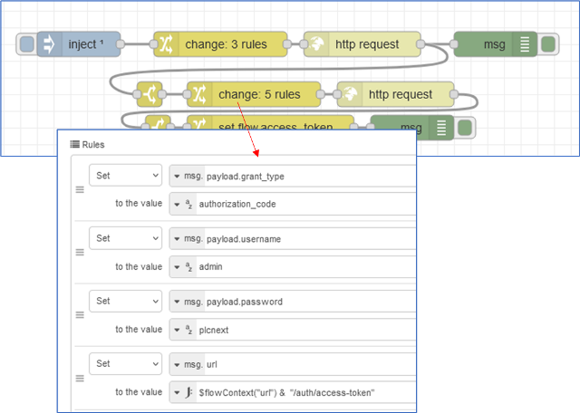

[Сервісні компоненти](../README.md)

# REST data interface

## Концепція

[Довідкова інформація](https://www.plcnext.help/te/Service_Components/REST_data_interface/REST_data_interface_Introduction.htm)

У цьому розділі ви дізнаєтеся про підхід на основі REST технології PLCnext, який використовується для обміну даними через HTTP із вбудованим програмним забезпеченням PLCnext Control і з даними в глобальному просторі даних (GDS).

## Про REST

REST, або **RE**presentational **S**tate **T**transfer, — це стиль архітектури програмного забезпечення, що складається з рекомендацій і найкращих практик для створення масштабованих веб-служб. Якщо Ви знайомі з REST, можете продовжувати читати з наступного пункту. Якщо ні -  про REST можна прочитати наприклад в [лекції по REST](https://pupenasan.github.io/ProgIngContrSystems/%D0%9B%D0%B5%D0%BA%D1%86/6_httpapi.html) а перед тим варто познайомитися з HTTP. Якщо HTTP для Вас також нова тема, можна почитати про це в [цій лекції](https://pupenasan.github.io/ProgIngContrSystems/%D0%9B%D0%B5%D0%BA%D1%86/4_http.html).  Додатково є лабораторні роботи по HTTP з використанням Node-RED [за цим посиланням](https://pupenasan.github.io/ProgIngContrSystems/%D0%9B%D0%B0%D0%B1%D0%BE%D1%80/lab2_tcphttp.html). REST дає можливість прямої інтеграції різноманітних IP-застосунків безпосередньо з PLCnext. Тобто в PLCnext не потрібно додаткового ПЗ чи обладнання щоб доступитися до даних з таких застосунків, хіба що виключно з ціллю безпеки.    

В кінці розділу є приклад використання REST PLCnext з клієнта в Node-RED для читання та запису змінних в ПЛК. 

## REST в PLCnext 

Ключовими особливостями інтерфейсу даних PLCnext REST є:

- Доступ до даних через порти GDS або змінні PLC. Через REST API можна отримати доступ лише до портів GDS і змінних, які позначені атрибутом HMI.
- Авторизація на різних рівнях користувачів базується на основі керування користувачами PLCnext Engineer HMI
- Використовується зашифрована передача даних через https

Цей інтерфейс даних REST має кілька версій, і кожна версія зберігається стабільною та підтримуватиметься.  Phoenix Contact залишає за собою право вносити зміни та доповнення в подальші версії, які можуть призвести до несумісності. Тому настійно рекомендується викликати цей інтерфейс даних REST із вашої програми явно за допомогою версії, яка використовувалася під час розробки, а не за допомогою ключа `latest`  (за замвоченням).

Інтерфейс даних REST надається компонентом HMI PLCnext для клієнтів HMI PLCnext Engineer, який зазвичай є програмою на основі браузера, що працює на вбудованому веб-сервері `nginx` на будь-якому контролері PLCnext. Однак його ж можна використати і для інших застосунків як REST Client. Схематичний рисунок нижче показує, де знаходиться інтерфейс даних REST у контексті PLCnext Runtime System:


Обмін даним налаштовується в такому порядку:

1. Перш за все потрібен проект PLCnext Engineer, який має містити принаймні одну сторінку HMI щоб ініціалізувати компонент HMI PLCnext (спочатку може бути порожньою). 
2. У проекті PLCnext Engineer усі порти GDS або змінні ПЛК, до яких потрібно отримати доступ за допомогою інтерфейсу даних REST, мають бути затверджені опцією `HMI`.
3. Потім потрібно отримати авторизований доступ до портів GDS і змінних PLC через інтерфейс REST data . Прочитайте тему "Автентифікація", щоб дізнатися, як це робиться.
4. Після відкриття Sesame ви можете читати або писати змінні, налаштовувати змінні в групах, отримати звіти сеансу і зробити це за надсилання всіх видів запитів.

Зверніть увагу що для перевірки на імітаторі, порт повинен бути таким, як налаштовано в конфігурації, за замовченням `5050`.

## Автентифікація 

Автентифікація в інтерфейсі REST data – це двоетапний процес:

1. Спочатку йде запит маркера автентифікації (authorization token)
2. Потім йде запит на автентифікацію користувача, за якими по маркеру автентифікації отримують маркер доступу (access token)

3) Після цього за допомогою отриманого маркера доступу ви отримаєте доступ до портів і змінних GDS. Реалізація перетворення інтерфейсу даних REST у захищений ресурс базується на OAuth 2.0, як описано в [RFC 6749](https://tools.ietf.org/html/rfc6749) (зверніть увагу: є деякі відмінності!) . 

На рисунку нижче показано процедуру автентифікації в контексті PLCnext Technology:


- `(A)` Клієнт запитує авторизацію для інтерфейсу REST data . Це надає клієнту дозвіл на автентифікацію в `pxc_api` (API Phoenix Contact). Запит містить секрет, відомий клієнту, який має бути повторений у відповіді від сервера.
- `(B)` Сервер відповідає маркером авторизації та секретом, наданим клієнтом.
- `(C)` Коли користувач намагається увійти, клієнт надсилає ім’я користувача та пароль відкритим текстом через зашифрований канал (TLS).
- `(D)` Якщо підсистема безпеки PLCnext Runtime System приймає користувача та пароль, то для цього користувача повертаються у відповідь маркер доступу та ролі. 

Коли клієнт отримує маркер доступу, для кожного запиту даних відбувається наступний обмін:

- `(E)` Клієнт включає маркер доступу в HTTP-заголовок запиту даних `pxc_api`, використовуючи заголовок `Authorization` і маркер `Bearer`.
- `(F)`  Після успішної перевірки маркера `Bearer` у заголовку запиту повертаються дані запиту.

Помилки автентифікації повертаються в полі `WWW-Authenticate Response Header` за допомогою інфраструктури, описаної в HTTP/1.1 [RFC 2617](https://tools.ietf.org/html/rfc2617).

- `invalid_token `у відповіді про помилку вказує, що токен відсутній або недійсний.
- `invalid_grant ` вказує на те, що користувач і пароль не збігаються з обліковими даними на сервері.

**Запит маркера автентифікації** 

Надішліть запит із таким тілом до URI запиту:

| Частина запиту/відповіді         | Значення                                               |
| -------------------------------- | ------------------------------------------------------ |
| Request URI (HTTP method `POST`) | `https://192.168.225.78/_pxc_api/v1.2/auth/auth-token` |
| Request body (.json)             | `{"scope":"variables"}`                                |
| Response (.json)                 | `{"code":"yourAuthToken","expires_in":600}`            |

Маркер автентифікації, переданий у відповідь, буде прив’язаний до запитуючої IP-адреси до закінчення терміну дії.

**Запит на автентифікацію користувача**

Вставте маркер автентифікації (`"yourAuthToken"`), дійсне ім’я користувача та відповідний пароль у нове тіло запиту. Надішліть запит із підготовленим тілом на URI запиту:

| Частина запиту/відповіді          | Значення                                                     |
| --------------------------------- | ------------------------------------------------------------ |
| Request URI (HTTP method `POST`): | `https://192.168.225.78/_pxc_api/v1.2/auth/access-token`     |
| Request body (.json):             | `{"code": "yourAuthToken", "grant_type": "authorization_code", "username": "admin", "password": "PLCpassword"}` |
| Response (.json):                 | e.g. `{"token_type":"Bearer","access_token":"df3b895e160a92f1","roles":[]}` |

Маркер доступу, який передається у відповідь, надає доступ до портів і змінних GDS, якщо його помістити в заголовок HTTP. У запиті даних передаються ролі користувача, пов’язані з іменем користувача. Ролі користувачів відповідають `EHmiLevels`, встановленим у  Web-based Management

**Автентифікація при запиту даних**

Приклад запиту даних міститиме в заголовку таку пару `key-value`:

```
{"Authorization": "Bearer xyz"}
```

**Відключення автентифікації**

Із налаштуваннями за замовчуванням для доступу до інтерфейсу даних REST потрібна автентифікація користувача через керування користувачами PLCnext. Phoenix Contact рекомендує ці налаштування за замовчуванням з міркувань безпеки. Якщо вам потрібен прямий доступ без автентифікації, автентифікацію можна вимкнути в налаштуваннях безпеки веб-сервера HMI, як показано нижче:


## Отримання колекцій та словників 

Щоб завантажити колекцію запитів у цьому інтерфейсі даних REST, просто натисніть посилання та розпакуйте:

- [Browse Items](https://www.plcnext.help/assets/files/PLCnext_DA_REST_BrowseItems.postman_collection.json.zip) collection v1.4
- [Data Session](https://www.plcnext.help/assets/files/PLCnext_DA_REST_DataSession.postman_collection.json.zip) collection v1.4

Щоб отримати словник, ви можете використовувати такі виклики:

- отримання словника даних
- отримання словника типів

**Отримання словника даних**

Наступний запит повертає JSON з усіма доступними з REST API змінними та інформацією про їх тип.

```http
GET https://%PlcAddress%/ehmi/data.dictionary.json
```

де `%PlcAddress%` - адреса PLC

Приклад відповіді:

```json
{
    "$schema":"http:\/\/json-schema.org\/draft-0\/schema#",
    "title":"DataDictionary",
    "HmiVariables2":
      {
        "Arp.Plc.Eclr/ESM_DATA.ESM_INFOS[1].TICK_COUNT":
          { 
            "Type": "DINT",
            "InitValue": "0",
            "ReadOnly": true
          },
        "Arp.Plc.Eclr/Test_Global":
          {
            "Type": "BOOL",
            "InitValue": "FALSE"
          },
        "Arp.Plc.Eclr/Test_Global_GroupVar1":
          {
            "Type": "BOOL",
            "InitValue": "FALSE"
          },
        "Arp.Plc.Eclr/Test_Global_GroupVar2":
          { 
            "Type": "BYTE",
            "InitValue": "BYTE#16#0"
          },
        "Arp.Plc.Eclr/Test_Global_GroupVar3":
          {
            "Type": "WORD",
            "InitValue": "WORD#16#0"
          },
        "Arp.Plc.Eclr/Test_Global_GrouptVar4":
          {
            "Type": "DWORD",
            "InitValue": "DWORD#16#0"
          },
        "Arp.Plc.Eclr/TestArray":
          {
            "Type": "arrByte_Stream",
            "InitValue": ""
          }
      }
  }
```

**Отримання словника типів**

Наступний запит повертає JSON з усіма використаними типами даних.

```
GET https://%PlcAddress%/ehmi/type.dictionary.json
```

де `%PlcAddress%` це адреса ПЛК

Приклад відповіді:

```json
{
  "$schema":"http:\/\/json-schema.org\/draft-0\/schema#",
  "title":"TypeDictionary",
  "Types": 
  [
    {
      "Name": "DINT",
      "RuntimeType": "System.Int32",
      "RuntimeSize": 4,
      "RuntimeAlignment": 4,
      "Kind": "Elementary"
    },
    {
      "Name": "BOOL",
      "RuntimeType": "System.Boolean",
      "RuntimeSize": 1,
      "RuntimeAlignment": 1,
      "Kind": "Elementary"
    },
    {
      "Name": "BYTE",
      "RuntimeType": "System.Byte",
      "RuntimeSize": 1,
      "RuntimeAlignment": 1,
      "Kind": "Elementary"
    },
    {
      "Name": "WORD",
      "RuntimeType": "System.UInt16",
      "RuntimeSize": 2,
      "RuntimeAlignment": 2,
      "Kind": "Elementary"
    },
    {
      "Name": "DWORD",
      "RuntimeType": "System.UInt32",
      "RuntimeSize": 4,
      "RuntimeAlignment": 4,
      "Kind": "Elementary"
    },
    {
      "Name": "arrByte_Stream",
      "RuntimeType": "ProConOS_eCLR.arrByte_Stream",
      "RuntimeSize": 28,
      "RuntimeAlignment": 1,
      "Kind": "Array",
      "ElementType": "BYTE",
      "Dimensions": 
      [
        {
          "StartIndex": 0,
          "Length": 28
        }
      ]
    }
  ]
}
```

## Запити

У наведеній нижче таблиці підсумовано запити та відповіді на них.

| Command                                                      | HTTP method | Relative URI for PLCnext Control                         | Query Parameters                                             | Response  |
| ------------------------------------------------------------ | ----------- | -------------------------------------------------------- | ------------------------------------------------------------ | --------- |
| [Service Description](https://www.plcnext.help/te/Service_Components/REST_data_interface/REST_data_interface_Request.htm#Service_description) | `GET`       | `/_pxc_api/api`             `/_pxc_api/v%Major%.%Minor%` |                                                              | JSON data |
| [Sessions](https://www.plcnext.help/te/Service_Components/REST_data_interface/REST_data_interface_Sessions.htm) |             |                                                          |                                                              |           |
| Report Sessions                                              | `GET`       | `/_pxc_api/api/sessions`                                 |                                                              | JSON data |
| Create Session                                               | `POST`      | `/_pxc_api/api/sessions`                                 | with request body `stationID=%StationID%&timeout=%OptionalTimeout%` | JSON data |
| Maintain Session                                             | `POST`      | `/_pxc_api/api/sessions/%SessionID%`                     |                                                              | JSON data |
| Reassign Session                                             | `POST`      | `/_pxc_api/api/sessions/%SessionID%`                     | with request body `stationID=%StationID%&timeout=%OptionalTimeout%` | JSON data |
| Delete Session                                               | `DELETE`    | `/_pxc_api/api/sessions/%SessionID%`                     |                                                              | –         |
| [Groups](https://www.plcnext.help/te/Service_Components/REST_data_interface/REST_data_interface_Groups.htm) |             |                                                          |                                                              |           |
| Report Groups                                                | `GET`       | `/_pxc_api/api/groups`                                   |                                                              | JSON data |
| Register Group                                               | `POST`      | `/_pxc_api/api/groups/%GroupID%`                         | with request body `pathPrefix=%OptionalVariablePathPrefix%&paths= 		%VariablePath1%,...,%VariablePathN%` | JSON data |
| Read Group                                                   | `GET`       | `/_pxc_api/api/groups/%GroupID%`                         | `summary=%OptionalSummarySetting%`                           | JSON data |
| Unregister Group                                             | `DELETE`    | `/_pxc_api/api/groups/%GroupID%`                         |                                                              | –         |
| [Variable](https://www.plcnext.help/te/Service_Components/REST_data_interface/REST_data_interface_Variables.htm) |             |                                                          |                                                              |           |
| Read Variable(s)            via `GET`                        | `GET`       | `/_pxc_api/api/variables`                                | `pathPrefix=%OptionalVariablePathPrefix%&paths= 		%VariablePath1%,...,%VariablePathN%` | JSON data |
| Read Variable(s)            via `POST`                       | `POST`      | `/_pxc_api/api/variables`                                | with request body `pathPrefix=%OptionalVariablePathPrefix%&paths= 		%VariablePath1%,...,%VariablePathN%` | JSON data |
| Write Variable(s) with constant values                       | `PUT`       | `/_pxc_api/api/variables`                                | JSON Data with `%ConstantValue1%` to `%ConstantValueN%`      | JSON data |
| Write Variable(s)with variable values                        | `PUT`       | `/_pxc_api/api/variables`                                | JSON Data with `%ReadVariablePath1%` to `%ReadVariablePathN%` | JSON data |

де `_pxc_api`, `api`, `v1.0`, `sessions`, `groups`, `variables` віртуальні директорії

Щоб працювати з вищевказаними функціями на вашому PLCnext Control, спочатку зробіть інтерфейс даних REST захищеним ресурсом, як описано в розділі "Автентифікація".

### Service Description (опис сервісу)

Документ з описом сервісу доступний у корені сервісу. Він надає версію сервісу у формі `v{Major}.{Minor}`. Шлях `api` можна використовувати для отримання останньої версії сервісу. Шлях поточної версії – `v1.1`. 

Це робиться за допомогою однієї з наступних команд HTTP GET:

```http
GET https://%plcaddress%/api
```

або

```http
GET https://%plcaddress%/_pxc_api/v%Major%.%Minor%
```

де `%PlcAddress%` - це адреса ПЛК, `%Major%` — це основна версія API 1, і `%Minor%` — це проміжна версія API (0–1).

Відповіддю є код статусу HTTP `200` (OK) для успішного отримання опису сервісу разом із отриманими даними JSON. Інакше для невдалої спроби повідомляється відповідний код статусу HTTP (наприклад, `400` = неправильний запит, `500` = внутрішня помилка сервера).

Детальніше можна прочитати [за посиланням](https://www.plcnext.help/te/Service_Components/REST_data_interface/REST_data_interface_Request.htm#Service_description).

### Sessions (сеанси)

При бажанні веб-сервер може відстежувати набір активних клієнтських станцій на основі відповідної інформації про сеанс. В іншому випадку веб-сервер автоматично вважатиме кожну станцію анонімною. Дані сервіси надають можливості також керувати сеансами. Доступні наступні дії з сеансами через REST:

- Звітування про сеанси - повідомляє про колекцію поточних активних сеансів на веб-сервері (якщо такі є). Отриманий звіт – це сторінка з нульом або більше ідентифікаторами та посиланнями на сеанс разом із посиланням на наступну сторінку (якщо така є), доки не буде отримано повний список поточних активних сеансів.
- Створення сеансу - створює контрольований за часом сеанс для певної станції. Отриманою відповіддю є ідентифікатор сеансу та час очікування сеансу.
- Підтримання сеансу - підтримує попередньо створений сеанс для активної клієнтської станції, щоб уникнути тайм-ауту сеансу.
- Перепризначення сеансу - перепризначає раніше створений сеанс іншій станції, а отримана відповідь є ідентифікатором нового сеансу.
- Видалення сеансу - видаляє попередньо створений сеанс 

Детальніше можна прочитати [за посиланням](https://www.plcnext.help/te/Service_Components/REST_data_interface/REST_data_interface_Sessions.htm)

### Variables (читання/запис змінних)

Інтерфейс надає можливість читання/запису змінних. Глобальні змінні повинні мати виставлено опцію  `HMI`, щоб бути доступними для REST API. Читання можна робити як через методи GET так і POST. 

#### Читання

Приклад читання через GET:

```http
GET https://%PlcAddress%/_pxc_api/api/variables?sessionID=%OptionalSessionID%&pathPrefix=%OptionalVariablesPathPrefix%&paths=%VariablePath1%,...,%VariablesPathN%
```

| Замінники                      | Призначення                                                  |
| ------------------------------ | ------------------------------------------------------------ |
| `%PlcAddress%`                 | адреса ПЛК                                                   |
| `%OptionalSessionID%`          | необов’язково призначений ідентифікатор для поточного сеансу, який потрібно підтримувати, щоб неявно уникнути тайм-ауту сеансу або `""`, якщо не використовується |
| `%OptionalVariablePathPrefix%` | необов’язковий бажаний префікс шляху для кожної зі змінних (наприклад, `Arp.Plc.Eclr/`) |
| `%VariablePath1%`              | відносний або повний шлях першої змінної (наприклад, `Go`, `Arp.Plc.Eclr/Go` відповідно), а також додатковий індекс, індекси та/або діапазон індексів у випадку змінної масиву (наприклад, `PartArray[2]`, `PartArray[2; 4]`, `PartArray[2; 4; 6-8]` відповідно) |
| `%VariablePathN%`              | відносний або повний шлях останньої змінної (наприклад, `CycleCount`, `Arp.Plc.Eclr/CycleCount` відповідно), а також необов’язковий індекс, індекси, -та/або- діапазон індексів у випадку змінної масиву (наприклад, `ProductArray[2]`, `ProductArray[2; 4]`, `ProductArray[2; 4; 6-8]` відповідно) |

Ця команда зчитує поточне(і) значення(а) вказаної(их) змінної(ї) у тому самому порядку, у якому було надано спочатку. Результуюча відповідь є значеннями змінної або змінних. 

Відповіддю є код статусу HTTP `200` (ОК) для успішного читання змінної разом із отриманими даними JSON, показаними в наступному блоці коду; інакше для невдалої змінної прочитаєте відповідний код стану HTTP (наприклад, `400` = неправильний запит, `408` = час очікування запиту, `500` = внутрішня помилка сервера).

```json
{
  "apiVersion": "%ApiVersion%",
  "projectCRC": %ProjectCrc%,
  "userAuthenticationRequired": %UserAuthenticationRequired%,
  "variables":
  [
    {
    "path": "%VariablePath1%",
    "value": %VariableValue1%
    },
    …
    {
    "path": "%VariablePathN%",
    "value": %VariableValueN%
    }
  ]
}
```

Наприклад, запит:

```http
GET https://127.0.0.1:5050/_pxc_api/api/variables?pathPrefix=Arp.Plc.Eclr/MyProgram1.Machine&paths=1,2
```

при вдалому виконанні може повернути наступне корисне навантаження:

```json
{
	"apiVersion": "1.8.0.0",
	"projectCRC": 4197131709,
	"userAuthenticationRequired": true,
	"variables": [
		{
			"path": "Arp.Plc.Eclr/MyProgram1.Machine1",
			"value": {
				"x_pos": 10,
				"y_pos": -10,
				"depth": 25,
				"rpm": 800,
				"ready": false,
				"temper": 2.412008762359619
			}
		},
		{
			"path": "Arp.Plc.Eclr/MyProgram1.Machine2",
			"value": {
				"x_pos": 10,
				"y_pos": -10,
				"z_pos": -10,
				"depth": 25,
				"rpm": 800,
				"ready": false,
				"temper": 2.612008810043335
			}
		}
	]
}
```

Аналогічну операцію можна зробити через метод `POST` , про що можна прочитати за [цим посиланням](https://www.plcnext.help/te/Service_Components/REST_data_interface/REST_data_interface_Variables.htm).

Записування передбачає два варіанти:

- записування в змінну значення константи
- записування в змінну значення іншої змінної

#### Записування константи

Формат записування константи наступний:

```http
PUT https://%PlcAddress%/_pxc_api/api/variables
```

Корисне навантаження має мати наступний формат:

```json
{
  "sessionID": "%OptionalSessionID%",
  "pathPrefix": "%OptionalVariablePathPrefix%",
  "variables":
  [
    {
      "path": "%VariablePath1%",
      "value": %ConstantValue1%,
      "valueType": "Constant"
    },
    …
    {
      "path": "%VariablePathN%",
      "value": %ConstantValueN%,
      "valueType": "Constant"
    }
  ]
}
```

Де `%ConstantValueN%` - значення, яке записується, усі інші замінники в синтаксисі наведено в таблиці вище.

Відповіддю є код статусу HTTP 200 (ОК) для успішного запису змінної разом із отриманими даними JSON. Інакше для невдалої змінної видасть відповідний код статусу HTTP (наприклад, 400 = Bad Request, 408 = Request Timeout, 500 = Internal Server Error).

Наприклад, URL запиту:

```http
PUT https://127.0.0.1:5050/_pxc_api/api/variables
```

з корисним навантаженням:

```json
{
    "pathPrefix": "Arp.Plc.Eclr/MyProgram1.Machine",
    "variables": [
        {
            "path": "1.x_pos",
            "value": 1000,
            "valueType": "Constant"
        },
        {
            "path": "2.temper",
            "value": 1.1,
            "valueType": "Constant"
        }
    ]
}
```

дасть відповідь з наступним корисним навантаженняі:

```json
{
	"apiVersion": "1.8.0.0",
	"projectCRC": 4197131709,
	"userAuthenticationRequired": true,
	"variables": [
		{
			"path": "Arp.Plc.Eclr/MyProgram1.Machine1.x_pos",
			"value": 1000,
			"uri": "/_pxc_api/api/variables/Arp.Plc.Eclr/MyProgram1.Machine1.x_pos"
		},
		{
			"path": "Arp.Plc.Eclr/MyProgram1.Machine2.temper",
			"value": 1.100000023841858,
			"uri": "/_pxc_api/api/variables/Arp.Plc.Eclr/MyProgram1.Machine2.temper"
		}
	]
}
```

#### Записування значення з іншої змінної

Наступна команда записує поточні значення (значення) запитуваної (джерельних) змінної (змінних) до вказаної (цільової) змінної (змінних). Це робиться за допомогою такої ж команди HTTP `PUT` як в попередньому випадку:

```http
PUT https://%PlcAddress%/_plc_api/api/variables
```

але в корисному навантаженню у "value" вказується посилання на іншу змінну: 

```json
{
  "sessionID": "%OptionalSessionID%",
  "pathPrefix": "%OptionalVariablePathPrefix%",
  "variables":
  [
    {
      "path": "%WriteVariablePath1%",
      "value": "%ReadVariablePath1%",
      "valueType": "Variable"
    },
    …
    {
      "path": "%WriteVariablePathN%",
      "value": "%ReadVariablePathN%",
      "valueType": "Variable"
    }
  ]
}
```

### Groups

Якщо потрібно, веб-сервер може керувати зареєстрованими групами змінних, щоб полегшити читання попередньо означеного списку змінних. В іншому випадку можна просто використовувати веб-сервер для безпосереднього читання змінних. 

- Report Groups - повідомляє про колекцію поточних зареєстрованих груп (якщо такі є). Отриманий звіт – це сторінка з нулем або більше назвами груп і посиланнями разом із посиланням на наступну сторінку (якщо така є), доки не буде отримано повний список зареєстрованих на даний момент груп.
- Register Group - реєструє групу для наданого списку змінних, які пізніше можна прочитати разом. Отриманою відповіддю буде назва групи та типи змінних.
- Read Group - зчитує значення попередньо зареєстрованого списку змінних групи в тому ж порядку, в якому вони були надані спочатку. Отримана відповідь є тією самою відповіддю на реєстрацію групи разом зі значеннями змінних.
- Unregister Group - скасовує реєстрацію попередньо зареєстрованої групи, а отримана відповідь просто означає, чи було це успішно.

Детальніше можна прочитати [за посиланням](https://www.plcnext.help/te/Service_Components/REST_data_interface/REST_data_interface_Groups.htm)

## Приклад клієнта в Node-RED

Для демонстрації роботи REST API в PLCnext використаємо в якості клієнта середовище Node-RED. Ніяких спеціальних вузлів встановлювати не потрібно, скористаємося вбудованими вузлами Node-RED.  

У цьому прикладі ви зможете зробити наступне:

- отримати маркер за іменем користувача і паролем для доступу до захищеного інтерфейсу  
- отримати перелік доступних для читання/запису змінних
- прочитати значення змінної
- записати значення змінної 

### 1. Підготовка 

1) Для початку необхідно підготовити проект з однією змінною, який описано в швидкому старті  за [цим посиланням](https://pupenasan.github.io/plcnext/hmi/hmiquickstart.html). Завантажте його в імітатор ПЛК та перевірте що він працює.
2) Запустіть Node-RED. Якщо Ви не працювали до цього з Node-RED можете пройти cпочатку [цю лабораторну роботу](https://pupenasan.github.io/ProgIngContrSystems/%D0%9B%D0%B0%D0%B1%D0%BE%D1%80/lab1_nodered.html) в якій Ви зможете встановити Node-RED та навчитися працювати з ним.

### 2. Створення фрагменту потоку для автентифікації

1. Прочитайте про автентифікацію в інтерфейсі REST data, що наведено вище.

2. Створіть фрагмент програми наведений нижче на рисунку. Він реалізує етапи (`A`-`D`) в описі Автентифікації, що наведений вище. Під рисунком опис налаштувань усіх вузлів. Експортний варіант фрагменту наведений в коді нижче:  


- Потік у фрагменті запускається автоматично, за рахунок відповідного налаштування вузлу `inject`. У корисному навантаженні вставляється та частина url (url-префікс), яка буде незмінна для всіх запитів. 
- Далі у наступному вузлі відбуваються дії (див. Запит маркера автентифікації) :
  - збереження частини url в контексті потоку, щоб потім його використовувати в інших частинах потоку
  - формування `msg.url` для подачі його в http-запит: до збереженого в контексті url-префіксу добавляється `/auth/auth-token`
  - в корисне навантаження вставляється `{"scope":"variables"}`


- Вузли `httprequest` забезпечують формування запиту та очікування відповіді від http-серверу. У даному застосунку вони мають наступні налаштування (див.рис. нижче):
  - вибрати метод `POST`
  - вибрати автоматичне перетворення в JSON `a parsed JSON object`
  - активувати захищений протокол, в якому необхідно зняти опцію `Verify server certificate`, інакше при роботі буде виникати помилка у зв'язку з самопідписаним сертифікатом 


- після обробки першого вузла `http request` в потоці, при позитивному результаті на виході сформується відповідь з потрібним `code` (див. Запит маркера автентифікації)


- Якщо відповідь містить `statusCode = 200` то повідомлення передається далі на крок обробки "Запиту на автентифікацію користувача". Де в полях payload, виставляються користувач, пароль, а отриманий код авторизації передається по потоку. В url вставляється запит на маркер.  



- наступний вузол `httprequest` повинен повернути маркер доступу, в повідомленні що має вигляд подібно до наведеного на рисунку нижче
- якщо повідомлення повернуло успішний результат, то це маркер зберігається в контекст потоку `access_token` для подальшого використання в інших запитах, наприклад читання чи запису змінних 


**Зверніть увагу, що маркер надається на певний час ( вказується в `expires_in`). Тому вузол ініціювання отримання маркеру треба буде інколи запускати вручну. Можна змінити фрагмент потоку так, щоб він перезапускався кожні 5 хв, тоді маркер буде постійно свіжий.**  

Експортний варіант фрагменту.

```json
[{"id":"d11f95bce9626dec","type":"tab","label":"Flow 2","disabled":false,"info":"","env":[]},{"id":"3eb029da51efa5bf","type":"inject","z":"d11f95bce9626dec","name":"","props":[{"p":"payload"}],"repeat":"","crontab":"","once":true,"onceDelay":0.1,"topic":"","payload":"https://127.0.0.1:5050/_pxc_api","payloadType":"str","x":110,"y":80,"wires":[["df7b6a272e4100c4"]]},{"id":"df7b6a272e4100c4","type":"change","z":"d11f95bce9626dec","name":"","rules":[{"t":"set","p":"url","pt":"flow","to":"payload","tot":"msg"},{"t":"set","p":"url","pt":"msg","to":"$flowContext(\"url\") &  \"/auth/auth-token\"","tot":"jsonata"},{"t":"set","p":"payload","pt":"msg","to":"{\"scope\":\"variables\"}","tot":"json"}],"action":"","property":"","from":"","to":"","reg":false,"x":280,"y":80,"wires":[["8ff17c310151d49d"]]},{"id":"2d558e30dbbf5a52","type":"debug","z":"d11f95bce9626dec","name":"","active":true,"tosidebar":true,"console":false,"tostatus":false,"complete":"true","targetType":"full","statusVal":"","statusType":"auto","x":610,"y":80,"wires":[]},{"id":"8ff17c310151d49d","type":"http request","z":"d11f95bce9626dec","name":"","method":"POST","ret":"obj","paytoqs":"ignore","url":"","tls":"822d583eaa962b77","persist":false,"proxy":"","authType":"","senderr":false,"x":450,"y":80,"wires":[["2d558e30dbbf5a52","e0392ed3c61592d8"]]},{"id":"e0392ed3c61592d8","type":"switch","z":"d11f95bce9626dec","name":"","property":"statusCode","propertyType":"msg","rules":[{"t":"eq","v":"200","vt":"num"}],"checkall":"true","repair":false,"outputs":1,"x":195,"y":140,"wires":[["f886226b3b3d4f34"]],"l":false},{"id":"9c920cba149f0ca3","type":"http request","z":"d11f95bce9626dec","name":"","method":"POST","ret":"obj","paytoqs":"ignore","url":"","tls":"822d583eaa962b77","persist":false,"proxy":"","authType":"","senderr":false,"x":490,"y":140,"wires":[["89180e8fc9582c20"]]},{"id":"f886226b3b3d4f34","type":"change","z":"d11f95bce9626dec","name":"","rules":[{"t":"set","p":"payload.grant_type","pt":"msg","to":"authorization_code","tot":"str"},{"t":"set","p":"payload.username","pt":"msg","to":"admin","tot":"str"},{"t":"set","p":"payload.password","pt":"msg","to":"plcnext","tot":"str"},{"t":"set","p":"url","pt":"msg","to":"$flowContext(\"url\") &  \"/auth/access-token\"","tot":"jsonata"},{"t":"delete","p":"payload.expires_in","pt":"msg"}],"action":"","property":"","from":"","to":"","reg":false,"x":320,"y":140,"wires":[["9c920cba149f0ca3"]]},{"id":"1df9ce9deec0b7a1","type":"debug","z":"d11f95bce9626dec","name":"","active":true,"tosidebar":true,"console":false,"tostatus":false,"complete":"true","targetType":"full","statusVal":"","statusType":"auto","x":510,"y":180,"wires":[]},{"id":"dac8ad2f0b5edb52","type":"change","z":"d11f95bce9626dec","name":"","rules":[{"t":"set","p":"access_token","pt":"flow","to":"payload.access_token","tot":"msg"}],"action":"","property":"","from":"","to":"","reg":false,"x":340,"y":180,"wires":[["1df9ce9deec0b7a1"]]},{"id":"89180e8fc9582c20","type":"switch","z":"d11f95bce9626dec","name":"","property":"statusCode","propertyType":"msg","rules":[{"t":"eq","v":"200","vt":"num"}],"checkall":"true","repair":false,"outputs":1,"x":205,"y":180,"wires":[["dac8ad2f0b5edb52"]],"l":false},{"id":"822d583eaa962b77","type":"tls-config","name":"","cert":"","key":"","ca":"","certname":"","keyname":"","caname":"","servername":"","verifyservercert":false,"alpnprotocol":""}]
```

### 3. Отримання словника даних

1. Прочитайте про сервіс отримання словника даних в інтерфейсі REST data, що наведена вище.

2. Добавте в існуючому потоці фрагмент програми наведений нижче на рисунку. Він повертає JSON з усіма доступними змінними та інформацією про їх тип. Під рисунком опис налаштувань усіх вузлів. Експортний варіант фрагменту наведений в коді нижче:


- в url вказується запит на отримання доступних змінних
- вузол `httprequest` має аналогічні налаштування як в попередньому фрагменті за винятком того, що використовується метод `GET`  

3) Зробіть розгортання проекту. Натисніть кнопку на вузлі `Get data dictionary`, результат має бути як на рисунку нижче. Зверніть увагу на опис змінних в `HmiVariables` , змінна яка нам потрібна для читання/запису має формат: `Arp.Plc.Eclr/RealVar` 


```json
[{"id":"758652e82209a25c","type":"inject","z":"d11f95bce9626dec","name":"Get data dictionary","props":[{"p":"url","v":"https://127.0.0.1:5050/ehmi/data.dictionary.json","vt":"str"}],"repeat":"","crontab":"","once":false,"onceDelay":0.1,"topic":"","x":150,"y":260,"wires":[["65c8c55f1bcdb00b"]]},{"id":"65c8c55f1bcdb00b","type":"http request","z":"d11f95bce9626dec","name":"","method":"GET","ret":"obj","paytoqs":"ignore","url":"","tls":"822d583eaa962b77","persist":false,"proxy":"","authType":"","senderr":false,"credentials":{},"x":330,"y":260,"wires":[["bf906fa584c81c6d"]]},{"id":"bf906fa584c81c6d","type":"debug","z":"d11f95bce9626dec","name":"","active":true,"tosidebar":true,"console":false,"tostatus":false,"complete":"true","targetType":"full","statusVal":"","statusType":"auto","x":470,"y":260,"wires":[]},{"id":"822d583eaa962b77","type":"tls-config","name":"","cert":"","key":"","ca":"","certname":"","keyname":"","caname":"","servername":"","verifyservercert":false,"alpnprotocol":""}]
```

### 4. Читання змінної

1. Прочитайте про запити на читання змінних в інтерфейсі REST data, що наведена вище.

2. Добавте в існуючому потоці фрагмент програми наведений нижче на рисунку. Він реалізує читання змінної. Під рисунком опис налаштувань усіх вузлів. Експортний варіант фрагменту наведений в коді нижче:  


- У вузлі Read Tags за допомогою виразів JSONata в заголовки записується маркер, який зчитується з контексту потока

```json
{"Authorization":"Bearer " & $flowContext("access_token")	}
```

- Також у вузлі Read Tags за допомогою виразів JSONata формується url з url-префіксу, pathPrefix та запитуваної змінної

```json
$flowContext("url") & "/api/variables?pathPrefix=Arp.Plc.Eclr/&paths=RealVar"
```

- Вузол `http request` має такі ж налаштування як у попередньому пункті і використовує метод `GET`

3) Зробіть розгортання потоку. Натисніть кнопку на вузлі `Inject`, результат має бути як на рисунку нижче. Зверніть увагу на значення змінної, порівняйте його з тим, що є на ВЕБ-сторінці ПЛК. 


```json
[{"id":"0994e2e320a0754e","type":"change","z":"d11f95bce9626dec","name":"Read tags","rules":[{"t":"set","p":"headers","pt":"msg","to":"{\"Authorization\":\"Bearer \" & $flowContext(\"access_token\")\t}","tot":"jsonata"},{"t":"set","p":"url","pt":"msg","to":"$flowContext(\"url\") & \"/api/variables?pathPrefix=Arp.Plc.Eclr/&paths=RealVar\"","tot":"jsonata"}],"action":"","property":"","from":"","to":"","reg":false,"x":250,"y":300,"wires":[["d93cd7b821cb5a56"]]},{"id":"b6d1427894475101","type":"inject","z":"d11f95bce9626dec","name":"Get auth-token","props":[{"p":"topic","vt":"str"}],"repeat":"","crontab":"","once":false,"onceDelay":0.1,"topic":"","x":125,"y":300,"wires":[["0994e2e320a0754e"]],"l":false},{"id":"d93cd7b821cb5a56","type":"http request","z":"d11f95bce9626dec","name":"","method":"GET","ret":"obj","paytoqs":"ignore","url":"","tls":"822d583eaa962b77","persist":false,"proxy":"","authType":"","senderr":false,"x":410,"y":300,"wires":[["92d9221030899209"]]},{"id":"92d9221030899209","type":"debug","z":"d11f95bce9626dec","name":"","active":true,"tosidebar":true,"console":false,"tostatus":false,"complete":"true","targetType":"full","statusVal":"","statusType":"auto","x":550,"y":300,"wires":[]},{"id":"822d583eaa962b77","type":"tls-config","name":"","cert":"","key":"","ca":"","certname":"","keyname":"","caname":"","servername":"","verifyservercert":false,"alpnprotocol":""}]
```

### 5. Записування змінної

1. Прочитайте про запити на записування змінних в інтерфейсі REST data, що наведена вище.

2. Добавте на існуючому потоці фрагмент програми, наведений нижче на рисунку. Він реалізує запис значення в змінну. Під рисунком опис налаштувань усіх вузлів. Експортний варіант фрагменту наведений в коді нижче:  


- у вузлі `Write tags` формується:
  - url: `$flowContext("url") & "/api/variables"`
  - headers, як в попередньому випадку
  - корисне навантаження, яке має вигляд:

```json
{
	"pathPrefix": "Arp.Plc.Eclr/",
	"variables": [
		{
			"path": "RealVar",
			"value": 500,
			"valueType": "Constant"
		}
	]
}
```

3) Зробіть розгортання проекту. Натисніть кнопку на вузлі `Inject`, результат має бути як на рисунку нижче. Порівняйте чи на ВЕБ-сторінці ПЛК записалося значення, тобто воно близько до 500. 


```
[{"id":"f4071af18590b070","type":"http request","z":"d11f95bce9626dec","name":"PUT","method":"PUT","ret":"obj","paytoqs":"ignore","url":"","tls":"024f7b2990a501ca","persist":false,"proxy":"","authType":"","senderr":false,"x":390,"y":360,"wires":[["432da1936cec53a3"]]},{"id":"4e850c4b0e29b708","type":"change","z":"d11f95bce9626dec","name":"Write tags","rules":[{"t":"set","p":"url","pt":"msg","to":"$flowContext(\"url\") & \"/api/variables\"","tot":"jsonata"},{"t":"set","p":"headers","pt":"msg","to":"{\"Authorization\":\"Bearer \" & $flowContext(\"access_token\")\t}","tot":"jsonata"},{"t":"set","p":"payload","pt":"msg","to":"{\"pathPrefix\":\"Arp.Plc.Eclr/\",\"variables\":[{\"path\":\"RealVar\",\"value\":500,\"valueType\":\"Constant\"}]}","tot":"json"}],"action":"","property":"","from":"","to":"","reg":false,"x":230,"y":360,"wires":[["f4071af18590b070"]]},{"id":"432da1936cec53a3","type":"debug","z":"d11f95bce9626dec","name":"","active":true,"tosidebar":true,"console":false,"tostatus":false,"complete":"true","targetType":"full","statusVal":"","statusType":"auto","x":510,"y":360,"wires":[]},{"id":"c71402f1961c3abb","type":"inject","z":"d11f95bce9626dec","name":"Get auth-token","props":[{"p":"topic","vt":"str"}],"repeat":"","crontab":"","once":false,"onceDelay":0.1,"topic":"","x":105,"y":360,"wires":[["4e850c4b0e29b708"]],"l":false},{"id":"024f7b2990a501ca","type":"tls-config","name":"","cert":"","key":"","ca":"","certname":"","keyname":"","caname":"","servername":"","verifyservercert":false,"alpnprotocol":""}]
```

