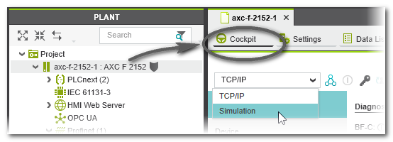
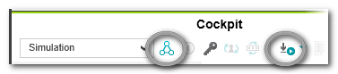

[На основну](../README.md)

# Емулятор контролеру

Емуляція контролера доступна для цілей PLCnext Technology із мікропрограмою версії 2022.0 або новішої. Для деяких типів контролерів емуляцію потрібно розблокувати за допомогою ліцензії. Для будь-якого іншого типу контролера, окрім AXC F1152, активуйте ліцензію на емуляцію, як зазвичай, у майстрі активації Phoenix Contact. Для певних типів контролерів емуляція може не підтримуватися. Ця тема стосується лише стандартного (не пов’язаного з безпекою) контролера. Етапи моделювання Safety PLC описані в довідковому розділі "Safety PLC Введення в експлуатацію: від компіляції до налагодження".

## Загальна інформація про емуляцію контролера

PLCnext Engineer містить емулятор контролера, який можна використовувати для емуляції виконання логіки програми. Це корисно,

- якщо апаратне забезпечення недоступне, або
- якщо перед запуском «справжньої» мережі рекомендується тестування емульованого функціонування.

Емуляція програми не може замінити перевірку належного функціонування з використанням пристроїв/датчиків/приводів вводу/виводу за жодних обставин. Емульоване тестування можна проводити лише на додаток до стандартного функціонального тесту, наприклад, як попереднє тестування. Емуляція контролера PLCnext — це окрема програма, яка фактично емулює ЦП контролера, встановленого як ціль вашого проекту. Він здатний емулювати всю поведінку контролера та обробляє ідентичний машинний код, згенерований для задіяного контролера. Тому під час перемикання між реальним апаратним забезпеченням і емуляцією в Cockpit (див. нижче) не потрібно переналаштовувати.

## При роботі з емулятором контролера ... 

- PLANT показує вузол контролера як вузол емулятора. Піктограма щита біля вузла відрізняється від піктограми щита, яка вказує на підключення контролера:

  

- Дані процесу доступні як порти на емуляції, тому їх можна зчитувати або записувати програмою контролера. Однак, якщо мережа підключена, ці дані процесу ніколи не оновлюються пристроями польової шини. Це означає, що фізичні входи пристрою не будуть читатися, а виходи пристрою не будуть записуватися під час емуляції.

- Онлайн-редактори та всі інструменти налагодження ідентичні в режимі емуляції та мають використовуватися однаково. Навіть світлодіоди стану контролера та інформація доступні в Cockpit (категорія «Overview»).

- Ви виконуєте ті самі кроки в PLCnext Engineer, що й під час роботи з фізичною мережею, хоча ви повинні переконатися, що в редакторі «Cockpit» вузла контролера в PLANT вибрано запис «Simulation». Під час емуляції програми ви можете примусово вводити змінні або відображати онлайн-значення в редакторах, як зазвичай.

## Налаштування емулятора контролера як цільової системи

1. У PLANT двічі клацніть вузол контролера та відкрийте Cockpit.
2. На панелі інструментів «Cockpit» виберіть «Simulation» зі спадного списку.
    Якщо запис «Simulation» не може бути обраний, емуляція недоступна для використовуваного типу контролера.

Емуляція може запитувати ім’я користувача та пароль під час встановлення зв’язку з PLCnext Engineer (див. розділ нижче). Це можна зробити, наприклад, вибравши команду «Connect...» у панелі керування або написавши та запустивши проект:

Під час запуску емуляції та підключення відображається діалогове вікно з індикатором виконання. Натиснувши «Cancel» в цьому діалоговому вікні, емуляція та встановлення з’єднання завершуються. Після підключення емуляції PLANT показує вузол контролера як вузол моделювання. Піктограма щита біля вузла відрізняється від піктограми щита, яка вказує на підключення контролера:

Усі команди та операції налагодження тепер стосуються емуляції. Це включає в себе команди в контекстному меню контролера в PLANT і у вікні ONLINE STATE (яке розташоване в області перехресних функцій внизу екрана).

## Облікові дані емуляції 

Дані для входу в систему для моделювання є такими:

- Ім'я користувача: `admin`
- Пароль: `plcnext`

## Можливі операції в емуляції 

- Виконання моделювання функціонального тесту.
- Відображення онлайн-значень у режимі налагодження, які циклічно зчитуються з контролера та відображаються в редакторах.
- Використання команд налагодження, таких як forcing/overwriting змінних і точки зупинки у режимі налагодження.
- Використання вікна WATCHES для збору змінних з різних аркушів, відображення їхніх онлайн-значень і виконання команд налагодження.
- Запуск програми HMI на веб-сервері емуляції.