[На основну](../README.md)

# Робота з SQL

PLCnext підтримує обмін даними з SQL напряму, що робить можливим використання його в якості клієнта СКБД (систем керування базами даних). Це у свою чергу відкриває багато можливостей, зокрема (але не обмежено):

- інтегрування зі сторонніми ІТ-застосунками через обмін даними в таблицях БД;
- робота з рецептами: зчитування, створення, збереження та ін;
- формування звітної інформації для різних користувачів
- формування трендового архіву, журналу подій, журналу тривог (хоч для цих цілей є і інші способи)

## Про SQL

Для використання бібліотек SQL потрібні елементарні знання реляційних баз даних та SQL (SQL=Structured Query Language). Якщо Вам не знайомі ці технології, то для кращого розкміння даного розділу бажано прочитати мінімально необхідну теорію та зробити певні практичні заняття:

- прочитати лекції в тему баз даних та SQL:
  -  [Бази даних та систем керування базами даних](https://pupenasan.github.io/ProgIngContrSystems/Лекц/11_db.html)
  -  [Мова SQL](https://pupenasan.github.io/ProgIngContrSystems/Лекц/12_sql.html).

- пройти лабораторну роботу [Основи роботи з базами даних та SQL ](https://pupenasan.github.io/ProgIngContrSystems/Лабор/lab6_db.html)

Для роботи з SQL в PLCnext в якості клієнта є бібліотека DBFL_SQL.

## Бібліотека DBFL_SQL

### Загальна інформація та встановлення

Ця бібліотека пропонує функціональні блоки в якості драйверів баз даних для програм MS SQL, MySQL і MariaDB. Підтримуваний ПЛК підключається до бази даних SQL через Ethernet TCP/IP. Команди введення та виведення функціонального блоку записуються в базу даних SQL у вигляді записів даних, де вони зберігаються і можуть бути викликані пізніше. 

Для використання бібліотеки завантажте її з [PLCnext Store](https://www.plcnextstore.com/world/app/1522) і скопіюйте файл `DBFL_SQL_x.pcwlx` в каталог робочих бібліотек PLCnext Engineer. Типовим каталогом робочих бібліотек PLCnext Engineer є `C:\Users\Public\Documents\PLCnext Engineer\Libraries`. В PLCnext Engineer у області COMPONENTS натисніть праву кнопку миші по паці `Libraries` в категорії `Libraries` та виберіть `Add User Library`, після чого виберіть цю бібліотеку.

Бібліотека включає наступні функціональні блоки:

- Доступ до баз даних:

  - `DBFL_TSQL_ACCESS` - до MsSQL

  - `DBFL_MySQL_ACCESS` - до MySQL/MariaDB

- Перетворення команди SQL або її частини в масив `SQL_OUT` -   `DBFL_CODE`	

- Доступ до комірки отриманої таблиці з SQL-запиту `DBFL_xxx_ACCESS` 

  - `DBFL_TSQL_DECODE` - для роботи з `DBFL_TSQL_ACCESS`.

  - `DBFL_MySQL_DECODE` - для роботи з `DBFL_MySQL_ACCESS`.


- Збереження кількох SQL команд (до 50) для виконання всієї послідовності - `DBFL_CommandFiFo`

- Формування динамічних SQL-команд, які дають можливість вставляти в запити потрібні значення зі змінних:  

  - початок SQL команди `DBFL_StartComT1`, `DBFL_StartComT2`

  - `DBFL_BoolToComT1`, `DBFL_BoolToComT2` - вставлення значення типу Boolean 

  - `DBFL_IntToComT1`, `DBFL_IntToComT2` - вставлення значення типу integer 

  - `DBFL_DIntToComT1`, `DBFL_DIntToComT2` - вставлення значення типу DINT  

  - `DBFL_RealToComT1`, `DBFL_RealToComT2` - вставлення значення типу REAL 

  - `DBFL_DateTimeStrT1`, `DBFL_DateTimeStrT2` - вставлення значення типу date/time 

  - `DBFL_ByteToComT1`, `DBFL_ByteToComT2` - вставлення значення типу byte 

  - `DBFL_WordToComT1`, `DBFL_WordToComT2`- вставлення значення типу word 

  - `DBFL_StrToComT1`, `DBFL_StrToComT2` - вставлення значення типу string 

Нижче розглянемо тільки блоки доступу до MySQL/MariaDB. Детальну інформацію про інші блоки можна почитати в довідці. 

### Формування підключення та запиту DBFL_MYSQL_ACCESS

Функціональний блок забезпечує доступ до бази даних, створеної на сервері MySQL або MariaDB. Параметри, необхідні для підключення (`DB_USER`, `DB_PASSWORD`, `IP_PORT`, `IP_ADDRESS`, `DB_NAME`), мають бути типу `STRING`. `IP_ADDRESS` задається в класичному вигляді, типу: `172.16.252.10`.

Логічна одиниця на вході `IP_ACTIVATE` ініціює доступ до БД за вказаними параметрами підключення.  Щоб надіслати команду SQL, вхід `DB_ACTIVATE` має бути встановлено в `TRUE`. Після успішного надсилання команди SQL вихід `SQL_READY` встановлюється в`TRUE`.  Команда SQL має бути присутньою на вході `SQL_IN` і має бути типу `DBFL_ARR_BYTE_0_1439`, який представляє SQL запит як масив байт з максимальним розміром 1439 байт. Для створення команди SQL в текстовому вигляді, що зручніше користувачу, можна використовувати спеціальні функціональні блоки з цієї ж бібліотеки що формують масив `DBFL_ARR_BYTE_0_1439` на основі різних вхідних даних:

- функціональний блок `DBFL_CODE`, який формує запит з кількох рядків STRING
- функціональні блоки динамічних команд по типу`DBFL_<type>_ToComT<v>`, який перетворює `<type>` в масив байт

Відповідь на SQL-запит приходить у `RCV_BUFFER` також у вигляді масиву байт  `DBFL_ARR_BYTE_0_1439`. Це таблиця, і для зручності читання змісту її комірок надається спеціальний функціональний блок `DBFL_MySQL_DECODE`. 

Функціональний блок може обробляти лише одну команду за раз. 

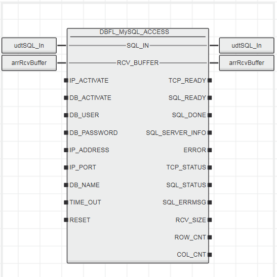

Вхідні параметри

| Параметр    | Тип    | Опис                                                         |
| ----------- | ------ | ------------------------------------------------------------ |
| IP_ACTIVATE | BOOL   | `TRUE`: встановити TCP-з'єднання з базою даних  <br />`FALSE`: розірвати з'єднання TCP |
| DB_ACTIVATE | BOOL   | Передній фронт: надсилається команда SQL                     |
| DB_USER     | STRING | Ім'я користувача для підключення до бази даних               |
| DB_PASSWORD | STRING | Пароль для підключення до бази даних                         |
| IP_ADDRESS  | STRING | IP-адреса сервера бази даних                                 |
| IP_PORT     | STRING | Порт сервера бази даних (за замовчуванням MySQL = `3306`, якщо параметр не встановлено) |
| DB_NAME     | STRING | Назва бази даних                                             |
| TIME_OUT    | TIME   | Час очікування для внутрішніх процедур помилок (за замовчуванням =  `5 s`, якщо не підключено, максимум   `9999 s`) |
| RESET       | BOOL   | Зарезервовано, лише для внутрішньої діагностики виробником.  |

Вихідні параметри

| Параметр        | Тип                            | Опис                                                         |
| --------------- | ------------------------------ | ------------------------------------------------------------ |
| TCP_READY       | BOOL                           | `TRUE` TCP-з'єднання з базою даних встановлено.<br /> `FALSE`: TCP-з'єднання з базою даних не встановлено. |
| SQL_READY       | BOOL                           | Функціональний блок готовий відправити команду SQL.          |
| SQL_DONE        | BOOL                           | `TRUE`: команда SQL виконана успішно. Вихід буде `TRUE`, доки вхід `DB_ACTIVATE` не буде встановлено на `FALSE`. |
| SQL_SERVER_INFO | `DBFL_UDT_ MYSQL_ Server_Info` | Надає розробнику інформацію про стан SQL-сервера. Структура типу даних `DBFL_UDT_MYSQL_Server_Info` (див. таблицю). |
| ERROR           | BOOL                           | `TRUE`: сталася помилка <br />`FALSE`: помилок не сталося. У разі помилки потрібно оцінити виходи `TCP_STATUS` і `SQL_STATUS`. |
| TCP_STATUS      | DINT                           | Код помилки TCP (див. таблицю «Коди помилок TCP»)            |
| SQL_STATUS      | DINT                           | SQL error code (див. http://dev.mysql.com/doc/refman/5.1/en/error-handling.html) |
| SQL_ERRMSG      | DBFL_UDT_ STRING255            | Відповідний текст помилки для `SQL_STATUS` (безпосередньо з сервера SQL) |
| RCV_SIZE        | DINT                           | Розмір отриманих даних користувача, наприклад, для `select * from MyTable`. |
| ROW_CNT         | DINT                           | Кількість зачеплених рядків (для оцінки потрібен функціональний блок `SQL_DECODE`, який підключається до `MAX_ROW` під час отримання таблиці). |
| COL_CNT         | DINT                           | Кількість зачеплених стовпців (для оцінки потрібен функціональний блок `SQL_DECODE`, під час отримання таблиці має бути підключено до `MAX_COL`). |

Параметри INOUT

| Параметр   | Тип                     | Опис                                                         |
| ---------- | ----------------------- | ------------------------------------------------------------ |
| SQL_IN     | `DBFL_ARR_BYTE_0_1439 ` | Команда SQL у формі `ARRAY OF BYTE`                          |
| RCV_BUFFER | `DBFL_ARR_BYTE_0 1439 ` | Містить дані, отримані з протоколу MySQL (можна оцінити за допомогою функціонального блоку `MYSQL_DECODE`). |

Помилки TCP

| Діагностичний код               | Опис                                                         |
| ------------------------------- | ------------------------------------------------------------ |
| 20000                           | Internal socket error                                        |
| 20010                           | Socket error while sending data                              |
| 20020                           | Internal socket error (connection to the database is reinitialized  automatically: duration 3 s) |
| 50000 + TCP_Socket error code   | For details refer to appendix.                               |
| 60000 + TCP_SEND error code     | For details refer to appendix.                               |
| 70000 + TCP_RECEIVE error codes | For details refer to appendix.                               |
| 79999                           | The request resulted in too much data in the receive buffer. |

Нижче наведений фрагмент коду в якому використовується екземпляр `DBFL_MYSQL_ACCESS_2`, який підключається до БД `db1` на хості `10.0.0.2`. Це підключення відбувається в момент коли змінна `MYSQLACTIVATE=TRUE` і залишається таким допоки ця змінна буде в `TRUE`. Як видно з рисунку підключення вдалося, так як немає помилки, статуси в 0.

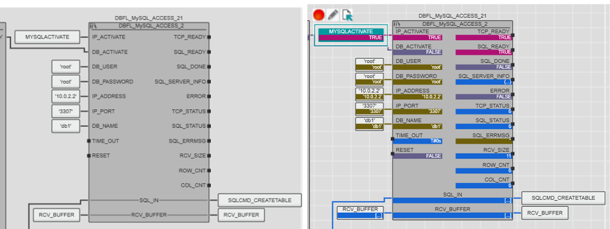

### Формування команди DBFL_CODE

Функціональний блок вставляє команди SQL або їх частини в масив що передається на `SQL_OUT`. При цьому команди є конкатенацією рядків `STR_1...STR_18` які перетворюються в формат `DBFL_ARR_BYTE_0_1439`.  Альтернативним способом є використання динамічно-заповнюваної команди, що описана ничже в іншому пункті.

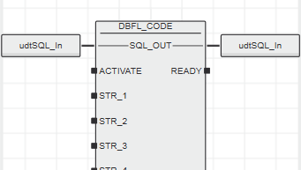

Вхідні параметри

| Параметр         | Тип    | Опис                                                         |
| ---------------- | ------ | ------------------------------------------------------------ |
| ACTIVATE         | BOOL   | Передній фронт: дані, наявні на входах від `STR_1` до `STR_18`, передаються на `SQL_OUT`. |
| STR_1 ... STR_18 | STRING | Вхідні рядки (до 18-ти) для команди бази даних (підтримується максимум 79 символів на рядок) |

Вихідні параметри

| Параметр | Тип  | Опис                  |
| -------- | ---- | --------------------- |
| Ready    | BOOL | `TRUE`: Дані прийняті |

Параметри INOUT

| Параметр | Тип                    | Опис                        |
| -------- | ---------------------- | --------------------------- |
| SQL_OUT  | `DBFL_ARR_BYTE_0_1439` | Команда SQL як масив байтів |

Нижче наведений фрагмент коду сумісної роботи `DBFL_CODE` та `DBFL_MYSQL_ACCESS`.  Екземпляр `DBFL_CODE_21` формує SQL-запит на створення таблиці з іменем `table1`, 

```sql
CREATE TABLE table1 (
 ID INT, 
 NAME CHAR(50),
 SP1 FLOAT ,
 SP2 FLOAT 
) 
COLLATE = cp1251_ukrainian_ci;
```

який перетворюється в формат  `DBFL_ARR_BYTE_0_1439`, що зрештою передається на вхід екземпляра `DBFL_MYSQL_ACCESS_2`. Після готовності розрахунку на виході `READY` формується логічна одиниця, що ініціює виконання запиту на `DBFL_MYSQL_ACCESS_2` по передньому фронту. 

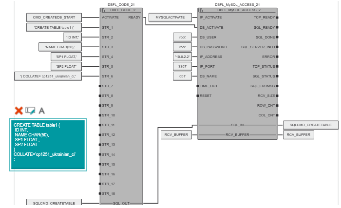

### Доступ до комірок результату запиту DBFL_MySQL_DECODE

Функціональний блок використовується для розшифрування отриманої таблиці з `DBFL_MySQL_ACCESS` шляхом доступу до потрібної комірки. Значення `TRUE` на вході `ACTIVATE` запускає декодування вибраної комірки таблиці. Для вибору комірки використовуються вхідні параметри `ROW_SELECT` і `COL_SELECT`. Вихід `DATA_TYPE` вказує на тип даних вибраної клітинки. Залежно від типу даних вибрана комірка може бути виведена на один з 3-х виходів `DINT_OUT`, `REAL_OUT` і `STR_OUT`.

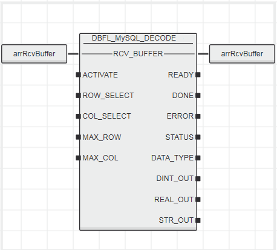

Вхідні параметри

| Параметр   | Тип  | Опис                                                         |
| ---------- | ---- | ------------------------------------------------------------ |
| ACTIVATE   | BOOL | Передній фронт: декодування отриманих даних на вході `RCV_BUFFER` |
| ROW_SELECT | DINT | Вказівка рядка, де знаходиться потрібна комірка              |
| COL_SELECT | DINT | Вказівка стовпчика, де знаходиться потрібна комірка          |
| MAX_ROW    | DINT | Максимальна кількість рядків у вибраній таблиці (`ROW_CNT` функціонального блоку `DBFL_MySQL_ACCESS`) |
| MAX_COL    | DINT | Максимальна кількість стовпців у вибраній таблиці (`COL_CNT` функціонального блоку `DBFL_MySQL_ACCESS`) |


Вихідні параметри

| Параметр  | Тип    | Опис                                                         |
| --------- | ------ | ------------------------------------------------------------ |
| READY     | BOOL   | `TRUE`: Дані успішно декодовано                              |
| DONE      | BOOL   | `TRUE`: Команда виконана.                                    |
| ERROR     | BOOL   | `TRUE`: Сталася помилка `FALSE`: Помилок не сталося          |
| STATUS    | INT    | У разі помилки (`ERROR = TRUE`) статус можна дізнатися її причину за статусом |
| DATA_TYPE | STRING | Тип даних вибраної комірки                                   |
| DINT_OUT  | DINT   | Вміст вибраної комірки якщо тип даних `INTEGER`              |
| REAL_OUT  | REAL   | Вміст вибраної комірки якщо тип даних `REAL`                 |
| STR_OUT   | STRING | Вміст вибраної комірки якщо тип даних `STRING`               |

Параметри INOUT

| Параметр   | Тип                    | Опис                                                   |
| ---------- | ---------------------- | ------------------------------------------------------ |
| RCV_BUFFER | `DBFL_ARR_BYTE_0_1439` | Отримані дані (з функціонального блоку `MySQL_ACCESS`) |

Коди для статусів

| Code | Опис                                                         |
| ---- | ------------------------------------------------------------ |
| 0    | Помилки немає                                                |
| 1    | Помилка стовпця (COL_SELECT > MAX_COL)                       |
| 2    | Помилка рядка (ROW_SELECT > MAX_ROW)                         |
| 3    | Недійсний тип даних                                          |
| 4    | Вибраний рядок/стовпець має значення 0 (COL_SELECT or ROW_SELECT = 0) |
| 5    | Недійсні дані                                                |

Не всі типи даних SQL можна зіставити з контролерними. Зверніть увагу на таблиці для використаної бази даних. 

Приведення типів даних MySQL та PLCnext

| MySQL data type  | Controller data type           |
| ---------------- | ------------------------------ |
| BIT              | STRING formatted: Hexadecimal  |
| TINYINT          | DINT formatted: Decimal        |
| SMALLINT         | DINT formatted: Decimal        |
| MEDIUMINT        | DINT formatted: Decimal        |
| INT              | DINT formatted: Decimal        |
| INTEGER          | DINT formatted: Decimal        |
| BIGINT           | DINT formatted: Decimal        |
| FLOAT            | REAL formatted: Decimal        |
| DOUBLE           | REAL formatted: Decimal        |
| DOUBLE PRECISION | REAL formatted: Decimal        |
| REAL             | REAL formatted: Decimal        |
| DECIMAL          | REAL formatted: Decimal        |
| DEC              | REAL formatted: Decimal        |
| DATE             | STRING formatted: Alphanumeric |
| DATETIME         | STRING formatted: Alphanumeric |
| TIMESTAMP        | STRING formatted: Alphanumeric |
| TIME             | STRING formatted: Alphanumeric |
| YEAR             | STRING formatted: Alphanumeric |
| CHAR             | STRING formatted: Alphanumeric |
| TINYBLOB         | STRING formatted: Hexadecimal  |
| TINYTEXT         | STRING formatted: Alphanumeric |
| BLOB             | STRING formatted: Hexadecimal  |
| TEXT             | STRING formatted: Alphanumeric |
| MEDIUMBLOB       | STRING formatted: Hexadecimal  |
| MEDIUMTEXT       | STRING formatted: Alphanumeric |
| LONGBLOB         | STRING formatted: Hexadecimal  |
| LONGTEXT         | STRING formatted: Alphanumeric |
| ENUM             | STRING formatted: Alphanumeric |
| SET              | STRING formatted: Alphanumeric |

Беззнакові типи даних виводяться  в контролері як відформатовані десяткові STRING. Двійкові типи даних в контролері виводяться як відформатовані шістнадцяткові STRING. До них також відноситься тип даних TEXT. Результати збереженої процедури/функції часто виводяться у контролері у вигляді відформатованих шістнадцяткових STRING . Шістнадцяткові STRING рядки можна обробляти як арифметичні операції.

Нижче показаний приклад фрагменту програми що зчитує перелік баз даних в MariaDB і виводить першу з них. Її назва `DB1`. 

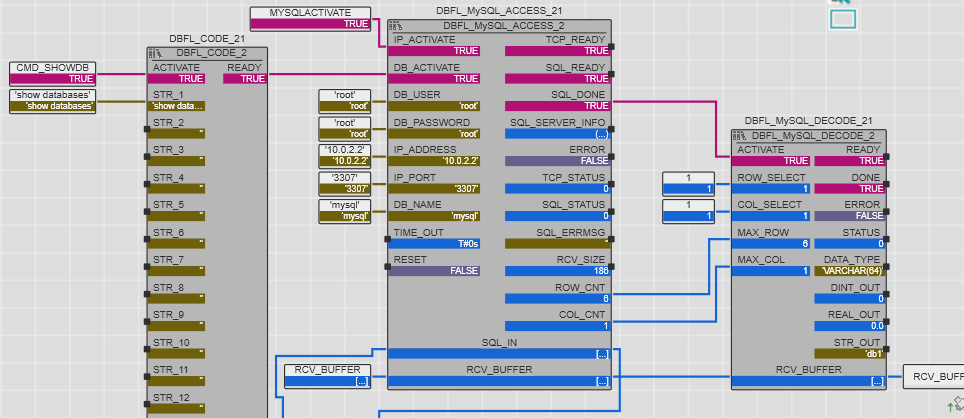

### Формування динамічно-формованої команди 

Для формування SQL-команд на основі реальних даних ПЛК, необхідно перетворювати змінні в потрібний формат MySQL. Для цього є ряд функціональних блоків формату `DBFL_<type>ToComT<v>`. Ми розглянемо тут тільки кілька з них для прикладу, використання інших описане в інструкції.  

- початок SQL команди `DBFL_StartComT1`, `DBFL_StartComT2`
- `DBFL_StrToComT1`, `DBFL_StrToComT2` - вставлення значення типу `string` 
- `DBFL_IntToComT1`, `DBFL_IntToComT2` - вставлення значення типу `integer` 
- `DBFL_RealToComT1`, `DBFL_RealToComT2` - вставлення значення типу `REAL` 
- `DBFL_DateTimeStrT1`, `DBFL_DateTimeStrT2` - вставлення значення типу `date/time` 

Функціональні блоки що закінчують на `T2` відрізняються від тих, що на `T1` наявністю в перших додаткового входу `IN_xActivate`, за переднім фронтом якого відбувається формування виходу та `OUT_DataValid` .

Функціональні блоки змінюють Inout параметр `INOUT_udtComBuffer` з типом  `DBFL_UDT_SQL_COMMAND`, який має наступний формат:

```pascal
    DBFL_UDT_SQL_COMMAND : STRUCT
        Data : DBFL_ARR_BYTE_0_1439; //байтовий масив
        WP : INT; //
        Mode : INT; //
    END_STRUCT
```

Для всіх функціональних блоків спільні наступні параметри:

Вхідні параметри

| Параметр     | Тип  | Опис                                                         |
| ------------ | ---- | ------------------------------------------------------------ |
| IN_xActivate | BOOL | Передній фронт: команда на введення значення з входів в `INOUT_udtComBuffer`. |

Вихідні параметри

| Параметр      | Тип  | Опис                                                      |
| ------------- | ---- | --------------------------------------------------------- |
| OUT_DataValid | BOOL | Передній фронт: текстове значення введено в буфер IN/OUT. |

Параметри Inout

| Параметр           | Тип                    | Опис        |
| ------------------ | ---------------------- | ----------- |
| INOUT_udtComBuffer | `DBFL_UDT_SQL_COMMAND` | SQL command |

#### DBFL_StartComT2

Функціональний блок створює початок команди бази даних. Він видаляє команду SQL у буфері та вставляє перший командний рядок.

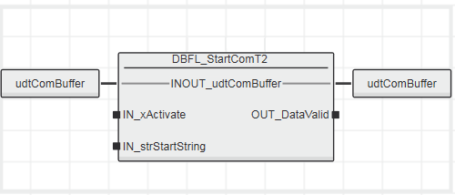

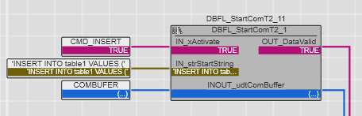

#### DBFL_StrToComT2

Функціональний блок вставляє рядок у команду SQL.

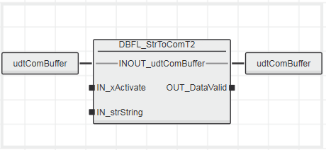

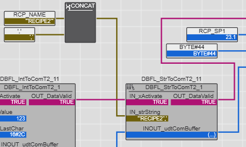

#### DBFL_IntToComT2

Функціональний блок вставляє ціле значення в команду SQL. Вхід `IN_bLastChar` можна використовувати для введення роздільників між значеннями або завершальним символом у команді SQL.

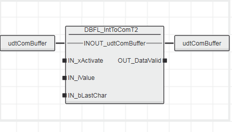

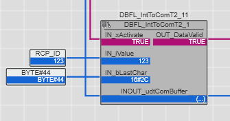

#### DBFL_RealToComT2

Функціональний блок вставляє значення REAL у команду SQL. Вхід `IN_bLastChar` можна використовувати для введення роздільників між значеннями або завершальним символом у команді SQL.

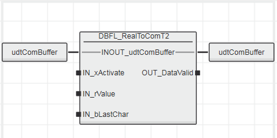


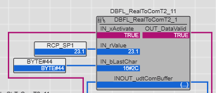

#### DBFL_DateTimeStrT2

Функціональний блок вставляє значення дати/часу в команду SQL. Вхід `IN_bLastChar` можна використовувати для введення роздільників між значеннями або завершальним символом у команді SQL

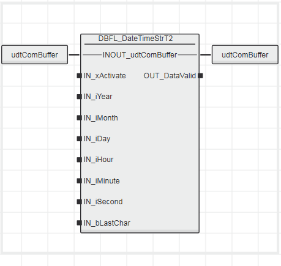

#### Приклад

У даному прикладі розглянемо як в таблицю `table1`, з форматом що описаний в прикладі вище (створення), задати значення зі змінних в полях:

- ID - `RCP_ID`
- NAME - `RCP_NAME`
- SP1 - `RCP_SP1`
- SP2 - `RCP_SP1`

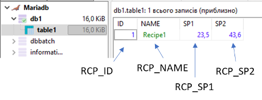

У випадку запису статичних значень команда SQL мала б подібний формат:

```sql
INSERT INTO table1 VALUES (1, "Recipe1", 23.5, 43.6)
```

Натомість запит буде мати кілька частин: 

- префікс `INSERT INTO table1 VALUES(`, який можна сформувати ФБ `DBFL_StartComT2`
- значення з  `RCP_ID` типу INT, який можна сформувати ФБ `DBFL_IntToComT2`
- значення з `RCP_NAME` типу STRING, який можна сформувати ФБ `DBFL_StrToComT2`
- значення з  `RCP_SP1` та `RCP_SP2`, які можна сформувати ФБ  `DBFL_RealToComT2`

Кожне значення в дужках повинно закінчуватися комою, тому в `IN_bLastChar` необхідно ставити ASCII код коми, тобто `BYTE#44`. Останнє значення повинно закінчуватися закритою дужкою, тому в  `IN_bLastChar` необхідно ставити `BYTE#41`.

Програма показана нижче в 2-х частинах. 

На рисунку нижче показаний процес формування `COMBUFER` з кількох частин, кожна з яких реалізується окремим функціональним блоком. Стартує обробка по `CMD_INSERT=TRUE`. На вхід `DBFL_StrToComT2` подається результат конкатенації значення текстової змінної і `,`, що зумовлено відсутністю параметра `IN_bLastChar`.    

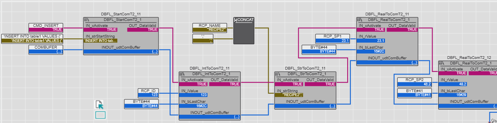

 Далі `COMBUFER.DATA` передається як сформований байтовий масив, який зрештою і є SQL-запитом. Запит ініціюється одразу по його формуванню.    

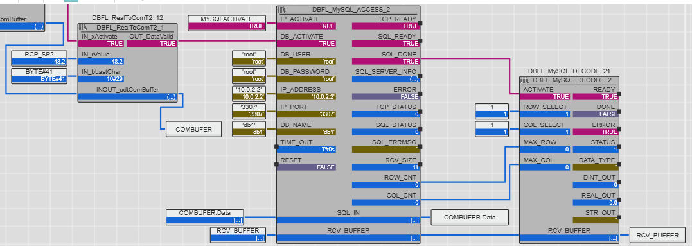

### Приклад з MySQL/MariaDB

todo

Пококовий приклад, як мінілабораторка з використанням імітатора ПЛК та MySQL.
